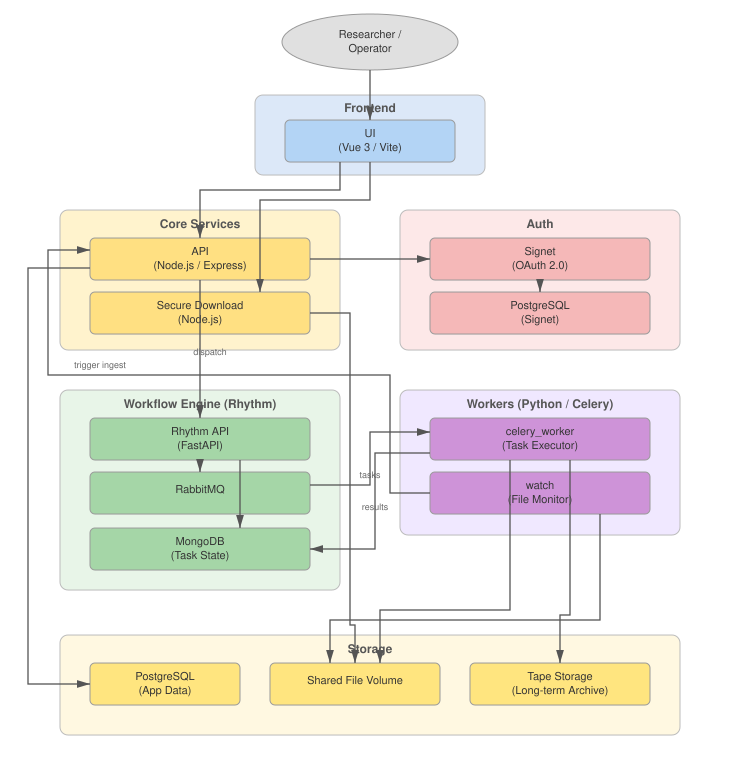

# Bioloop

Open-source data lifecycle management for research teams and core facilities.

> **Bioloop at PEARC '26**
>
> "[SciLINC: an instrument to archival data management platform based on
> Bioloop](https://doi.org/10.1145/3785462.3815868)" will be presented on
> Tuesday, July 28, 2026, from 12:00–12:15 PM in Auditorium Room 1 at
> [PEARC '26](https://pearc.acm.org/pearc26/conference-schedule/).

## Overview

Bioloop connects instrument output and existing filesystem data to
project-based, auditable workflows for ingestion, archival, staging, and secure
delivery. Rather than replacing an institution's storage and computing
infrastructure, Bioloop provides an orchestration and governance layer that
connects those services through a web portal, API, and extensible workers.

Bioloop was created for research environments that generate large, complex
datasets and need to move them reliably from instruments to researchers while
preserving access controls, provenance, and long-term retrievability.

## Key capabilities

- **Project-based organization and access:** Group datasets and collaborators
  within projects, with role- and membership-based authorization.
- **Flexible data ingestion:** Support automated instrument ingestion,
  [browser-based uploads](docs/features/dataset_upload.md), and
  [allowlisted filesystem imports](docs/features/import_sources.md).
- **Tiered storage workflows:** Coordinate active disk and long-term archival
  storage while retaining the context needed to retrieve and reuse data.
- **Provenance and auditability:** Track raw datasets, derived data products,
  lineage, workflow state, and access history.
- **Secure data delivery:** Stage archived data and provide
  [token-scoped downloads](docs/features/secure_download.md) to authorized
  researchers.
- **Extensible processing:** Compose and scale custom data workflows with
  [Celery](https://docs.celeryq.dev/en/stable/) and
  [Rhythm](https://github.com/IUSCA/rhythm).
- **Operational visibility:** Keep users informed through
  [notifications](docs/features/notifications.md), workflow histories, and
  status tracking.
- **Portable deployment:** Run the service components in Docker containers on
  institutional infrastructure or in public cloud environments.

## Architecture

Bioloop separates its web interface, API, authentication, secure-download
service, workflow engine, workers, and storage integrations into independently
deployable services.

## Getting started

- [Install with Docker](docs/installation/install-docker.md)
- [Install locally](docs/installation/install-local.md)

## Documentation

### Install and configure

- [Installation with Docker](docs/installation/install-docker.md)
- [Local installation](docs/installation/install-local.md)
- [Architecture overview](docs/architecture.md)

### Core features

- [Dataset uploads](docs/features/dataset_upload.md)
- [Import sources](docs/features/import_sources.md)
- [Secure downloads](docs/features/secure_download.md)
- [Notifications](docs/features/notifications.md)

### Components

- [Web interface](docs/ui/overview.md)
- [API](api/README.md)
- [Workflow workers](docs/worker/overview.md)

## Publication and citation

The PEARC '26 paper describes SciLINC, Indiana University's managed
instrument-to-archive service built on Bioloop:

> Daniel Havert, Charles Brandt, Deepak Duggirala, and Le Mai Weakley. 2026.
> *SciLINC: an instrument to archival data management platform based on
> Bioloop.* In *Proceedings of the Practice and Experience in Advanced Research
> Computing 2026: Resilient Roots + Empowered Communities*.
> [https://doi.org/10.1145/3785462.3815868](https://doi.org/10.1145/3785462.3815868)

To cite the Bioloop software itself, use the metadata in
[`CITATION.cff`](CITATION.cff) or the
[Bioloop v1.0.0 Zenodo record](https://doi.org/10.5281/zenodo.19206731).

## Related projects

Bioloop integrates with several other open-source projects:

- [Signet](https://github.com/IUSCA/signet) provides OAuth-based
  authentication.
- [Rhythm API](https://github.com/IUSCA/rhythm_api) exposes workflow
  orchestration services.
- [Rhythm](https://github.com/IUSCA/rhythm) provides reusable Celery workflow
  patterns.

## License

Bioloop is licensed under the
[Educational Community License, Version 2.0](LICENSE.md).
