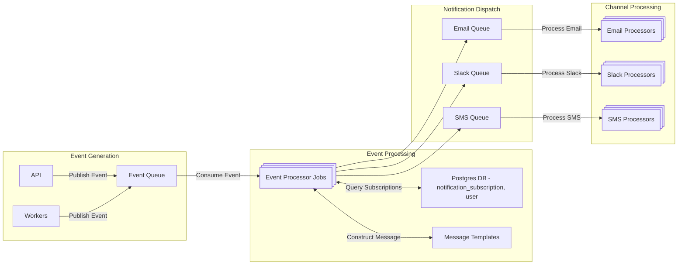

(https://mermaid.live/edit#pako:eNp9U9Fu0zAU_ZUrP3cPvAaE2NKu26CoECQkkgo5zm1izbEjXxs0Nf13HIeNlC71U5Jzz_HxOc6BCVMhS9hemd-i4dbBp69vCw1hkS9ry7sGCrb6hdrBGjVa7qTRBRtHhnWdX2_vd3B19b7f-lJJaiCO93CTj7wvHj3uJow3-XdjH9FSpMEZbxxFXRV6xsrWGoFEUtdTKzfRRWo0-Raf1dIPB6CGd5hAF1i0AMVLVMn_WsbCgympYMd_gim8GxTDAewTZL4kYWU3BEA9LPOtIVdbJFiGjUEbJ_dSxHx-0mR2AZ7Q7s5UB5_OeuFgE7bnNfawyv8-wjdsO8Ud0u5SGJ8ne8JSUsedaKaJpDHg23zVcqnOihjRdZ4pLh5n0Ls822Qn2OtW0oZrjWqmmdvxfowYRDc93F9oJvp9aea0lfWJWDTfw8O82Hi8GbG7U7FN1sPHC1Ihi1eEYiRswVq0wXgV_qfDABTMNdhiwQZqhXvulRtSOYZR7p3JnrRgSbgDuGC-q0LdS8lDoC1L9lxR-GqNr5uXt47rH8Y8o8c_FDY0aw)