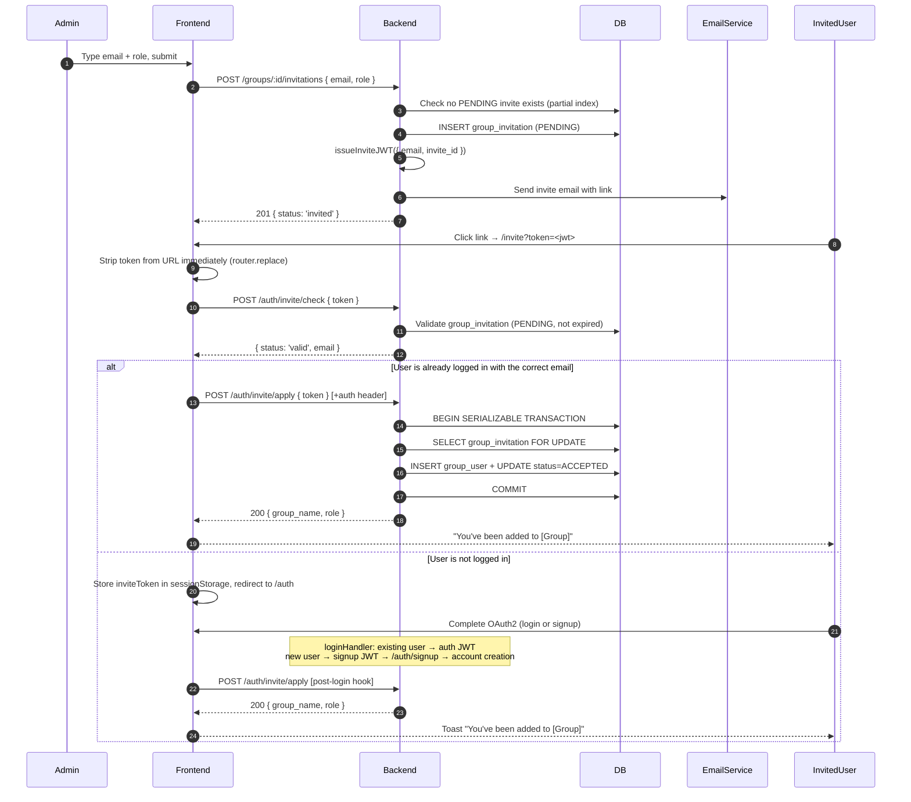

# Group Invitations – Design Specification

## Overview

Group admins can invite users who do not yet have portal accounts to join a group. The system sends an email with a signed invite link. When the recipient clicks the link, one of two paths follows:

- **New user:** routed through the standard OAuth2 signup flow. After the account is created, all pending invitations for that email are applied automatically — the user lands in the portal already a group member.
- **Existing user:** prompted to authenticate (or already logged in). The group membership is applied immediately.

**Collection access is not a separate invitation type.** The correct composition is: invite a user to a group (this flow), then issue a collection grant to that group (existing grant flow). Users admitted through an invitation inherit collection access through group membership automatically.



---

## Design Decisions

### Why a dedicated `group_invite` JWT scope — not the existing signup JWT?

The existing `scope: 'signup'` JWT is intentionally short-lived (10-minute TTL), single-use via nonce, and carries no resource context. An invitation link must survive in an inbox for days. Reusing the signup JWT would require:

- Stretching the TTL to 7 days — weakening a well-tested, tightly bounded token
- Embedding group context in the payload — leaking group identity into a URL that appears in email, browser history, and server logs
- Storing group context outside the JWT anyway — which is the `group_invitation` table we'd need regardless

A dedicated `scope: 'group_invite'` JWT keeps both flows isolated and leaves the entire existing signup flow untouched.

### JWT vs opaque token — why JWT, and what it is NOT doing here

The standard argument for JWTs is stateless validation: verify the signature, trust the payload, skip the DB. **That advantage does not apply here.** Both `/check` and `/apply` must hit the DB regardless — to confirm `status = PENDING`, check `expires_at`, read group state, and apply membership. The JWT's cryptographic self-containment provides zero enforcement benefit over a random opaque token.

The reason for using a JWT is narrower and more pragmatic:

- **The invited email survives the OAuth2 redirect with no extra state.** After storing `inviteToken` in sessionStorage and navigating through OAuth, the frontend recovers the invited email via `jwtDecode(inviteToken).sub`. With an opaque token, the email would not be in the token — the frontend would need to store it separately in sessionStorage, re-introducing the second key we deliberately removed.
- **Consistency with the existing token infrastructure.** The RS256 key pair, validation pattern, and `scope` claim model are already established. Using an opaque token would diverge from every other token in the system for no security gain at the current threat model.

The email-in-URL exposure (the main privacy cost of a JWT) is already mitigated: HTTPS in transit, URL stripped on mount before any sub-resource fires, and `Referrer-Policy: no-referrer` at the nginx layer. The invited email also arrives in the recipient's inbox in plaintext — having it additionally in the URL query string is not a meaningful incremental exposure.

**Future migration path:** If a future requirement demands that the invited email never appear in a URL (e.g. invitations to groups with sensitive classification), switch to a 256-bit random opaque token stored in the `group_invitation` row. The cost is one extra sessionStorage key for the email across the OAuth redirect, and dropping the client-side `jwtDecode` call in favour of reading email from the `/check` response.

---

### Why status transition for single-use, not a nonce?

The nonce table was purpose-built to make the signup JWT single-use. For invitations, the `group_invitation` row already carries a full lifecycle (`PENDING → ACCEPTED / CANCELLED`). The `PENDING → ACCEPTED` transition inside a serializable DB transaction gives the same single-use guarantee without adding a fourth table. **The invitation row is the nonce.**

---

### Why wrap signup in a single transaction?

User creation and invitation application must be atomic. A committed user with no group membership is a valid state — but if user creation commits and invitation application then fails, the invite is permanently orphaned: subsequent signup attempts fail at the email uniqueness check, so `applyPendingInvitations` can never be retried through the signup path.

A single `prisma.$transaction` makes both operations succeed or both roll back. The user always retries from a clean state.

---

### Why detect the OAuth email mismatch on the frontend?

OAuth providers let users choose which account to authenticate with. If an invite is sent to `institutional@university.edu` and the user accidentally authenticates with `personal@gmail.com`, the backend creates an account under the personal email, `applyPendingInvitations` finds nothing, and the user lands in the portal with no group membership and no explanation.

The backend cannot prevent this: it only sees the email the OAuth provider returns. The frontend is the right detection point — it already has both pieces of information:
- `auth.pendingUser.email` — the email the OAuth provider just returned
- `jwtDecode(inviteToken).sub` — the invited email, recoverable locally since JWTs are base64, not encrypted

This requires no new server round-trip. It is not a security bypass — the backend still enforces `decoded.sub === req.user.email` independently on every `/apply` call. The frontend check prevents the specific UX failure of a user completing signup and finding themselves not in the group.

---

### Why sessionStorage for the invite token — not localStorage or memory?

| Storage | Verdict | Reason |
|---------|---------|--------|
| In-memory (Pinia state) | ✗ | Lost on full-page navigation — cannot survive the OAuth2 redirect |
| `localStorage` | ✗ | Persists indefinitely across browser sessions; another user opening a new tab on a shared machine could inherit a previous session's token |
| `sessionStorage` | ✓ | Survives the OAuth2 redirect (same-tab navigation), cleared when the tab is closed, never shared across tabs or sessions |

`sessionStorage` is the smallest sufficient scope for a within-tab OAuth redirect.

---

### Why not store the invited email separately alongside the token?

The invite JWT contains the invited email as the `sub` claim. `jwtDecode(inviteToken).sub` retrieves it without a second sessionStorage key. Storing it separately would introduce a state synchronization risk (what if the two get out of sync?) for no benefit. One key, one source of truth.

---

### Extensibility pre-accommodations

Two anticipated extensions are pre-accommodated without speculative code:

- **Bulk invitations:** `invitationService.createInvitation()` is a pure, composable function — bulk support is just iteration with no architectural change.
- **Invitation-only signup mode:** Disable the `signup` feature flag. The `loginHandler`'s `NOT_A_USER` path short-circuits to a "you need an invitation" response. No new code needed.

---

## Data Model

### `INVITATION_STATUS` enum

```prisma
enum INVITATION_STATUS {
  PENDING
  ACCEPTED
  CANCELLED
}
```

`EXPIRED` is not a status value. Expiry is a computed condition: `status = 'PENDING' AND expires_at < now()`. This keeps `expires_at` as the single source of truth — no cron job required, no consistency window between when a record logically expires and when a background job catches up.

### `group_invitation` table

```prisma
model group_invitation {
  id            String            @id @default(uuid())
  group_id      String
  invited_email String            @db.VarChar(254)
  role          GROUP_MEMBER_ROLE @default(MEMBER)
  invited_by    String            // user.subject_id of the inviting admin
  status        INVITATION_STATUS @default(PENDING)
  created_at    DateTime          @default(now()) @db.Timestamp(6)
  expires_at    DateTime          @db.Timestamp(6)
  accepted_at         DateTime?  @db.Timestamp(6)
  cancelled_at        DateTime?  @db.Timestamp(6)
  cancellation_reason String?    // e.g. 'group_archived', 'admin_cancelled'

  group   group @relation(fields: [group_id], references: [id], onDelete: Cascade)
  inviter user  @relation("invitations_sent", fields: [invited_by], references: [subject_id], onDelete: Restrict)

  @@index([group_id, status])
  @@index([invited_email, status])
}
```

Add to the `user` model:
```prisma
invitations_sent group_invitation[] @relation("invitations_sent")
```

### Partial unique index

```sql
CREATE UNIQUE INDEX group_invitation_pending_unique
  ON group_invitation (group_id, invited_email)
  WHERE status = 'PENDING';
```

This enforces at most one active invite per `(group, email)` at the DB level, surviving race conditions at the application layer. Multiple `ACCEPTED` / `CANCELLED` rows for the same pair are permitted — they form the historical record.

### Invite JWT

Issued by `auth.issueInviteJWT({ email, invite_id })`:

```json
{
  "iss": "<configured issuer>",
  "sub": "invited@example.com",
  "scope": "group_invite",
  "invite_id": "<uuid of group_invitation row>",
  "exp": "<unix timestamp, 7 days from now>"
}
```

**Validation rules** (all required; mirrors `validateSignupToken` logic):
- Valid RS256 signature — same key pair as all auth JWTs
- `scope === 'group_invite'`
- `sub` (email) is present
- `invite_id` is present
- Token is not expired

**Config additions:**

```json
{
  "auth": {
    "group_invite": {
      "jwt": {
        "scope": "group_invite",
        "ttl_milliseconds": 604800000
      }
    }
  }
}
```

---

## API Reference

### Authorization

| Action | Authorized roles |
|--------|-----------------|
| Create invitation | Group admin, Platform admin |
| List invitations | Group admin, Platform admin |
| Cancel invitation | Group admin, Platform admin |
| Check invite token | Public (unauthenticated) |
| Apply invite token | Authenticated user (email must match invite) |

Add `invite` as a new capability in the group authorization config.

---

### `POST /groups/:id/invitations`

```json
// Request body
{ "email": "new-user@example.com", "role": "MEMBER" }
```

**Logic:**
1. Validate group exists and is not archived → `403` if archived
2. Normalize email to lowercase
3. Check if a user with this email is already a direct member → `400 Already a member`
4. Check for a `PENDING` invite for `(group_id, email)` → `200 { status: 'already_invited' }` (idempotent; no duplicate email sent)
5. Create `group_invitation` row: `status: PENDING`, `expires_at = now + TTL`
6. Issue invite JWT: `issueInviteJWT({ email, invite_id })`
7. Send invitation email
8. Respond `201 { status: 'invited' }`

The endpoint intentionally does not reveal whether the invited email has an existing account — exposing this would allow group admins to enumerate portal users.

---

### `GET /groups/:id/invitations`

Returns invitations filtered by `status` query param (default: `PENDING`). Supports `limit` / `offset` pagination.

Response fields per row: `id`, `invited_email`, `role`, `status`, `created_at`, `expires_at`, `is_expired` (computed: `expires_at < now()`), `inviter.name`.

The `is_expired` boolean is computed by the API — the UI uses it to display an "Expired" badge without needing a separate status value. To query expired invitations, use `status=PENDING` and filter client-side on `is_expired`, or add an `expired` virtual filter value at the API layer.

---

### `DELETE /groups/:id/invitations/:inviteId`

Sets `status = CANCELLED`, `cancelled_at = now`. Only allowed if current status is `PENDING`.

The WHERE clause **must** include `group_id` to prevent an ID-based access issue — an admin of Group A must not be able to cancel Group B's invitations:

```javascript
await prisma.group_invitation.update({
  where: {
    id: inviteId,
    group_id: params.id, // ties inviteId to the authorized group
  },
  data: { status: 'CANCELLED', cancelled_at: new Date(), cancellation_reason: 'admin_cancelled' },
});
// Prisma throws RecordNotFound if the invitation doesn't belong to this group.
```

---

### `POST /auth/invite/check` — public

Validates the invite token without consuming it. The frontend calls this on mount of the `/invite` page to decide which path to show.

```json
// Request
{ "token": "<invite_jwt>" }

// Valid response
{ "status": "valid", "email": "invited@example.com" }

// Invalid response
{ "status": "invalid", "reason": "expired" | "not_found" | "already_accepted" | "cancelled" }
```

`reason: "expired"` is returned when the JWT is still cryptographically valid but `expires_at < now()` on the DB row (or the JWT `exp` itself has passed). It is derived from the date, not from a status value.

**Logic:**
1. Validate invite JWT (signature, expiry, scope)
2. Look up `group_invitation` by `invite_id` — must be `PENDING` and `expires_at > now()`
3. Do not check whether the email has an existing account (prevents account enumeration)

---

### `POST /auth/invite/apply` — authenticated

Applies the invitation to the authenticated user's account.

```json
// Request
{ "token": "<invite_jwt>" }

// Success response
{ "group_name": "...", "role": "MEMBER" }
```

**Logic (inside a serializable transaction):**
1. Validate invite JWT
2. Assert `decoded.sub === req.user.email` → `403 This invitation is for a different email address`
3. `SELECT group_invitation WHERE id = invite_id AND status = PENDING AND expires_at > now() FOR UPDATE`
4. Check `group.is_archived` → if archived, mark `CANCELLED` with `reason: 'group_archived'`, respond `409 The group has been archived since this invitation was sent`
5. Check user is not already a direct member → if already a member, mark `ACCEPTED`, respond `200` (idempotent)
6. Add user to `group_user` with the invited `role`
7. Update `group_invitation` → `status = ACCEPTED`, `accepted_at = now()`
8. Respond `200 { group_name, role }`

The `SELECT FOR UPDATE` in step 3 serializes concurrent requests on the same `invite_id` — see [Security Analysis](#security-analysis) for the concurrent accept scenario.

---

### Signup integration

When a new user completes signup, `applyPendingInvitations` runs inside the same transaction as `createUser`:

```javascript
// In POST /auth/signup:
await prisma.$transaction(async (tx) => {
  const user = await userService.createUser(user_data, tx);
  await invitationService.applyPendingInvitations({
    email: user.email,
    user_subject_id: user.subject_id,
    tx,
  });
  req.auth = { user, method: 'SIGNUP' };
});
// then call next() → loginHandler
```

`userService.createUser` needs a one-line change to accept an optional `tx` parameter (`tx ?? prisma`).

`applyPendingInvitations` finds all `PENDING` invitations for the email and applies each one within the outer transaction. The same call must be made from the **platform admin user-creation endpoint** — see edge case below.

#### Edge case: admin creates a user account while a PENDING invitation exists

A group admin invites `newuser@example.com`. Before the invitee signs up, a platform admin manually creates an account for that email. `applyPendingInvitations` is not triggered in the admin-create path. Two paths follow:

| Path | Outcome |
|------|---------|
| User clicks the invite link after the account exists | `/check` valid → OAuth login → post-login `/apply` hook fires → membership applied ✓ |
| User logs in directly, never clicks the link | Invitation stays `PENDING` indefinitely — user is in the portal but not in the group |

**Fix:** The admin user-creation endpoint must call `applyPendingInvitations` after creating the user row, same as the signup path. If the admin intentionally wants to create the account without honouring the invitation, they must cancel it explicitly first.

#### Failure taxonomy

Failures inside `applyPendingInvitations` fall into two categories:

**Category A — Runtime errors** (DB failure, deadlock, unexpected exception)

Propagate up through the transaction boundary and roll back both user creation and all invitation applications. The user sees a `500` and can retry signup from scratch. Because the user row was never committed, the next attempt is identical.

**Category B — Stale data errors** (caught per-invitation; do not abort the outer transaction)

| Condition | Handling |
|-----------|---------|
| Group archived after invite was created | Skip; mark `CANCELLED` with `reason: 'group_archived'`; continue with remaining invites |
| Group deleted after invite was created | `group_invitation` row CASCADE deleted — no row found, no-op |
| User somehow already a member (defensive) | Treat as idempotent success; mark `ACCEPTED` |
| Multiple invites, one is stale | Per-invite isolation — remaining invites still apply |

Signup succeeds regardless of Category B failures. The `cancellation_reason` field gives admins an audit trail for why an invite was not honoured.

---

## Frontend Flow

### `/invite` page

Route: `ui/src/pages/auth/invite.vue` — `requiresAuth: false`

```
/invite?token=<invite_jwt>
```

**On mount:**

1. Extract `token` from `route.query.token`
2. **Immediately** call `router.replace({ query: {} })` to strip the token from the URL — before any sub-resource request fires. This removes the token from the browser's active history entry and prevents it appearing in referrer headers sent to any third-party resource (analytics, CDN fonts, etc.) the page loads.
3. Decode `jwtDecode(token).sub` locally to get the invited email.
4. Call `POST /auth/invite/check { token }`.

**If `/check` returns `invalid`:** Show a reason-appropriate error ("This invite has expired", "This invite has already been used", etc.) with a link to `/auth`.

**If `/check` returns `valid`:**

| Logged-in state | Action |
|----------------|--------|
| Logged in; `auth.user.email` matches invited email (case-insensitive) | Call `POST /auth/invite/apply { token }` → show "You've been added to [group]" → redirect to group page |
| Logged in; emails don't match | Show **"This invitation was sent to a different email address"** — do not reveal which email (the logged-in user is not the intended recipient) |
| Not logged in | Store `inviteToken` in sessionStorage; redirect to `/auth` |

When not logged in, the frontend redirects to `/auth` regardless of whether the user has an account — checking would require account enumeration. The `loginHandler` handles both cases: existing users receive an auth JWT; new users receive a signup JWT and are routed to `/auth/signup`.

---

### Auth store additions

```javascript
// sessionStorage: survives the OAuth2 redirect (same-tab navigation),
// cleared on tab close, never shared across tabs or browser sessions.
const inviteToken = ref(useSessionStorage("invite_token", ""));

function clearInviteData() {
  inviteToken.value = "";
}
```

---

### Post-login invite application

In `withHandledVerifyResponse`, after a successful `SUCCESS` login response, if `inviteToken.value` is set:

1. Call `POST /auth/invite/apply { token: inviteToken.value }` with the auth header
2. Show toast "You've been added to [group]" on success
3. Call `clearInviteData()` regardless of outcome

---

### Signup — OAuth email mismatch detection

After OAuth returns the pending user's identity (`auth.pendingUser.email`), if `inviteToken` is set, detect a mismatch before allowing form submission:

```javascript
const oauthEmail = auth.pendingUser?.email?.toLowerCase();
const inviteEmail = auth.inviteToken
  ? jwtDecode(auth.inviteToken).sub?.toLowerCase()
  : null;

if (inviteEmail && oauthEmail && oauthEmail !== inviteEmail) {
  showMismatchDialog = true;
}
```

**Mismatch dialog:**
> "The account you signed in with (`personal@gmail.com`) doesn't match the email this invitation was sent to (`institutional@university.edu`). To join the group automatically, go back and sign in with the correct account."

Two choices:

- **Go back and try again** — clears the pending OAuth state, redirects to `/auth` to reauthenticate. The `inviteToken` is retained in sessionStorage so the invite is honoured on the next attempt.
- **Continue to portal without joining the group** — clears `inviteToken`, proceeds with account creation. The invitation remains `PENDING`; the group admin can see it is still outstanding.

If emails match, the form submits normally. The backend `applyPendingInvitations` applies the invite silently as part of signup. No UI changes needed for the happy path.

---

## Email

### Template

**Subject:** `You've been invited to join [Group Name] on [App Name]`

**Body (plain text + HTML):**
```
[Inviter Name] has invited you to join "[Group Name]" as a [Member / Admin].

Click the link below to accept the invitation:

  Accept Invitation →  https://app.example.com/invite?token=<invite_jwt>

This link expires in 7 days. If you did not expect this invitation, you can safely ignore this email.
```

All user-supplied values (group name, inviter name) must be HTML-escaped when constructing the HTML version of the email body — a malicious group admin could otherwise inject HTML and mislead recipients about where the invite link goes. Use a template engine that auto-escapes (e.g. Handlebars) or explicit `he.encode()` calls.

### Email service

New file: `api/src/services/email.js` — thin wrapper over `nodemailer`.

- `sendEmail({ to, subject, html, text })` — single reusable function
- Transport configured from `config.email` (SMTP host/port/auth)
- If `email.enabled` is `false`: log email content to stdout and resolve without error (dev-friendly)
- On send failure in production: log the error, resolve without throwing — the invite record is already committed; the admin can resend

### Config

```json
// config/default.json
{
  "email": {
    "enabled": false,
    "from": "noreply@bioloop.example.com",
    "smtp": {
      "host": "",
      "port": 587,
      "secure": false,
      "auth": { "user": "", "pass": "" }
    }
  }
}
```

```json
// config/custom-environment-variables.json
{
  "email": {
    "enabled": "EMAIL_ENABLED",
    "from": "EMAIL_FROM",
    "smtp": {
      "host": "EMAIL_SMTP_HOST",
      "port": "EMAIL_SMTP_PORT",
      "auth": { "user": "EMAIL_SMTP_USER", "pass": "EMAIL_SMTP_PASS" }
    }
  }
}
```

---

## Security Analysis

### Mitigations summary

| Threat | Mitigation |
|--------|-----------|
| **Token forgery** | Invite JWT signed with RS256 private key — same key as all auth JWTs |
| **Token replay / double-accept** | `PENDING → ACCEPTED` transition inside a serializable transaction with `SELECT FOR UPDATE`; second request finds `status ≠ PENDING` |
| **Email mismatch / impersonation** | `/apply` enforces `decoded.sub === req.user.email` server-side. For new sign-up flows: frontend detects mismatch before form submission and presents a blocking choice, preventing silent orphaning |
| **Account enumeration by group admin** | Invite creation always returns the same response regardless of whether the email has an existing account |
| **Expired invite** | `expires_at > NOW()` checked in both `/check` and `/apply`; expiry is a computed condition on the date column — no cron or status transition required |
| **Privilege escalation via invite role** | Role field validated server-side; only `MEMBER` or `ADMIN` accepted; only group/platform admins can create invitations |
| **Invite to archived group** | `POST /groups/:id/invitations` rejects at creation; `/apply` cancels with `reason: 'group_archived'` and returns `409` |
| **ID-based access issue on invitation cancel** | `DELETE` WHERE clause includes both `id` and `group_id` — Prisma throws `RecordNotFound` if the invite doesn't belong to the authorized group |
| **Duplicate memberships** | `group_user` PK `(group_id, user_id)` — DB constraint enforces at write layer |
| **Duplicate PENDING invites** | Partial unique index on `(group_id, invited_email) WHERE status = 'PENDING'` — DB-enforced, race-safe |
| **Email header injection** | nodemailer's structured API — no raw header string interpolation |
| **HTML injection in email body** | Escape all user-supplied values (group name, inviter name) in the HTML email template |
| **Scope confusion** | `scope === 'group_invite'` checked before any DB lookup in both `/check` and `/apply` |
| **JWT in URL: browser history** | `/invite` page strips `?token=` immediately on mount via `router.replace({ query: {} })` |
| **JWT in URL: referrer leakage** | `Referrer-Policy: no-referrer` set at the nginx `/invite` location block |
| **Invite spam / cancel-resend abuse** | Max 100 PENDING invitations per group (configurable); rate limit of 20 invitations/hour per `(group_id, caller_id)` |

---

### Wrong user clicks the invite link

The JWT `sub` locks the invite to the invited email. The following chain means a wrong person can never successfully accept:

| Scenario | What happens |
|----------|-------------|
| Not logged in, wrong person | They complete OAuth → logged in as themselves → backend `/apply` asserts `decoded.sub === req.user.email` → `403` |
| Already logged in as someone else | Frontend decodes JWT, compares `sub` to `auth.user.email` (case-insensitive) → shows "This invitation was sent to a different email address" — does not reveal which email — no backend call made |
| Link intentionally forwarded to a colleague | Colleague must authenticate as the originally invited email via OAuth; mismatched OAuth identity → backend `/apply` → `403` |

The error message shown to a wrong logged-in user intentionally does not display the invited email. The email is already in the JWT payload (base64, not encrypted) so anyone holding the token can decode it — but the UI should not surface it unprompted to avoid confirming the invitee's identity to an unintended party.

---

### Concurrent accepts

If the recipient opens the invite link in multiple tabs simultaneously:

1. All tabs call `POST /auth/invite/apply` with the same JWT
2. `SELECT FOR UPDATE` inside the serializable transaction serializes the requests
3. **First request:** finds `status = PENDING`, adds to `group_user`, transitions to `ACCEPTED`, commits
4. **Subsequent requests:** find `status = ACCEPTED` → treated as idempotent (user already a member) → return `200`
5. All tabs show "You've been added to [group]" — no error, no inconsistency

No duplicate `group_user` row is possible: the DB PK `(group_id, user_id)` enforces this at the write layer regardless.

---

### Email mutability

The entire `/apply` security model depends on `decoded.sub === req.user.email`, which holds only if email addresses are immutable after account creation.

If email change is ever implemented:
- PENDING invitations for the old address become unable to be applied — correct behavior, since the invite was issued to that identity
- All PENDING invitations for the changed-from address become unable to be applied — no status update is strictly necessary (the `expires_at` check already excludes them once expired, and `/apply` enforces the email match), but they should be explicitly cancelled on email change to keep the admin list clean

**Note for the future:** any email-change feature must include cleanup of PENDING group invitations for the old address.

---

## Out of Scope

| Feature | Rationale |
|---------|-----------|
| **Resend invitation** | Straightforward follow-up: cancel + re-create with the same email |
| **Bulk / CSV invitations** | `createInvitation` is composable; implementation is iteration with no architectural change |
| **Collection access via invitation** | Not a separate invitation type. Invite to a group (this flow), grant the group access to the collection (existing grant flow). Group members inherit collection access automatically. |
| **Invitation-only signup mode** | Disable `signup` feature flag; `loginHandler`'s `NOT_A_USER` path short-circuits — no code changes needed |
| **Invitation audit trail** | Extend `authorization_audit` with `INVITE_SENT`, `INVITE_ACCEPTED`, `INVITE_CANCELLED` event types |
| **Platform admin invitation dashboard** | Add `/admin/invitations` endpoint for a cross-group view |

---

## Implementation Checklist

### Backend

- [ ] **DB migration:** `INVITATION_STATUS` enum, `group_invitation` table, partial unique index, `invitations_sent` relation on `user` model
- [ ] **`api/src/services/invitations.js`:** `createInvitation`, `applyPendingInvitations`, `cancelInvitation`
- [ ] **`api/src/services/email.js`:** `sendEmail` (nodemailer, config-driven, dev console fallback)
- [ ] **`api/src/services/auth.js`:** `issueInviteJWT({ email, invite_id })`
- [ ] **`api/src/routes/groups.js`:** `POST /:id/invitations`, `GET /:id/invitations`, `DELETE /:id/invitations/:inviteId` (with `group_id` in WHERE clause)
- [ ] **`api/src/routes/auth/invite.js`:** `POST /check`, `POST /apply`
- [ ] **`api/src/routes/auth/index.js`:** Mount invite router
- [ ] **`api/src/routes/auth/signup.js`:** Wrap `createUser` + `applyPendingInvitations` in a single `prisma.$transaction`
- [ ] **Admin user-creation endpoint:** Call `applyPendingInvitations` after creating the user row
- [ ] **`api/config/default.json`:** `auth.group_invite.jwt.*` and `email.*` config blocks
- [ ] **`api/config/custom-environment-variables.json`:** `EMAIL_*` env var mappings
- [ ] **Authorization config:** Add `invite` capability to group authorization rules
- [ ] **Rate limiting:** Max PENDING cap per group (configurable) + per-group-per-caller hourly rate limit on invite creation
- [ ] **Email HTML escaping:** Escape group name and inviter name in the HTML email template
- [ ] *(No expiry cron needed — expiry is computed from `expires_at` at query time)*

### Frontend

- [ ] **`ui/src/pages/auth/invite.vue`:** New route (`requiresAuth: false`); strip `?token=` immediately on mount before any sub-resource loads; `/check` + redirect logic
- [ ] **`ui/src/stores/auth.js`:** `inviteToken` (sessionStorage-backed), `clearInviteData`; post-login `/apply` hook in `withHandledVerifyResponse`
- [ ] **`ui/src/pages/auth/signup.vue`:** On mount, if `inviteToken` set, compare `jwtDecode(inviteToken).sub` to `auth.pendingUser.email` (case-insensitive); show blocking mismatch dialog on mismatch with "go back" (preserve token) and "continue without invitation" (clear token) options
- [ ] **`ui/src/services/v2/groups.js`:** `createInvitation`, `listInvitations`, `cancelInvitation`
- [ ] **`ui/src/services/auth.js`:** `checkInvite`, `applyInvite`
- [ ] **`ui/src/components/v2/groups/AddGroupMemberModal.vue`:** "Invite by email" section shown when user search returns no results
- [ ] **`ui/src/components/v2/groups/GroupInvitationsTab.vue`:** Pending invitations table with cancel action (group admins only)
- [ ] **Nginx config:** `Referrer-Policy: no-referrer` on the `/invite` location block
- [ ] **Router:** Register `/invite` with `requiresAuth: false`
