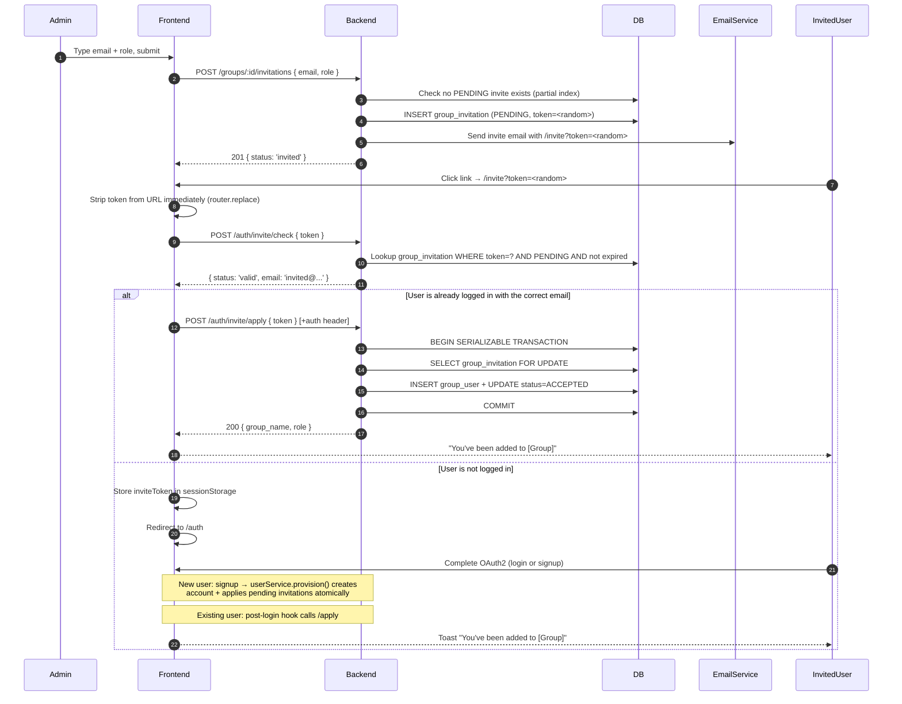

# Group Invitations – Design Specification

## Overview

Group admins can invite users who do not yet have portal accounts to join a group. The system sends an email with a signed invite link. When the recipient clicks the link, one of two paths follows:

- **New user:** routed through the standard OAuth2 signup flow. After the account is created, all pending invitations for that email are applied automatically — the user lands in the portal already a group member.
- **Existing user:** prompted to authenticate (or already logged in). The group membership is applied immediately.

**Collection access is not a separate invitation type.** The correct composition is: invite a user to a group (this flow), then issue a collection grant to that group (existing grant flow). Users admitted through an invitation inherit collection access through group membership automatically.



---

## Design Decisions

### Why an opaque random token — not a custom JWT?

Earlier designs used a JWT for the invite URL, reasoning that it was consistent with the existing token infrastructure and that the embedded email payload would survive the OAuth2 redirect without a second sessionStorage key.

That reasoning does not hold under scrutiny:

**JWTs provide no enforcement benefit here.** Both `/check` and `/apply` must hit the DB regardless — to confirm `status = PENDING`, check `expires_at`, verify group state, and apply membership. The cryptographic signature adds a round-trip of verify-then-lookup on top of a lookup that was always required.

**Email in the URL is an unnecessary exposure.** A JWT encodes its payload in base64; anyone who intercepts or copies the invite URL can read the invited email address without authentication. While the email is delivered in the recipient's inbox in plaintext anyway, having it also in the URL means it appears in browser history, server access logs, intermediary proxy logs, and referrer headers if the stripping mitigation fails or is misconfigured. These are independent exposure surfaces beyond the email delivery channel.

**A `/check` endpoint that returns the email removes the only meaningful JWT advantage.** If `/check` returns `{ email }` on a valid token, the frontend already has the invited email from the server without needing to decode any token. The JWT's "email in the payload" benefit becomes redundant.

**The correct design:**
- Generate `crypto.randomBytes(32).toString('base64url')` — 256 bits of entropy, 43 URL-safe characters
- Store the token in `group_invitation.token` (unique, indexed)
- The URL is `/invite?token=<43-char-opaque>` — no embedded data, no decodable payload
- `/check` validates the token against the DB and returns `{ status: 'valid', email }` — the email travels through the server-validated response, not encoded in the URL itself
- `/apply` does the email equality check purely server-side — no client-side token decoding anywhere in the flow

---

### Why only the token is stored — not the email too?

After the OAuth2 redirect, only `invite_token` remains in sessionStorage. Getting the invited email for the signup mismatch check requires a `/check` call to the server.

The trade-off: one extra network round-trip on the signup page in exchange for:

- One less piece of mutable client state that can get out of sync
- No assumption that an email cached before OAuth is still the right email to compare against after OAuth
- A simpler auth store with a single invite key to manage and clear

The round-trip is cheap: `/check` is a fast indexed DB lookup that is already called on the `/invite` page. Calling it again on the signup page costs one request but gives a server-validated answer rather than trusting a value cached minutes earlier in sessionStorage.

---

### Why detect the OAuth email mismatch on the frontend before signup submits?

OAuth providers let users choose which account to authenticate with at the OAuth screen. If an invite is sent to `institutional@university.edu` and the user accidentally authenticates with `personal@gmail.com`, the backend would create an account under the personal email, `applyPendingInvitations` would find no matching invite, and the user would land in the portal without group membership and no explanation. The invite would stay `PENDING` indefinitely.

The backend cannot prevent this: it only sees the email the OAuth provider returned. The frontend is the right detection point — it has the invited email from sessionStorage and the OAuth-returned email from the pending auth state. Detecting the mismatch before the signup form submits means:

1. No account is created for the wrong email
2. The user gets an actionable explanation with a clear path to retry
3. The `inviteToken` is preserved in sessionStorage so the invite is honoured on the correct retry

This is not a security bypass. The backend independently enforces `normalizeEmail(row.invited_email) === normalizeEmail(req.user.email)` on every `/apply` call regardless. The frontend check prevents the UX failure of a committed account creation that silently orphans the invite.

---

### Why centralize all user creation behind one service function?

The invariant "every new user account must have pending invitations applied" is currently encoded in the signup route and called out as a requirement for the admin create-user route. As the system grows, any path that creates a user record — import, recovery, provisioning, merge — must remember to also call `applyPendingInvitations`. This is a DRY failure point: the invariant lives in documentation and code review attention, not in code.

The fix is structural: introduce `userService.provision({ user_data, tx })`, which runs `createUser` and `applyPendingInvitations` in a single transaction. All user-creation paths call `provision`. The invariant cannot be forgotten because there is no separate `createUser` call that could omit the follow-up.

---

### Why status transition for single-use — not a nonce?

The nonce table was purpose-built to make the signup JWT single-use. For invitations, the `group_invitation` row already carries a full lifecycle (`PENDING → ACCEPTED / CANCELLED`). The `PENDING → ACCEPTED` transition inside a serializable DB transaction gives the same single-use guarantee without adding a new table. **The invitation row is the nonce.**

---

### Why wrap signup in a single transaction?

User creation and invitation application must be atomic. A committed user with no group membership is a valid state — but if user creation commits and invitation application then fails, the invite is permanently orphaned: subsequent signup attempts fail at the email uniqueness check, so `applyPendingInvitations` can never be retried through the signup path.

A single `prisma.$transaction` makes both operations succeed or both roll back. The user always retries from a clean state. This transaction is now encapsulated inside `userService.provision()` — see above.

---

### Why does `/check` return only `valid` or `invalid` — without a reason?

An earlier design returned granular reasons (`expired`, `already_accepted`, `cancelled`). The rationale was UX: tell the recipient why their invite is no longer valid.

The problem is that `/check` is an unauthenticated endpoint. The only guard against information leakage is that the caller must hold a valid invite token. But invite tokens appear in email, URL history, proxy logs, and potentially browser history if the on-mount stripping fails late. The bar for "attacker holds a valid token" is lower than it looks.

Returning `reason: 'already_accepted'` to an unauthenticated caller with a copy of the invite URL reveals that the intended recipient has signed up — inferring account existence and activity without authentication.

**The fix:** return only `{ status: 'valid' | 'invalid' }` from `/check`. Log the specific reason server-side at `info` level for debugging. Show a generic "This invitation is no longer valid — contact your group admin" in the UI for all invalid cases. The UX loss is minor; the information oracle is closed.

---

### Why sessionStorage — not localStorage or memory?

| Storage | Verdict | Reason |
|---------|---------|--------|
| In-memory (Pinia state) | ✗ | Lost on full-page navigation — cannot survive the OAuth2 redirect |
| `localStorage` | ✗ | Persists indefinitely across browser sessions; a token left by one user is visible to another user opening a new tab on a shared machine |
| `sessionStorage` | ✓ | Survives the OAuth2 redirect (same-tab navigation), cleared on tab close, never shared across tabs or sessions |

`sessionStorage` is the smallest sufficient scope for a within-tab OAuth redirect.

**Known limitation — cross-browser / cross-device OAuth:** `sessionStorage` is scoped to the tab. If a user opens the invite link in Chrome but completes OAuth in Safari (common on iOS with password managers that redirect to a different browser), the `invite_token` is not present in the new context. The result: the user is logged in (or signed up) but is not added to the group. This is not a security failure — it is a usability gap. The mitigation is the invite link itself: clicking it a second time in the correct browser starts from `/check` (still `valid`, still `PENDING`) and routes through the normal flow. This limitation should be surfaced in support documentation.

---

### Why clear the invite token only on a definitive outcome — not always?

An earlier design called `clearInviteData()` unconditionally after the post-login `/apply` call — success or failure. If `/apply` fails for a transient reason (network error, 5xx), the token is gone and the user has no automatic retry path. The invite appears to have silently disappeared.

The correct policy:

| `/apply` outcome | Action |
|----------------|--------|
| `200` success | Clear token + email; show "You've been added to [group]" toast |
| `403` email mismatch | Clear token + email; show "Invitation was for a different address" |
| `404` invite not found | Clear token + email; show "This invitation is no longer valid" |
| `409` group archived | Clear token + email; show "The group has been archived" |
| `5xx` / network error | **Retain** token + email; show "Failed to join group — tap here to retry" with retry button |

Retaining the token on transient errors means the retry button calls `/apply` again in the same browser tab session. The token does not persist across tab closes — the retry window is intentionally bounded to the session.

---

### Extensibility pre-accommodations

Two anticipated extensions are pre-accommodated without speculative code:

- **Bulk invitations:** `invitationService.createInvitation()` is a pure, composable function — bulk support is just iteration with no architectural change.
- **Invitation-only signup mode:** Disable the `signup` feature flag. The `loginHandler`'s `NOT_A_USER` path short-circuits to a "you need an invitation" response. No new code needed.

---

## Email Normalization

**Rule:** `validator.normalizeEmail(email)` from the [`validator`](https://github.com/validatorjs/validator.js) library.

This function is applied at every point where an email is stored or compared:
- Invite creation — before writing `invited_email` to the DB
- User creation — before writing `user.email` to the DB
- `/apply` — `normalizeEmail(row.invited_email) === normalizeEmail(req.user.email)`
- Frontend mismatch check — `normalizeEmail(auth.pendingUser.email) === normalizeEmail(inviteEmail)`

**What `validator.normalizeEmail` handles:**
- Lowercases the entire address
- For Gmail and Google Mail addresses: removes dots from the local part (`a.b@gmail.com` → `ab@gmail.com`), strips plus-tags (`user+tag@gmail.com` → `user@gmail.com`), and normalizes Google Mail aliases to `gmail.com`
- For all domains: lowercases the domain part

**What it does NOT handle:** institutional alias resolution (`jdoe@uni.edu` → `john.doe@uni.edu`) or provider-specific rules beyond Gmail. Non-Gmail plus-addressing (`user+tag@outlook.com`) is left as-is.

**Implication:** for Gmail users, dot-variants and plus-tags now match correctly — an admin can invite any Gmail variant and it will match the canonical address the OAuth provider returns. For other providers, an alias mismatch will not be automatically resolved. The user can always click the invite link a second time as an existing user to apply the invite via `/apply` directly.

**Frontend:** use the same `validator.normalizeEmail` via the browser-compatible build of `validator`. It is already a project dependency.

---

## Data Model

### `INVITATION_STATUS` enum

```prisma
enum INVITATION_STATUS {
  PENDING
  ACCEPTED
  CANCELLED
}
```

`EXPIRED` is not a status value. Expiry is a computed condition: `status = 'PENDING' AND expires_at < now()`. This keeps `expires_at` as the single source of truth — no cron job required, no consistency window between when a record logically expires and when a background job catches up.

### `group_invitation` table

```prisma
model group_invitation {
  id            String            @id @default(uuid())
  token         String            @unique @db.VarChar(43)  // 256-bit random base64url
  group_id      String
  invited_email String            @db.VarChar(254)         // stored normalized (trimmed, lowercase)
  role          GROUP_MEMBER_ROLE @default(MEMBER)
  invited_by    String            // user.subject_id of the inviting admin
  status        INVITATION_STATUS @default(PENDING)
  created_at    DateTime          @default(now()) @db.Timestamp(6)
  expires_at    DateTime          @db.Timestamp(6)
  accepted_at         DateTime?  @db.Timestamp(6)
  cancelled_at        DateTime?  @db.Timestamp(6)
  cancellation_reason String?    // e.g. 'group_archived', 'admin_cancelled'

  group   group @relation(fields: [group_id], references: [id], onDelete: Cascade)
  inviter user  @relation("invitations_sent", fields: [invited_by], references: [subject_id], onDelete: Restrict)

  @@index([group_id, status])
  @@index([invited_email, status])
}
```

The `token` field has a `@unique` index (Prisma-generated). No additional index is needed for `/check` and `/apply` lookups — `WHERE token = ?` resolves in O(1) via the unique index.

Add to the `user` model:
```prisma
invitations_sent group_invitation[] @relation("invitations_sent")
```

### Partial unique index

```sql
CREATE UNIQUE INDEX group_invitation_pending_unique
  ON group_invitation (group_id, invited_email)
  WHERE status = 'PENDING';
```

Enforces at most one active invite per `(group, email)` at the DB level, surviving race conditions at the application layer. Multiple `ACCEPTED` / `CANCELLED` rows for the same pair are permitted — they form the historical record.

### Invite token generation

```javascript
const { randomBytes } = require('node:crypto');

function generateInviteToken() {
  return randomBytes(32).toString('base64url'); // 43 chars, URL-safe, 256 bits of entropy
}
```

No signing key. No JWT library. Token validity is purely a DB lookup: if the row exists and is `PENDING` with `expires_at > now()`, the token is valid.

### Config additions

```json
// config/default.json
{
  "invitations": {
    "ttl_days": 7
  }
}
```

---

## API Reference

### Authorization

| Action | Authorized roles |
|--------|-----------------|
| Create invitation | Group admin, Platform admin |
| List invitations | Group admin, Platform admin |
| Cancel invitation | Group admin, Platform admin |
| Check invite token | Public (unauthenticated) |
| Apply invite token | Authenticated user (email must match invite) |

Add `invite` as a new capability in the group authorization config.

---

### `POST /groups/:id/invitations`

```json
// Request body
{ "email": "new-user@example.com", "role": "MEMBER" }
```

**Logic:**
1. Validate group exists and is not archived → `403` if archived
2. Normalize email: `normalizeEmail(body.email)`
3. Check if a user with this email is already a direct member → `400 Already a member`
4. Check for a `PENDING` invite for `(group_id, email)` → `200 { status: 'already_invited' }` (idempotent; no duplicate email sent)
5. Generate opaque token: `generateInviteToken()`
6. Create `group_invitation` row: `token`, `status: PENDING`, `expires_at = now + config.invitations.ttl_days`
7. Send invitation email (token in URL; see Email section)
8. Respond `201 { status: 'invited' }`

The endpoint intentionally does not reveal whether the invited email has an existing account — exposing this would allow group admins to enumerate portal users.

---

### `GET /groups/:id/invitations`

Returns invitations filtered by `status` query param (default: `PENDING`). Supports `limit` / `offset` pagination.

Response fields per row: `id`, `invited_email`, `role`, `status`, `created_at`, `expires_at`, `is_expired` (computed: `expires_at < now()`), `inviter.name`.

`is_expired` is computed by the API — the UI uses it to display an "Expired" badge. To query expired invitations, request `status=PENDING` and filter on `is_expired: true`.

---

### `DELETE /groups/:id/invitations/:inviteId`

Sets `status = CANCELLED`, `cancelled_at = now`. Only allowed if current status is `PENDING`.

The WHERE clause **must** include `group_id` to prevent an ID-based access issue — an admin of Group A must not be able to cancel Group B's invitations:

```javascript
await prisma.group_invitation.update({
  where: {
    id: inviteId,
    group_id: params.id, // ties inviteId to the authorized group
  },
  data: { status: 'CANCELLED', cancelled_at: new Date(), cancellation_reason: 'admin_cancelled' },
});
// Prisma throws RecordNotFound if the invitation doesn't belong to this group.
```

---

### `POST /auth/invite/check` — public

Validates the invite token without consuming it. The frontend calls this on mount of the `/invite` page to decide which path to show.

```json
// Request
{ "token": "<43-char-opaque-token>" }

// Valid response
{ "status": "valid", "email": "invited@example.com" }

// Invalid response
{ "status": "invalid" }
```

No `reason` field is returned to unauthenticated callers. The specific failure reason (`expired`, `already_accepted`, `cancelled`, `not_found`) is logged server-side at `info` level for diagnostics.

**Logic:**
1. Validate token is a non-empty string
2. Look up `group_invitation WHERE token = ? AND status = 'PENDING' AND expires_at > now()`
3. If not found: log reason, respond `{ status: 'invalid' }`
4. Do not check whether the email has an existing account (prevents account enumeration)
5. Respond `{ status: 'valid', email: row.invited_email }`

---

### `POST /auth/invite/apply` — authenticated

Applies the invitation to the authenticated user's account.

```json
// Request
{ "token": "<43-char-opaque-token>" }

// Success response
{ "group_name": "...", "role": "MEMBER" }
```

**Logic (inside a serializable transaction):**
1. Validate token is a non-empty string
2. `SELECT group_invitation WHERE token = ? AND status = 'PENDING' AND expires_at > now() FOR UPDATE`
3. If not found: respond `404`
4. Assert `normalizeEmail(row.invited_email) === normalizeEmail(req.user.email)` → `403 This invitation is for a different email address`
5. Check `group.is_archived` → if archived, mark `CANCELLED` with `reason: 'group_archived'`, respond `409 The group has been archived since this invitation was sent`
6. Check user is not already a direct member → if already a member, mark `ACCEPTED`, respond `200` (idempotent)
7. Add user to `group_user` with the invited `role`
8. Update `group_invitation` → `status = ACCEPTED`, `accepted_at = now()`
9. Respond `200 { group_name, role }`

The `SELECT FOR UPDATE` in step 2 serializes concurrent requests on the same token — see [Security Analysis](#security-analysis).

---

### User provisioning — `userService.provision()`

All paths that create a user account call `userService.provision()`. This is the single place where the "create user + apply invitations" invariant is encoded:

```javascript
// userService.provision({ user_data, tx? })
async function provision({ user_data, tx: outerTx }) {
  const run = async (tx) => {
    const user = await createUser(user_data, tx);
    await invitationService.applyPendingInvitations({
      email: user.email,
      user_subject_id: user.subject_id,
      tx,
    });
    return user;
  };

  // If an outer transaction is already open (e.g. from signup route), join it.
  // Otherwise open a new one.
  return outerTx ? run(outerTx) : prisma.$transaction(run);
}
```

**Callers:**
- `POST /auth/signup` — passes its own `prisma.$transaction` context
- Admin user-creation endpoint — calls `provision` directly (creates its own transaction)
- Any future import / recovery / provisioning path — must call `provision`, not `createUser` directly

The function is intentionally not exported alongside `createUser` to make the "right path" obvious: if you are writing code that creates a portal user, you call `provision`.

#### Failure taxonomy inside `applyPendingInvitations`

**Category A — Runtime errors** (DB failure, deadlock, unexpected exception)

Propagate up and roll back both user creation and all invitation applications. The user sees a `500` and retries from scratch. Because no user row was committed, the next attempt is identical.

**Category B — Stale data errors** (caught per-invitation; do not abort the outer transaction)

| Condition | Handling |
|-----------|---------|
| Group archived after invite was created | Skip; mark `CANCELLED` with `reason: 'group_archived'`; continue with remaining invites |
| Group deleted after invite was created | `group_invitation` row CASCADE deleted — no row found, no-op |
| User somehow already a member (defensive) | Treat as idempotent success; mark `ACCEPTED` |
| Multiple invites, one is stale | Per-invite isolation — remaining invites still apply |

Signup succeeds regardless of Category B failures. The `cancellation_reason` field gives admins an audit trail for why an invite was not honoured.

---

## Frontend Flow

### `/invite` page

Route: `ui/src/pages/auth/invite.vue` — `requiresAuth: false`

```
/invite?token=<43-char-opaque-token>
```

**On mount:**

1. Extract `token` from `route.query.token`
2. **Immediately** call `router.replace({ query: {} })` to strip the token from the URL — before any sub-resource request fires. This removes the token from the browser's active history entry and prevents it appearing in referrer headers sent to third-party resources the page loads (analytics, CDN fonts, etc.).
3. Call `POST /auth/invite/check { token }`.

**If `/check` returns `invalid`:** Show "This invitation is no longer valid — please contact your group admin" with a link to `/auth`. No specific reason is shown to the user.

**If `/check` returns `valid`:**

| Logged-in state | Action |
|----------------|--------|
| Logged in; `normalizeEmail(auth.user.email) === normalizeEmail(check.email)` | Call `POST /auth/invite/apply { token }` → show "You've been added to [group]" → redirect to group page |
| Logged in; emails don't match | Show **"This invitation was sent to a different email address"** — do not reveal which email (the logged-in user is not the intended recipient) |
| Not logged in | Store `inviteToken` in sessionStorage; redirect to `/auth` |

When not logged in, the frontend always redirects to `/auth` — checking whether the user has an account would require account enumeration. The `loginHandler` handles both cases: existing users receive an auth JWT; new users receive a signup JWT and are routed to `/auth/signup`.

---

### Auth store additions

```javascript
// sessionStorage: survives same-tab OAuth2 redirects,
// cleared on tab close, never shared across tabs or sessions.
const inviteToken = ref(useSessionStorage("invite_token", ""));

function clearInviteData() {
  inviteToken.value = "";
}
```

---

### Post-login invite application

In `withHandledVerifyResponse`, after a successful `SUCCESS` login response, if `inviteToken.value` is set:

```javascript
try {
  const res = await applyInvite({ token: inviteToken.value });
  showToast(`You've been added to ${res.group_name}`);
  clearInviteData();
} catch (err) {
  if ([403, 404, 409].includes(err.response?.status)) {
    // Definitive rejection — token is no longer usable
    showToast(errorMessageFor(err.response.status), { type: 'error' });
    clearInviteData();
  } else {
    // Transient failure — retain token so the user can retry
    showToast('Failed to join group — tap here to retry', {
      type: 'warning',
      action: () => applyInviteAndClear(),
    });
    // inviteToken is NOT cleared
  }
}
```

Clearing on transient errors would silently orphan the invite from the user's perspective. Retaining the token bounds the retry window to the current tab session.

---

### Signup — OAuth email mismatch detection

After OAuth returns the pending user's email (`auth.pendingUser.email`), if `inviteToken` is set, the signup page detects a mismatch before form submission:

```javascript
const oauthEmail = normalizeEmail(auth.pendingUser?.email);
// Re-fetch from /check — one round-trip, but avoids a second sessionStorage key
// and gives a server-validated email rather than a value cached before OAuth.
const { email: rawInviteEmail } = await checkInvite({ token: auth.inviteToken });
const inviteEmail = normalizeEmail(rawInviteEmail);

if (inviteEmail && oauthEmail && oauthEmail !== inviteEmail) {
  showMismatchDialog = true;
}
```

**Mismatch dialog:**
> "The account you signed in with (`personal@gmail.com`) doesn't match the email this invitation was sent to (`institutional@university.edu`). To join the group automatically, go back and sign in with the correct account."

Two choices:

- **Go back and try again** — clears the pending OAuth state, redirects to `/auth` to reauthenticate. `inviteToken` is retained in sessionStorage so the invite is honoured on the correct retry.
- **Continue to portal without joining the group** — clears `inviteToken`, proceeds with account creation. The invitation stays `PENDING`; the group admin can see it is still outstanding in the invitations list.

If emails match, the form submits normally. `userService.provision()` applies the invite atomically as part of account creation.

---

## Email

### Template

**Subject:** `You've been invited to join [Group Name] on [App Name]`

**Body (plain text + HTML):**
```
[Inviter Name] has invited you to join "[Group Name]" as a [Member / Admin].

Click the link below to accept the invitation:

  Accept Invitation →  https://app.example.com/invite?token=<opaque-token>

This link expires in 7 days. If you did not expect this invitation, you can safely ignore this email.
```

All user-supplied values (group name, inviter name) must be HTML-escaped in the HTML version of the email body — a malicious group admin could otherwise inject HTML and mislead recipients about where the invite link points. Use a template engine that auto-escapes (e.g. Handlebars) or explicit `he.encode()` calls.

### Email service

New file: `api/src/services/email.js` — thin wrapper over `nodemailer`.

- `sendEmail({ to, subject, html, text })` — single reusable function
- Transport configured from `config.email` (SMTP host/port/auth)
- If `email.enabled` is `false`: log email content to stdout and resolve without error (dev-friendly)
- On send failure in production: log the error, resolve without throwing — the invite record is already committed; the admin can resend

### Config

```json
// config/default.json
{
  "invitations": {
    "ttl_days": 7
  },
  "email": {
    "enabled": false,
    "from": "noreply@bioloop.example.com",
    "smtp": {
      "host": "",
      "port": 587,
      "secure": false,
      "auth": { "user": "", "pass": "" }
    }
  }
}
```

```json
// config/custom-environment-variables.json
{
  "email": {
    "enabled": "EMAIL_ENABLED",
    "from": "EMAIL_FROM",
    "smtp": {
      "host": "EMAIL_SMTP_HOST",
      "port": "EMAIL_SMTP_PORT",
      "auth": { "user": "EMAIL_SMTP_USER", "pass": "EMAIL_SMTP_PASS" }
    }
  }
}
```

---

## Security Analysis

### Mitigations summary

| Threat | Mitigation |
|--------|-----------|
| **Token forgery** | 256-bit random token — computationally infeasible to guess; no signature required because the token is not self-contained |
| **Token replay / double-accept** | `PENDING → ACCEPTED` transition inside a serializable transaction with `SELECT FOR UPDATE`; second request finds token no longer `PENDING` |
| **Email mismatch / impersonation** | `/apply` asserts `normalizeEmail(row.invited_email) === normalizeEmail(req.user.email)` server-side. For new sign-up flows: frontend detects mismatch before form submission using server-provided `inviteEmail` from sessionStorage |
| **Account enumeration by group admin** | Invite creation always returns the same response regardless of whether the email has an existing account |
| **Expired invite** | `expires_at > NOW()` enforced in both `/check` and `/apply`; expiry is a computed condition — no cron or separate status value required |
| **Privilege escalation via invite role** | Role field validated server-side; only `MEMBER` or `ADMIN` accepted; only group/platform admins can create invitations |
| **Invite to archived group** | `POST /groups/:id/invitations` rejects at creation; `/apply` cancels with `reason: 'group_archived'` and returns `409` |
| **ID-based access issue on invitation cancel** | `DELETE` WHERE clause includes both `id` and `group_id` — Prisma throws `RecordNotFound` if the invite doesn't belong to the authorized group |
| **Duplicate memberships** | `group_user` PK `(group_id, user_id)` — DB constraint enforces at write layer |
| **Duplicate PENDING invites** | Partial unique index on `(group_id, invited_email) WHERE status = 'PENDING'` — DB-enforced, race-safe |
| **Email header injection** | nodemailer's structured API — no raw header string interpolation |
| **HTML injection in email body** | All user-supplied values (group name, inviter name) HTML-escaped before template rendering |
| **Token in URL: browser history** | `/invite` page strips `?token=` immediately on mount via `router.replace({ query: {} })` before any sub-resource fires |
| **Token in URL: referrer leakage** | `Referrer-Policy: no-referrer` set at the nginx `/invite` location block |
| **Token state oracle via `/check`** | `/check` returns only `valid` / `invalid` — no reason field exposed to unauthenticated callers; reason logged server-side |
| **Email normalization inconsistency** | `normalizeEmail()` applied at every write and comparison point — one function, enforced by `userService.provision()` and invite service |

---

### Wrong user clicks the invite link

The invited email is stored in the DB row, not in the token. The server enforces the match; no trust is placed in client-side state.

| Scenario | What happens |
|----------|-------------|
| Not logged in, wrong person | They complete OAuth → logged in as themselves → `/apply` asserts email match → `403` |
| Already logged in as someone else | Frontend compares `auth.user.email` to `check.email` (case-insensitive) → shows "This invitation was sent to a different email address" — does not reveal which email — no `/apply` call made |
| Link intentionally forwarded to a colleague | Colleague authenticates as themselves via OAuth; `/apply` → `403` email mismatch |

The error message for a wrong logged-in user does not display the invited email. The opaque token reveals nothing decodable — there is no `jwtDecode` equivalent on the client side.

---

### Concurrent accepts

If the recipient opens the invite link in multiple tabs simultaneously:

1. All tabs call `POST /auth/invite/apply` with the same token
2. `SELECT FOR UPDATE` inside the serializable transaction serializes the requests
3. **First request:** finds `status = PENDING`, adds to `group_user`, transitions to `ACCEPTED`, commits
4. **Subsequent requests:** find the row is no longer `PENDING` → treated as idempotent (user already a member) → return `200`
5. All tabs show "You've been added to [group]" — no error, no inconsistency

No duplicate `group_user` row is possible: the DB PK `(group_id, user_id)` enforces this at the write layer regardless.

---

### Email mutability

The `/apply` email equality check holds only if user email addresses are immutable after account creation.

If email change is ever implemented:
- PENDING invitations for the old address become unable to be applied — correct, since the invite was issued to that identity
- Those invitations should be explicitly `CANCELLED` on email change to keep the admin list accurate and avoid orphaned `PENDING` records

**Note for the future:** any email-change feature must cancel PENDING group invitations for the old address as part of the change transaction.

---

## Out of Scope

| Feature | Rationale |
|---------|-----------|
| **Resend invitation** | Straightforward follow-up: cancel + re-create with the same email |
| **Bulk / CSV invitations** | `createInvitation` is composable; implementation is iteration with no architectural change |
| **Collection access via invitation** | Not a separate invitation type. Invite to a group (this flow), grant the group access to the collection (existing grant flow). Group members inherit collection access automatically. |
| **Invitation-only signup mode** | Disable `signup` feature flag; `loginHandler`'s `NOT_A_USER` path short-circuits — no code changes needed |
| **Invitation audit trail** | Extend `authorization_audit` with `INVITE_SENT`, `INVITE_ACCEPTED`, `INVITE_CANCELLED` event types |
| **Platform admin invitation dashboard** | Add `/admin/invitations` endpoint for a cross-group view |
| **Provider-specific email canonicalization** | Gmail dot-insensitivity and plus-address stripping handled by `validator.normalizeEmail`. Non-Gmail aliases and institutional alias resolution are out of scope — documented as a known mismatch edge case |

---

## Implementation Checklist

### Backend

- [ ] **DB migration:** `INVITATION_STATUS` enum (`PENDING`, `ACCEPTED`, `CANCELLED`), `group_invitation` table with `token varchar(43) UNIQUE`, partial unique index on `(group_id, invited_email) WHERE status = 'PENDING'`, `invitations_sent` relation on `user` model
- [ ] **`api/src/utils/email.js`:** `normalizeEmail(email)` wrapping `validator.normalizeEmail()`; import and use everywhere an email is stored or compared
- [ ] **`api/src/services/invitations.js`:** `generateInviteToken()`, `createInvitation`, `applyPendingInvitations`, `cancelInvitation`
- [ ] **`api/src/services/email.js`:** `sendEmail` (nodemailer, config-driven, dev console fallback)
- [ ] **`api/src/services/users.js`:** `provision({ user_data, tx? })` — `createUser` + `applyPendingInvitations` in one transaction; retire direct `createUser` calls from all user-creation paths
- [ ] **`api/src/routes/groups.js`:** `POST /:id/invitations`, `GET /:id/invitations`, `DELETE /:id/invitations/:inviteId` (with `group_id` in WHERE clause)
- [ ] **`api/src/routes/auth/invite.js`:** `POST /check` (returns `valid`/`invalid` only; logs reason server-side), `POST /apply`
- [ ] **`api/src/routes/auth/index.js`:** Mount invite router
- [ ] **`api/src/routes/auth/signup.js`:** Replace `createUser` call with `userService.provision()`
- [ ] **Admin user-creation endpoint:** Replace `createUser` call with `userService.provision()`
- [ ] **`api/config/default.json`:** `invitations.*` and `email.*` config blocks
- [ ] **`api/config/custom-environment-variables.json`:** `EMAIL_*` env var mappings
- [ ] **Authorization config:** Add `invite` capability to group authorization rules
- [ ] **Email HTML escaping:** Escape group name and inviter name in HTML email template
- [ ] *(No expiry cron needed — expiry is computed from `expires_at` at query time)*

### Frontend

- [ ] **`ui/src/utils/email.js`:** `normalizeEmail(email)` wrapping `validator.normalizeEmail()`; `validator` is already a project dependency
- [ ] **`ui/src/pages/auth/invite.vue`:** New route (`requiresAuth: false`); strip `?token=` immediately on mount; call `/check`; store `inviteToken` in sessionStorage if not logged in; handle valid/invalid states
- [ ] **`ui/src/stores/auth.js`:** `inviteToken` (sessionStorage-backed), `clearInviteData`; post-login `/apply` hook in `withHandledVerifyResponse` with selective token clearing (retain on transient errors)
- [ ] **`ui/src/pages/auth/signup.vue`:** On mount, if `inviteToken` set, call `/check` to get `inviteEmail`, compare `normalizeEmail(auth.pendingUser.email)` to `normalizeEmail(inviteEmail)`; show blocking mismatch dialog on mismatch with "go back" (preserve token) and "continue without invitation" (clear token) options
- [ ] **`ui/src/services/v2/groups.js`:** `createInvitation`, `listInvitations`, `cancelInvitation`
- [ ] **`ui/src/services/auth.js`:** `checkInvite`, `applyInvite`
- [ ] **`ui/src/components/v2/groups/AddGroupMemberModal.vue`:** "Invite by email" section shown when user search returns no results
- [ ] **`ui/src/components/v2/groups/GroupInvitationsTab.vue`:** Pending invitations table with cancel action and `is_expired` badge (group admins only)
- [ ] **Nginx config:** `Referrer-Policy: no-referrer` on the `/invite` location block
- [ ] **Router:** Register `/invite` with `requiresAuth: false`
- [ ] **Support docs:** Document cross-browser / cross-device sessionStorage limitation and the "click the link again" recovery path
