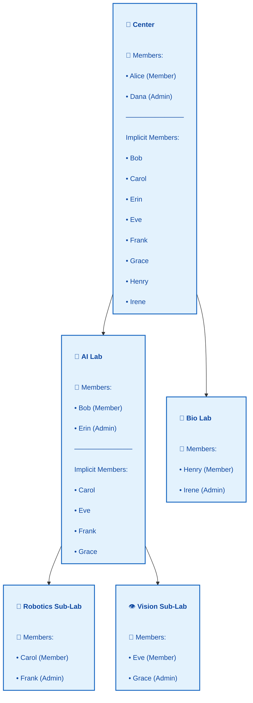
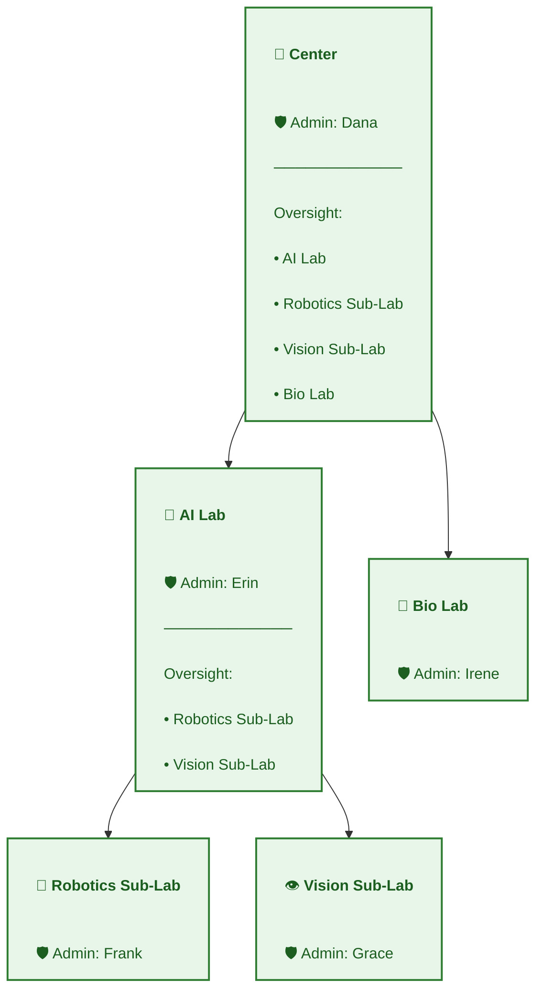
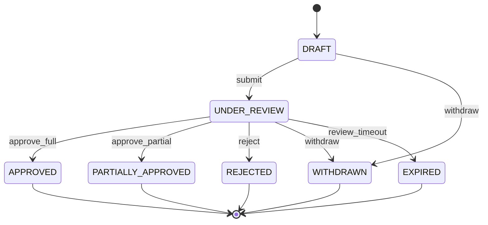
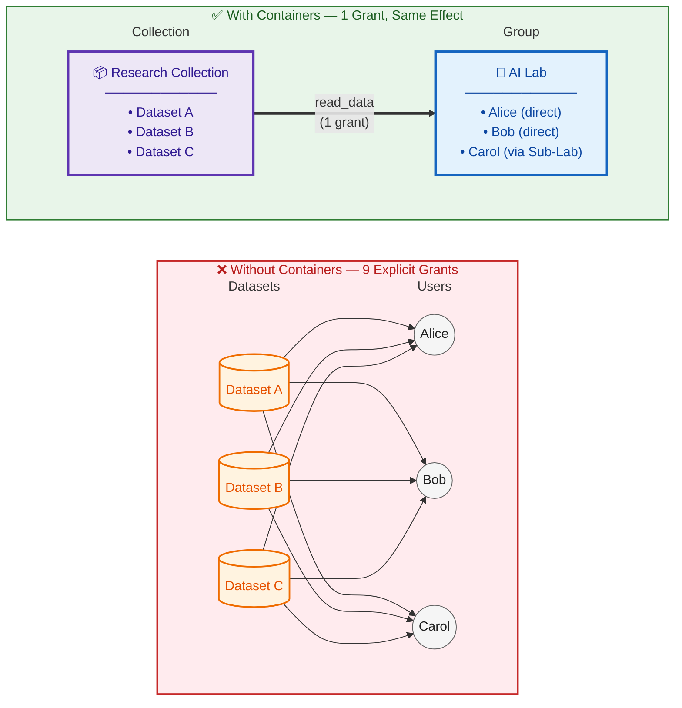
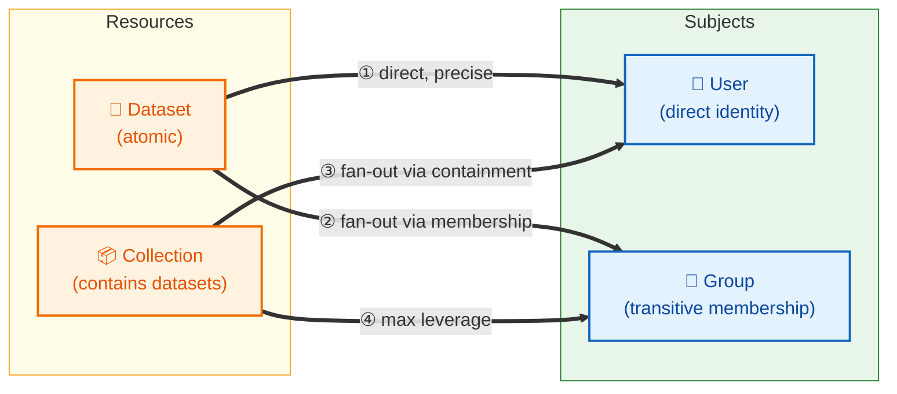
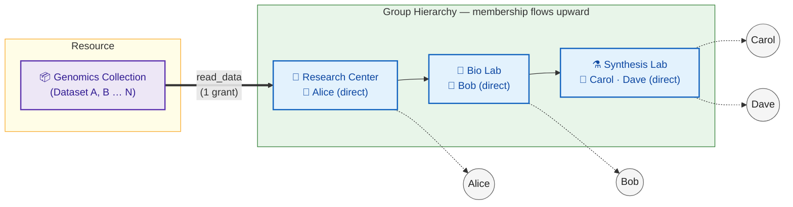

# Hierarchical Groups, Collections, and Data Access – Unified Design

## Purpose and Scope

This document defines a **foundational, future‑proof design** for hierarchical groups, dataset ownership, collections, and access control in a university or research‑group data management portal.

## Core Concepts

### Subjects

* **User** – authenticated human or service identity
* **Group** – container for users and administrative authority

Users may belong to multiple groups simultaneously.

---

### Resources

* **Dataset** – atomic unit of data access
* **Collection** – container for datasets, used for scalable access management

Datasets may belong to zero or more collections.

---

### Ownership vs Access

Ownership and access are **intentionally distinct**:

* **Ownership** defines *authority*
* **Access** defines *permission to act*

Every dataset and collection has exactly one **owning group**.

---

## Hierarchical Groups

### Group Hierarchy

Groups may be nested arbitrarily:

* Center → Core
* Center → Lab → Sub‑Lab

Hierarchy semantics:

* Membership is **transitive upward**
* Administrative authority is **local only**
* Oversight visibility is **transitive downward**

* If G1 is a parent of G2, then:

  * All members of G2 are also members of G1
  * Admins of G1 have **oversight visibility** over G2 (read-only governance observability)
  * Admins of G1 do **NOT** have governance authority over G2

* If an access grant targets Group G, then: All users who are members of G or its descendant groups receive the grant.

#### Critical Distinction: Organizational Hierarchy vs Governance Authority

* Hierarchy determines membership propagation and oversight visibility
* Ownership determines governance control
* Governance authority never derives from hierarchy alone

This separation ensures that organizational restructuring (reparenting) does not accidentally shift data governance authority.

#### Membership Transitivity Example


#### Oversight Transitivity Example


---

### Closure Table

To support transitive queries efficiently, group ancestry is materialized using a **closure table**.

**GroupClosure**

* ancestorGroupId
* descendantGroupId
* depth

Invariant:

* Every group has a self‑row with depth = 0

Hierarchy writes are rare; authorization reads are constant‑time and indexed.

### Oversight Visibility

**Oversight** is a derived, read-only governance capability.

#### Definition

A user has `oversight_view` over Group G if:

* User is admin of any ancestor of G (via closure table)

#### What Oversight Allows (Read-Only)

* View group metadata
* View descendant groups
* View datasets owned by descendant groups
* View grants on those datasets
* View membership of descendant groups
* Run audit reports

#### What Oversight Does NOT Allow

* Grant access
* Revoke access
* Edit dataset metadata
* Transfer ownership
* Edit collection membership
* Modify group membership
* Change visibility presets

Oversight provides **read-only governance observability**, not delegated control.

#### Reparenting Safety

When a group is reparented:

* Old ancestor admins lose oversight visibility
* New ancestor admins gain oversight visibility
* **No governance authority changes**
* **No dataset grant authority changes**

This ensures organizational restructuring does not accidentally shift data control.

### Archiving Groups

#### Archiving Philosophy

Archiving is **not deletion**. It represents a governance boundary that is organizationally closed but structurally and historically persistent.

Deletion would:
* Break auditability
* Orphan datasets
* Invalidate historical grant provenance
* Destroy explainability of past decisions

Archiving corresponds to institutional reality:
* A lab shutting down
* A grant expiring
* A project being formally closed
* A core being reorganized

But closure does not mean erasure.

#### What Archiving Preserves

When a group is archived:

* **Ownership remains intact**
  * Datasets owned by the archived group remain owned by it
  * No implicit ownership transfer occurs
  * If ownership transfer is desired, it must be performed explicitly via the dual-consent model
  * This preserves the invariant: authority changes require explicit action

* **Grants remain valid**
  * Grants granted **to** the group (giving access to group members) remain active
  * Grants granted **by** the group (created under its governance authority) remain valid
  * Dataset consumption grants remain active unless separately revoked or expired
  * Archiving is structural; it does not retroactively mutate access

* **Membership remains frozen**
  * Existing membership is preserved
  * No new members may be added
  * No members may be removed
  * This prevents silent access mutations that would violate auditability
  * If institutional policy requires explicit membership revocation, that must be performed separately

* **Hierarchy relationships remain intact**
  * Parent-child relationships persist
  * Ancestor admins retain oversight visibility over archived group
  * Reparenting of archived groups is disallowed (see prohibitions below)

#### What Archiving Prohibits

When `group.is_archived = true`, the following actions are disallowed:

**Membership and Admin Mutations:**
* Add new members
* Remove members
* Add new admins
* Modify admin list

**Governance Authority:**
* Create new grants for resources owned by the group
* Revoke existing grants (except via platform admin for incident response)
* Transfer ownership of datasets from the group (except via platform admin override)
* Create new datasets owned by the group
* Edit group metadata (except for archival notes or administrative timestamps)

**Structural Mutations:**
* Reparent the group
* Modify parent-child relationships
* Dataset creation with an archived group as owner must be rejected. Reason: Archive signals governance boundary closure. Allowing new assets under it defeats the lifecycle signal.
* Create new collections owned by the group / delete existing collections owned by the group
* Modify collection membership (add/remove datasets from collections owned by the group)


#### Permitted Actions on Archived Groups

For clarity, these actions **are** allowed:
* View metadata
* View members
* Oversight visibility (ancestor admins over archived descendants)
* Evaluate existing grants
* Run audit reports and explain historical access decisions
* Platform admin incident response (all actions, with audit trail)

#### Reversibility: Unarchiving

Archiving is reversible via explicit unarchive action:

```
Allow group.unarchive IF:
  user is platform_admin

```

Unarchiving requires platform admin authority because:
* It reactivates governance authority
* It re-enables dataset creation and grant authority
* It is a high-impact structural change

Each unarchive event must emit an audit record with full provenance.


---

### System Principal: "Everyone"

#### Definition

A built-in, non-editable principal representing all authenticated users.

Characteristics:

* Not a real group in the hierarchy.
* Cannot have admins.
* Cannot contain sub-groups.
* Exists solely as a grant target.

#### Purpose

Enables explicit representation of global access.

Example:

* Public dataset → Grant(read_data) to Everyone.
* Discoverable dataset → Grant(view_metadata) to Everyone.

#### Why This Matters

This preserves a single source of truth:

Access exists only if a grant exists.

Even “public” access is now durable, auditable, and revocable.

---

## Collections

Collections are **first‑class authorization containers**, symmetric to groups.

* Groups contain users
* Collections contain datasets

Collections exist to:

* Avoid dataset‑by‑dataset grants
* Enable coherent access review
* Support large‑scale governance


### Collection Membership Control

Collections **are** authorization containers.

Adding or removing a dataset from a collection is not a casual metadata edit—it is a **high‑impact authorization operation** that changes effective access for all subjects with grants to that collection.

Therefore:

* Adding a dataset to a collection requires the same authority as granting direct access to that dataset
* Only users with admin authority over the dataset's owning group may modify collection membership
* Collection edits emit audit events with full provenance (actor, authority, affected grants)
* Effective access changes are traceable to specific collection membership changes

Invariant:

* Collection membership mutations are subject to the same authorization and auditing standards as grant creation.
* No group may indirectly grant access to data it does not own.

This ensures that collections remain **explainable authorization primitives**, not implicit side channels.


```
ALLOW collection.addDataset IF:

U ∈ (collection.ownerGroup)
AND dataset.ownerGroup == collection.ownerGroup
```

```
ALLOW collection.removeDataset IF:

U ∈ (collection.ownerGroup)
AND dataset.ownerGroup == collection.ownerGroup
```


---

## Grants: The Core Authorization Primitive

### Grant Definition

A **Grant** is a durable, auditable fact that confers access.

**Grant**

* id
* subjectType (User | Group)
* subjectId
* resourceType (Dataset | Collection)
* resourceId
* accessType (read, compute, download, admin, etc.)
* grantedBy (actor identity)
* grantedViaGroup (authority)
* validFrom
* validUntil (nullable)
* status (active | revoked | expired)

Grants are **never deleted**.

---

### Why Grants Are Foundational

All non‑trivial use cases depend on grants:

* Revocation
* Expiration
* Access explanation
* Auditing
* Delegation
* Approval workflows

Implicit permissions are explicitly forbidden.

---

### Grants are atomic

If a data steward want to give a subject read and download access, two separate grants must be created:
1. Grant(subject, resource, read)
2. Grant(subject, resource, download)

`download` access type does not imply `read`. All access types are treated as orthogonal and must be explicitly granted. Even though `download` logically requires `read`, the system does not infer this. Each grant is a single, atomic fact.

Reasoning:
* Each grant is a single, atomic fact that can be audited, explained, and revoked independently.
* This avoids combinatorial explosion of access types and simplifies policy logic.


### Critical Constraint: No Overlapping Grants

For the same
`(subject_type, subject_id, resource_type, resource_id, access_type_id)` tuple,
there must never exist two non-revoked grants whose validity intervals overlap.

Historical multiplicity is allowed, but Concurrent multiplicity: forbidden.

This invariant prevents:
- Conflicting grants (e.g., two active grants with different `grantedBy` or `grantedViaGroup`)
- Ambiguous access explanations (which grant is the source of access?)
- Multiple audit trails for the same effective permission
- Complex revocation semantics (revoking one grant should revoke the permission, not leave another active grant in place)

Having this invariant helps with:
- Deterministic explainability
- Simple revocation logic
- Idempotent preset application
- Clean mental model: one grant = one permission fact.

### Critical Constraint: Grants Are Only For Consumption Actions

Grants represent **consumption rights**, not **governance authority**.

**Consumption Actions** (Grant-Based):

* `dataset.view_metadata`
* `dataset.view_sensitive_metadata`
* `dataset.read_data`
* `dataset.download`
* `dataset.compute`
* `collection.view_metadata`
* `collection.request_access`

These actions:

* Change who can use data
* Are revocable
* Are delegatable
* Are frequently modified
* Require explicit audit trails

**Governance Actions** (Structure-Based, NOT Grant-Based):

* `dataset.edit`
* `dataset.admin`
* `dataset.transfer_ownership`
* `dataset.grant_access`
* `dataset.revoke_access`
* `collection.edit`
* `collection.manage_membership`

These actions:

* Change who controls access
* Derive from ownership + group admin role
* Are enforced via ABAC rules
* Follow organizational hierarchy
* Require **no grant rows**

**Invariant**:

> Ownership defines *who may control access*.
>
> Grants define *who may consume data*.

This separation prevents:

* Circular administrative authority
* Cross-group governance complexity
* Blurred ownership boundaries
* Administrative authority existing outside organizational structure

**Why Keep Admin Actions Outside Grants**:

1. Governance topology must align with organizational structure
2. Administrative delegation would explode complexity
3. Ownership-based authority is deterministic and auditable
4. No risk of orphaned administrative grants after org changes

---

### Grant Presets

The system's grant model is deliberately atomic: each access type requires an explicit grant, and even logically related capabilities (like `read_data` and `download`) must be granted separately. While this atomicity provides precise control and clear audit trails, it imposes cognitive overhead on data stewards who simply want to make a dataset "public" or "downloadable by my lab."

**Grant presets** bridge this gap by mapping familiar governance concepts to the underlying grant primitives. They allow administrators and users to reason about access using natural, domain-appropriate terminology rather than understanding the technical mechanics of grant atomicity and composition.

#### Why Presets?

Presets exist to:

* **Reduce Cognitive Load**: Data stewards think in terms of "make this discoverable" or "share with my institution," not "grant `view_metadata` access type to subject X."
* **Encode Policy Patterns**: Common access patterns (public datasets, lab-internal data, institutional resources) can be captured as reusable templates.
* **Ensure Consistency**: Presets prevent inconsistent grant combinations (e.g., granting `download` without `read_data`) by encoding correct patterns.
* **Simplify UI/UX**: User interfaces can present governance options as familiar concepts rather than exposing raw grant mechanics.
* **Maintain Auditability**: Presets expand into explicit atomic grants, preserving full audit trails and explainability.

#### Grant Access Presets

Grant access presets define **what actions** a subject may perform. Each preset expands into one or more atomic grants with specific access types.

Examples (illustrative, not prescriptive):

* **`DISCOVERABLE`**: Grants `view_metadata` only. Dataset appears in search results and listings, but data remains inaccessible.
* **`VIEWABLE`**: Grants `view_metadata` and `view_sensitive_metadata`. Full metadata visibility without data access.
* **`READABLE`**: Grants `view_metadata` and `read_data`. Enables in-browser data viewing or API access.
* **`DOWNLOADABLE`**: Grants `view_metadata`, `read_data`, and `download`. Full consumption rights including local copies.
* **`COMPUTABLE`**: Grants `view_metadata` and `compute`. Data may be used in computational workflows but not directly accessed.

Each preset name reflects the **highest-level capability** it enables, with subordinate grants applied automatically.

#### Visibility Presets

Visibility presets define **who** receives access. Rather than specifying individual users or groups, stewards can reference common organizational boundaries.

Examples (illustrative, not prescriptive):

* **`EVERYONE`**: Targets the system-wide "Everyone" principal. Represents public access for any authenticated user.
* **`OWNING_GROUP`**: Targets the resource's owning group. Provides lab-internal or team-private access.
* **`INSTITUTION`**: Targets the root group in the organizational hierarchy. Represents university-wide or organization-wide access.
* **`PARENT_GROUP`**: Targets the immediate parent of the owning group in the hierarchy. Useful for center-level sharing.

Visibility presets resolve to specific subjects based on the resource's position in the group topology.

#### Composite Presets

Presets may be composed for common workflows. For example:

* **`OWNING_GROUP:DOWNLOADABLE`**: Applies `DOWNLOADABLE` access to the `OWNING_GROUP`. Creates grants for `view_metadata`, `read_data`, and `download` targeting the owning group and its descendants.
* **`INSTITUTION:DISCOVERABLE`**: Applies `DISCOVERABLE` access to `INSTITUTION`. Makes dataset searchable across the entire organization.
* **`EVERYONE:READABLE`**: Public dataset with in-browser viewing but no download rights.

When a composite preset is applied:

1. Visibility preset resolves to target subject(s)
2. Access preset expands into atomic access types
3. Individual grants are created with full provenance (preset name recorded in metadata)
4. Audit trail shows: "Preset `OWNING_GROUP:DOWNLOADABLE` applied → created grants X, Y, Z"

#### Extensibility

Preset definitions are configuration, not code. Organizations may define custom presets reflecting their governance policies:

* **`COLLABORATORS_ONLY`**: Grant to specific external collaboration groups
* **`TRAINING_REQUIRED`**: Grants conditional on training completion
* **`EMBARGO_UNTIL`**: Grants with future `validFrom` dates

Each preset definition specifies:
* Name and description
* Access types included
* Subject resolution logic
* Expiration policy (if applicable)
* Required preconditions (training, DUA, etc.)

#### Relationship to Core Model

Presets are a **convenience layer**—they do not change authorization semantics:

* Presets always expand into atomic grants
* Authorization evaluation ignores preset provenance
* Access explanations reference the underlying grants
* Revocation operates on individual grants, not presets
* Preset application is idempotent (reapplying creates no duplicate grants)

This ensures that even as preset definitions evolve, the authorization model remains stable and explainable.


--- 

## Access Requests Workflow



---

## Authorization Model

### Foundational Invariants

#### Zero-Default Access for Non-Privileged Users

Access to any resource requires explicit authority:

**Access is granted IF and ONLY IF:**

* User is platform admin, OR
* User is admin of the resource's owning group, OR
* User has oversight authority over the resource's owning group, OR
* User has an active grant for the requested access type

**Corollary: Resource existence is access-controlled.**

A user with no grants and no structural authority cannot:
* See a resource in listings
* Resolve a resource by ID or slug
* Know the resource exists

This must be enforced at the query layer—not as a UI concern.

#### Grant Transitivity Through Group Hierarchy

When a grant targets group G, it applies to:
* All direct members of G
* All members of descendant groups of G (transitively)

**This is not a special rule—it is a direct consequence of transitive membership.**

If members of G2 are transitively members of G1, then grants targeting G1 naturally include G2 members.

**Design principle:** Group topology defines access topology.

If access should not extend to descendant groups, grant to the specific leaf group rather than a parent. The closure table exists to support this—organizational structure determines access boundaries.

### Authorization Paths: Consumption vs Governance

The authorization model has two distinct evaluation paths:

#### A. Consumption Actions (Data Access)

Evaluation order:

1. Platform overrides (incident freeze)
2. Ownership membership (subject is member of owning group or ancestor)
3. Explicit active grants to dataset
4. Explicit active grants to collection containing dataset
5. Deny

**Example**: `dataset.read_data`

Allowed if **any** of:

* Subject belongs (directly or transitively) to the dataset's owning group
* Subject has an active `read_data` grant to the dataset
* Subject has an active `read_data` grant to a collection containing the dataset
* Subject belongs to a group (directly or transitively) that has an active `read_data` grant to the dataset or collection

This rule is monotonic and explainable.

**Grant transitivity note:** When evaluating "subject belongs to a group that has a grant", this includes membership through descendant groups. A grant to "Chemistry Department" applies to members of "Synthesis Lab" if Synthesis Lab is a descendant.

#### B. Governance Actions (Administrative Control)

Evaluation logic (no grant lookup required):

```
allow dataset.admin if:
  user is admin of dataset.ownerGroupId OR
  user is platform admin
```

**Note**: Ancestor group admins do **not** have governance authority. They have oversight visibility only.

#### C. Governance Visibility (Oversight)

For read-only governance observability:

```
allow dataset.view_governance_metadata if:
  user is admin of dataset.ownerGroupId OR
  user has oversight_view over dataset.ownerGroupId OR
  user is platform admin
```

This is distinct from:

* `dataset.read_data` (data-plane, grant-based)
* `dataset.view_metadata` (consumption-level, grant-based)

This is a **governance-plane permission** (structure-based).

### Groups Visibility Model

Non-admin members of a group can view:

**Visible:**
* Group identity (name, slug, description)
* Archive status
* Creation timestamp
* User contribution policy
* List of all members (identities and roles)
* Membership timestamps
* Admin list (which members hold admin role)
* Parent group(s) in hierarchy
* Immediate child groups

**Not visible:**
* Membership provenance (who assigned each member)
* Datasets owned by group (requires consumption grant)
* Collections owned by group (requires consumption grant)
* Grants given to the group (admin-only governance detail)
* Grants on group's resources (admin-only governance detail)

**Uniformity principle:** Transitive members see the same group information as direct members. There is no tiered visibility based on membership path.

**Rationale:** Membership semantics are already transitive. Visibility should be consistent with that definition. If an admin wants to restrict information access, the correct tool is restructuring group topology, not creating visibility tiers within the membership model.

**Platform configuration option:** Member list visibility may be configurable per deployment:
* `MEMBERS` (default): All group members can see member list
* `ADMINS_ONLY`: Only admins can see member list
* `PUBLIC`: Member list is publicly visible

---




---

## The Expressive Power of Indirection

Without containers, every access grant must target a specific user and a specific dataset. For **M datasets** and **N users**, this requires up to **M × N explicit grants** — a combinatorial explosion that is operationally unmanageable and auditorially opaque.

The authorization model eliminates this explosion through **three compounding layers of indirection**.

---

### Layer 1: Containers on Both Sides

Grants connect a **resource** (Dataset or Collection) to a **subject** (User or Group). Each side may be atomic or a container:



| Path | Datasets covered | Users covered | Grants needed |
|---|---|---|---|
| ① Dataset → User | 1 | 1 | M × N |
| ② Dataset → Group | 1 | all members (transitively) | M |
| ③ Collection → User | all in collection | 1 | N |
| ④ Collection → Group | all in collection | all members (transitively) | **1** |

---

### Layer 2: Group Membership Transitivity

A grant to a parent group is automatically inherited by all descendant groups through the closure table. Adding a new member to any descendant group — or adding a new descendant group — requires **zero new grants**.



**One grant written. Four users covered across N datasets across 3 group levels.**

---

### What This Means in Practice

> Add a dataset to the collection → all grantees gain access automatically.
> Add a member to any descendant group → they inherit access automatically.
> Neither action requires a new grant row.

Every access path remains **monotonic** (no grant = no access), **explainable** (each path traces to a specific grant + membership chain), and **revocable** (remove the single grant to revoke all derived access simultaneously).

---

## Explainability and Effective Access

Every authorization decision must be explainable as:

* The minimal set of grants and relationships that caused it

Examples:

* “Access via Collection X granted to Group Y”
* “Access via Lab Z membership (ancestor of owning group)”

Explainability is a **hard invariant**, not a UI feature.

---


## Lifecycle Management

### Groups

#### Creation

Groups are created with `status = active`.

#### Reparenting (Transactional Closure Update)

Reparenting updates the closure table and changes oversight visibility but does not modify governance authority.

#### Archival

For complete archival semantics, see **Section 6.4: Archiving Groups**.

Key points:
* Ownership remains intact
* Existing grants remain valid
* Membership is frozen
* No new governance authority may be exercised
* No new datasets may be created with the archived group as owner
* State is reversible via platform-admin unarchive

---

### Dataset Creation and Initial Ownership Assignment

Datasets are created via two pathways:

1. **System-created** (e.g., directory watchers): Deterministic rule assigns owning group based on source location/metadata
2. **User uploads**: Explicit ownership assignment at creation time

#### Ownership Assignment Rules

**Platform Admin:**
* Choose any group; no restrictions

**Group Admin:**
* Choose from administered groups only (local authority boundary)

**Normal User (as contributor):**
* Determined groups where user is member (transitive) AND `allowUserContributions = true`
* Single eligible group → auto-assign
* Multiple eligible groups → require explicit selection
* Zero eligible groups → reject

**Key Invariant:** Users may only choose groups where they are members. Uploading does not grant governance authority—the owning group's admins retain all control (grants, revocation, metadata, transfers).


### Ownership Transfer (Dual Consent)

Transferring dataset ownership from Group A to Group B requires:

1. User must be admin of **both** source group (A) and target group (B)
2. **OR** explicit consent from admins of both groups

Rationale:

* Ownership defines governance authority
* Source group loses control
* Target group gains control
* This is a high-impact governance operation
* Dual consent prevents unauthorized authority shifts

Single-admin shortcut:

* If user is admin of both groups, dual consent is implicit
* Authority chain is clear and auditable

Audit record includes:

* Actor identity
* Source group admin authority
* Target group admin authority
* Timestamp
* Provenance

### Other Lifecycle Operations

* Deprecation (admin of owning group)
* Controlled retirement (admin of owning group or platform admin)

Access changes propagate immediately.

---

## Auditing and Observability

Every material event emits an immutable audit record:

* grant.created
* grant.revoked
* grant.expired
* policy.decision

Audit records include:

* actor
* authority
* resource
* policy version
* timestamp

Auditing is coupled with database transactions to ensure consistency.

---


## Architectural Decisions

### Why ABAC

ABAC was chosen because:

* Group structures are dynamic and hierarchical.
* Access rules depend on relationships, not static roles.
* RBAC would cause role explosion (e.g., LabA‑Reader, CoreB‑Admin, etc.).

ABAC policies operate on attributes such as:

* `user.groupIds`
* `dataset.ownerGroupId`
* `group.adminIds`

### Why Closure Table

The naive adjacency‑list model (`group.parentId`) requires recursive queries for reads, which is unacceptable in a read‑heavy system.

The closure table:

* Stores all ancestor–descendant relationships explicitly.
* Enables constant‑time, indexed authorization checks.
* Makes transitive permissions trivial to evaluate.

Trade‑off accepted:

* Slower writes (group creation, reparenting).
* Faster, predictable reads (authorization checks).

This trade‑off matches the system's workload.

---


## Extensibility and Future Considerations

### Adding New Capabilities

Future features are added by:

* Introducing new attributes
* Adding new policies
* Defining new resource types
* Adding new consumption actions (always grant-based)

Examples supported without redesign:

* Time‑bound access
* Purpose‑based access
* External collaborators
* Training/DUA enforcement
* Dataset versioning


Training/DUA enforcement:
```
allow dataset.read_data if:
  [existing checks] AND
  (NOT dataset.requiresTraining OR user.trainingCompleted) AND
  (NOT dataset.requiresDUA OR user.duaSigned)
```

---

## Summary

This design establishes a **minimal but complete authorization core** built on three critical separations:

1. **Organizational Hierarchy vs Governance Authority**
   * Hierarchy determines membership and oversight visibility
   * Ownership (local to owning group) determines governance control

2. **Consumption vs Governance**
   * **Grants** define consumption rights (who can use data)
   * **Ownership + admin role** defines governance authority (who controls access)
   * Evaluated via separate authorization paths

3. **Oversight vs Authority**
   * Ancestor admins have **read-only oversight** visibility over descendants
   * Only owning group admins exercise **governance authority**

### Implementation Foundations

* Closure tables for efficient transitive authorization queries
* ABAC policies for dynamic, hierarchical rule evaluation
* Immutable audit trails coupled to all material events
* Mandatory explainability for every authorization decision
