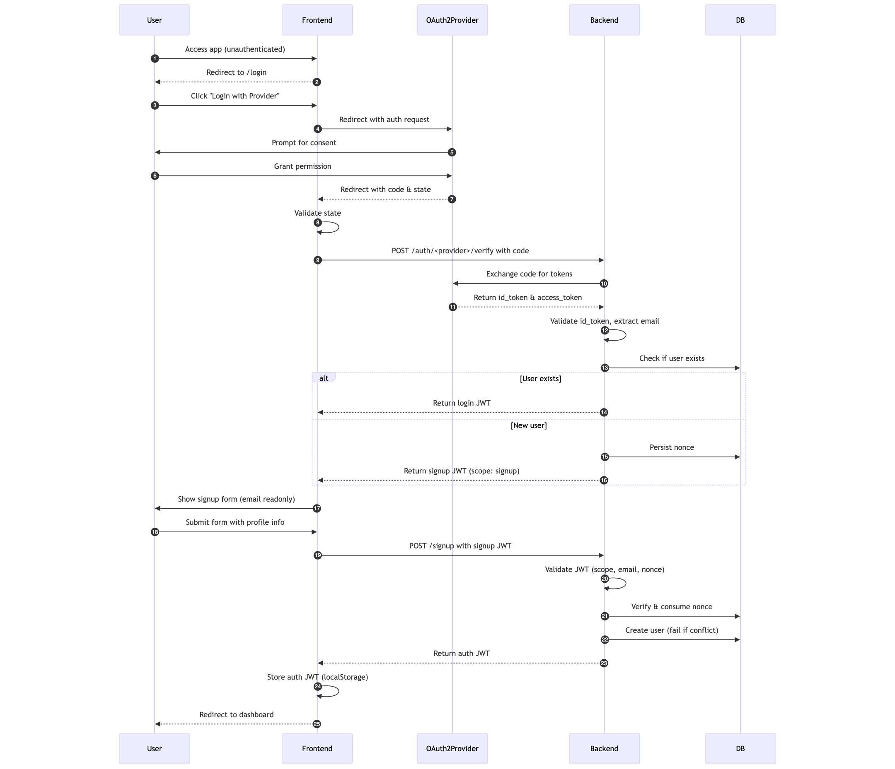
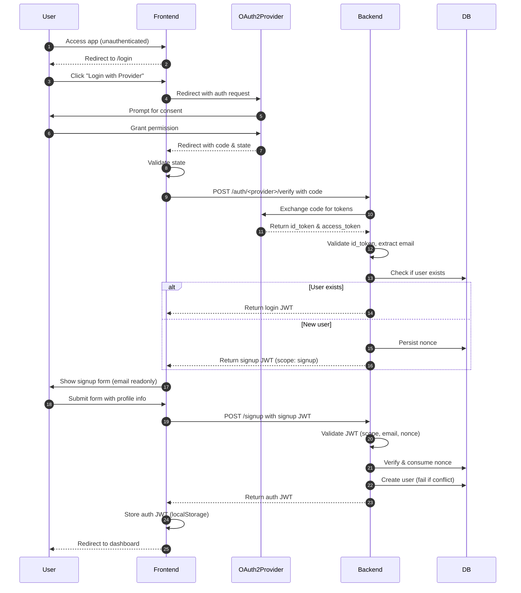

# OAuth2-Based Signup Flow


## Overview

This document defines the design and flow of the **user signup process** for our web application. The system uses **OAuth2** for third-party identity verification, with a **stateless backend API** and **JWT-based authentication**. The signup process is distinct from login and handles first-time users.


## Goals

- Allow users to sign up using external identity providers (e.g., Google, GitHub)
- Ensure secure transmission and validation of identity claims
- Avoid storing any server-side sessions
- Prevent account enumeration, CSRF, replay, or token misuse


## Architecture Overview

```text
Frontend Login page
    |
    |-- [OAuth2 Redirect]
    v
OAuth Provider (e.g., Google)
    |
    |-- [Redirect with code]
    v
Frontend: https://myapp.com/oauth/<provider>
    |
    |-- [POST /auth/<provider>/verify]
    v
Backend API (Express)
    |
    |-- [Generate Signup JWT]
    v
Frontend Signup Form (username, name, captcha)
    |
    |-- [POST /auth/signup]
    v
Backend API
    |
    |-- [Create user, issue auth JWT]
    v
Frontend stores JWT → Logged in
```

### Sequence Diagram


## Signup Flow (Step-by-Step)

### **Step 1: Unauthenticated Access**

- Any unauthenticated user is redirected to `/login`. Even visiting signup page without signup token will redirect to login.
- They can initiate "Login/Signup" via supported OAuth2 providers.

### **Step 2: OAuth2 Authorization**

- User is redirected to the OAuth2 provider (e.g., Google) for authorization.
- User grants permission and is redirected back to the frontend with a `code` and `state` parameter.

### **Step 3: OAuth2 Callback**

- Provider redirects user to `/auth/<provider>?code=...&state=...`
- Frontend validates `state`.
- Frontend sends the code to the backend:
  
  ```http
  POST /auth/<provider>/verify
  {
    code: "<oauth2_code>"
  }
  ```

### **Step 4: Token Exchange & Identity Verification**

- Backend exchanges code with provider using OAuth2 token endpoint.
- Validates `id_token` and extracts email.
- Checks if user already exists in database:
  - If yes → returns login JWT and skips signup.
  - If no → creates **Signup JWT** with:
    - Generate and persist nonce in the database for replay protection

    ```json
    {
      "sub": "user@example.com",
      "scope": "signup",
      "exp": <10 min>,
      "nonce": "<random>"
    }
    ```
#### **Response Body on Successful Oauth Verification**

Response from the backend after verifying the OAuth2 code and extracting the email:


##### **If User Exists**
```json
{
  "status": "success",
  "token": "<login_jwt>",
  "profile": {
    "email": "<email>"
  }
}
```

##### **If User Does Not Exist and Signup is Allowed**
```json
{
  "status": "signup_required",
  "signup_token": "<signup_jwt_with_nonce>",
  "email": "<email>"
}
```

##### **If User Does Not Exist and Signup is Not Allowed**
```json
{
  "status": "not_a_user"
}
```

### **Step 5: Frontend Signup Form**
- Based on the response, the frontend will show a signup form if the user does not exist.
- User sees form to complete profile: username, name, institution details, terms of use acceptance.
- Email is displayed as read-only.
- If user refreshes the signup page, they will be redirected to the login page.
- On submit, frontend sends:

  ```http
  POST /signup
  Authorization: Bearer <signup_token>
  {
    email: "user@example.com",
    username: "new-user",
    name: "Jane Doe",
    accepted_terms: true,
  }
  ```

### **Step 6: Signup Processing**

- Backend performs:
  - **JWT validation** (signature, expiration, `scope === 'signup'`)
  - Email in token matches request body
  - Nonce match (check against DB and delete nonce if used)
- Creates user in DB (error if user with given email/username exists)
- Issues **auth JWT** with user profile info
- Returns auth token to frontend
- If any checks fail, return generic client error without details

#### Validation
Username
- **Required**: Must not be empty.
- **Length**: 3–30 characters
- **Characters**: May only contain alphanumeric characters and only single hyphens, and cannot begin or end with a hyphen.
- **Case Normalization**: Store usernames in lowercase.
- **Conflict Handling**: If username already exists, return error without revealing if email is also taken. When `auth.signup.auto_generate_username_if_not_unique` config is enabled, auto-generate a username by appending a numeric suffix and incrementing it till a unique username is found.
- **Blacklist**: Reserved usernames (e.g., "admin", "user", "signup") should not be allowed.

Name & Institution Name
- **Required**: Must not be empty.
- **Length**: 1–100 characters

### **Step 7: Post Signup**

- Frontend saves auth token in `localStorage`
- User is redirected/logged in to the dashboard


## Security Considerations

| Concern | Mitigation |
|--------|------------|
| CSRF | Use OAuth2 `state` param and `email` in signup JWT |
| Replay | Short-lived signup token and one-time-use nonce |
| Account Enumeration | Do not expose "user already exists" to UI |
| Token leakage | Backend performs OAuth2 code exchange, not frontend |
| XSS | CSP headers, sanitize DOM, avoid `v-html` |


## Future Enhancements

- Account linking or multiple identity provider support
- Rate limiting signup attempts per IP/email
- Invite-only signup support
- Post-signup / First time login onboarding flow


## Open Questions

- Institution Name and Type: If we let users specify institution details, how do we validate them?
  - Should we allow free-form input or a dropdown of known institutions? Free-form could lead to typos or duplicates.
- Captcha: Should we implement a captcha challenge during signup to prevent bot signup? signup is partly protected by OAuth2 provider's consent flow. Only users authenticated with Oauth2 provider can access signup.
  - Where should we place the captcha in the flow? Security vs. user experience tradeoff.
    - login step
    - signup step

- Should we move auth token storage to `HttpOnly` secure cookie?


## Appendix

