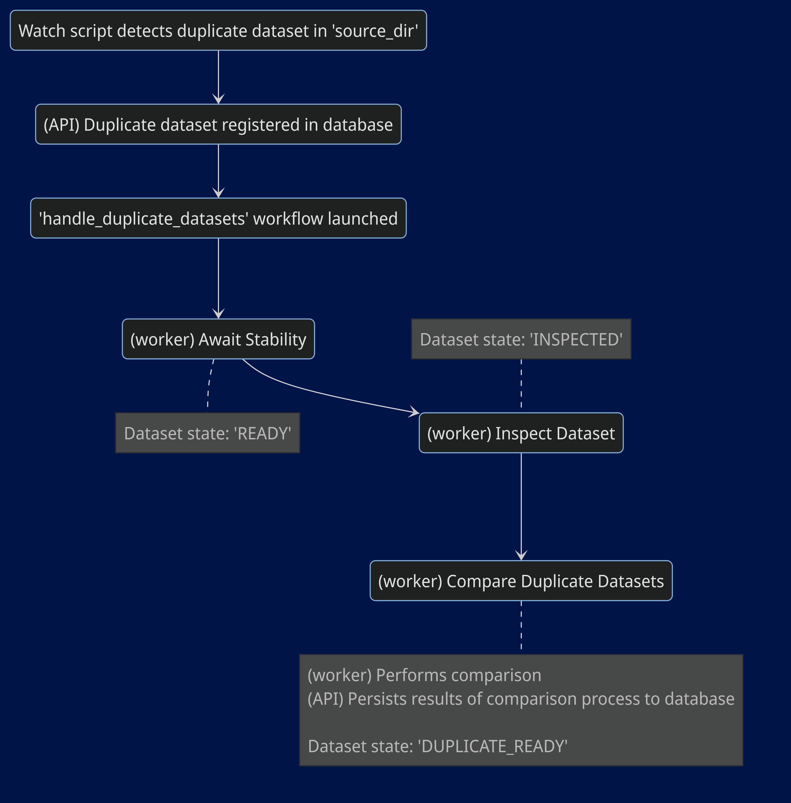
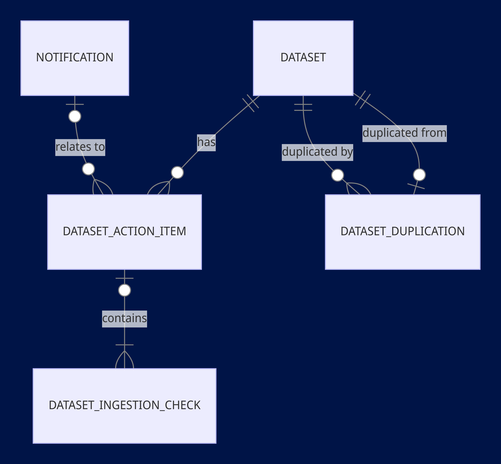
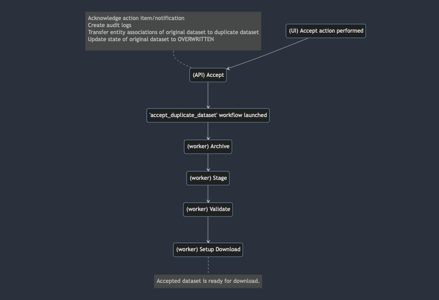
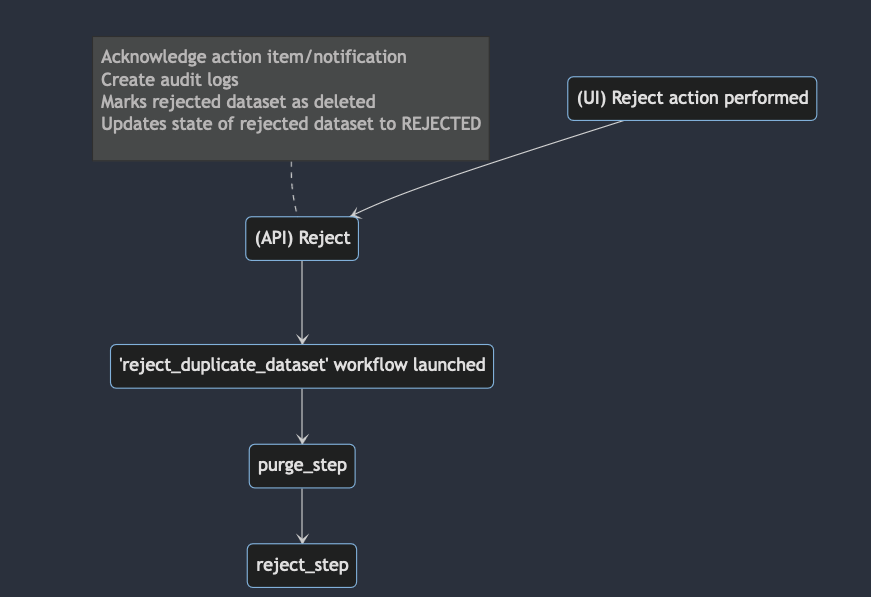

Bioloop allows for duplicate datasets to be registered in the system.

---

## Registration

Duplicate datasets are registered by the `watch.py` script, if it finds a dataset present in the `source_dir` directory which has the same name and type as an existing active dataset.

The duplicate dataset is registered at the database level, and action items and notifications are created in the system which allows authorized users to review the duplicate dataset.

Upon registration, the `watch` script launches the `handle_duplicate_datasets` workflow that runs the `await_stability`, `inspect_dataset` and `compare_duplicate_datasets` steps on the duplicate dataset.
- The `compare_duplicae_datasets` step:
  - compares the newly created duplicate dataset with the original dataset, and generates a comparison report which is persisted to Postgres.
  - Updates the state of the dataset to `DUPLICATE_READY`, at which the dataset becomes available for acceptance/rejection.

The results of the comparison analysis are shown to authorized users in the UI, based on which they can either accept or reject a duplicate dataset.

### Versioning

- The system is designed to handle multiple co-existing duplicates of the same dataset. However, for simplicity, this feature is disabled at the moment, and only one duplicate is allowed to exist in the system.
  - If enabled, multiple concurrent duplicates of a dataset will only be registered at the database level, not at the filesystem level.
- If multiple duplicates of the same dataset are allowed to co-exist in the system, they will be assigned versions to differentiate between them.
- Overwritten datasets are also assigned versions, in case a dataset is overwritten more than once.

### Action Items

For each duplicate dataset registered by the system, an action item is created in the Postgres table `dataset_action_item`, and a notification is persisted to the `notification` table.

Each action item is linked to multiple `dataset_ingestion_check` records, and each `dataset_ingestion_check` record represents the results of comparing a duplicate dataset with the original dataset based on a specific criteria.

A dataset is compared with another based on 3 criteria:
1. There are no files in either dataset that have the same name and path as a file in the other dataset, but a different MD5 checksum. 
2. Original dataset has files that the duplicate dataset doesn't.
3. Duplicate dataset has files that the original dataset doesn't.

---

## ER Diagram

---

## Actions
Only Operator and Admin roles are authorized to accept or reject an incoming duplicate dataset.

### Acceptance

When an authorized user accepts a duplicate dataset into the system, the following steps take place:
1. The action item and notification corresponding to the duplicate dataset are marked as resolved and marked as inactive.
2. An audit log is created for the incoming duplicate dataset's acceptance, and another one for the original dataset's overwrite.
3. Any other duplicates that may have been created for the original dataset are rejected, and their action items and notifications are resolved. 
4. The original dataset is deleted from the system by marking it as deleted in the database (i.e. setting its `is_deleted` to `true`).
5. The relational database associations of the original dataset are transferred to the duplicate dataset.
6. The state of the original dataset is updated to `OVERWRITTEN`.
7. The API layer launches the `accept_duplicate_dataset` workflow on the duplicate dataset, which:
   * runs the `archive_dataset`, `stage_dataset`, `validate_dataset` and `setup_dataset_download` steps, thereby making the newly-ingested dataset available for download.

### Rejection

When an authorized user rejects a duplicate dataset from the system, the following steps take place:
1. The action item and notification corresponding to the duplicate dataset are acknowledged.
2. An audit log is created for the incoming duplicate dataset's rejection.
3. The state of the rejected dataset is changed to `DUPLICATE_REJECTED`
4. The rejected dataset is marked as deleted in the database (by setting its `is_deleted` to `true`).
5. The API layer launches the `reject_duplicate_dataset` workflow on the duplicate dataset, which:
   * deletes the filesystem resources associated with the duplicate dataset (its `origin_path`) from the filesystem.

    
### Resumable
- The steps outlined above for the acceptance/rejection of a duplicate dataset can be resumed in case of an error occurs in either the API layer or the workflow layer.

### Irreversible
Once an authorized user initiates the acceptance or rejection of a duplicate dataset, the operation cannot be reverted.

---

## UI

- Authorized users sees a notification per dataset duplication.
- The UI polls for any incoming notifications that haven't been acknowledged yet every 5 seconds.
- Notification will continue to show up in the UI until a duplicate dataset has been either accepted or rejected by an authorized user.

