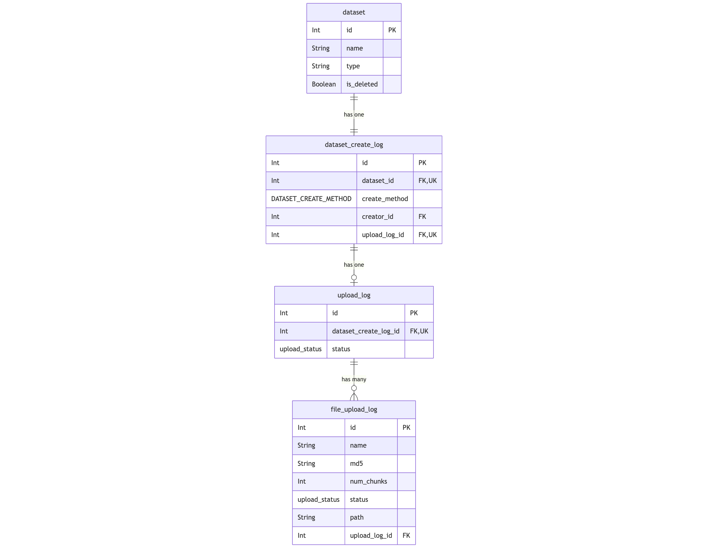

# Dataset Upload

## 1. Introduction

Bioloop allows uploading datasets through the browser, while ensuring strict access control to prevent unauthorized access.

## 2. Requirements and Limitations

- Authorized users should be able to upload datasets directly from their web browsers. The uploaded datasets should be protected from unauthorized users.
- Network timeouts, data corruption and other problems that arise from uploading large datasets must be avoided. To achieve this, our file upload architecture uploads files in chunks of 2 MB.
  - Uploading files in chunks also gives us a more granular view into the upload state.

## 3. Architecture Overview

To meet the requirements outlined above, a distributed architecture is employed.

- UI Client: User logs into the Bioloop application through their web browser and navigates to the appropriate page to initiate a dataset upload.
- API: This node serves the UI as well as workers via HTTP endpoints that are specific to dataset uploads.
- Database: Any metadata related to an upload is stored in a PostgreSQL database.
  - The contents of the uploaded files themselves are not persisted to this database.
- Rhythm API: This node is used to trigger workflows from the UI. These workflows process the uploaded dataset.
- Workers: Workflow tasks that process the uploaded dataset and register the uploaded dataset in the system.
- Signet: An OAuth server that supports Client-Credentials flow. This is used to issue secure tokens which are needed for authorizing into the File-Upload API.
- File-Upload API: A lightweight app hosted on the File-Upload Server, which writes files sent as part of an HTTP request to a filesystem.
- File-Upload Server (Nginx): A server which receives requests from users to upload files. Files are uploaded to this server.

## 4. The Upload Process

### 4.1 Database

For each upload, information is logged to the following relational tables (PostgreSQL):
1. `dataset_audit` - used to create an audit log of a dataset being created in the system. Each record in this table is linked to a single `dataset` record.
2. `dataset_upload_log` - contains metadata specific to a dataset's upload. Each record in this table is linked to multiple `file_upload_log` records.
3. `file_upload_log` - contains metadata about each file that is uploaded as part of upload.



### 4.2 Steps

1. Before an upload begins, the following events occur sequentially:
   - Checksum evaluation - MD5 checksums are evaluated for each file being uploaded, as well as for each chunk that a file being uploaded is split into. 
   - Any metadata associated with the upload is stored in the database. This includes:
     - Names, MD5 checksums, and relative paths of the files being uploaded.
     - User who is uploading the dataset
     - (Optional) Source Raw Data that the dataset being uploaded is being derived from.
     - (Optional) Project that the dataset being uploaded is assigned to
     - (Optional) Source instrument where the dataset being uploaded was collected from.
   - The UI requests a bearer token which it will use to call the File-Upload API (see [Access Control](#44-access-control))
2. Upload of files is initiated by the UI once the above steps are successful.
3. Chunks are uploaded sequentially to the File-Upload API.
   - For this, the client sends an HTTP request to the File-Upload API in order to upload a file chunk, which then writes the received chunk to the File-Upload Server, after validating its checksum.
   - If a chunk upload fails, the UI retries the upload upto 5 times before failing.
   - The bearer token that is being used to call the File-Upload API is refreshed every 20 seconds
4. After all files' chunks are uploaded successfully, the UI makes a request to the Rhythm API to trigger the `process_dataset_upload` workflow, which merges each file's uploaded chunks into the corresponding file.
   - This worker expects to have access to be the location where the File-Upload API uploads files to.


### 4.3 Directory structure
The directories on the File-Upload Server that are used for uploads are described below.

1. The location where a dataset will be uploaded to is evaluated through the following method:
```
const getUploadedDatasetPath = ({ datasetId = null, datasetType = null } = {}) => {
  # `dataset_id`: the unique id that is generated for the dataset being uploaded.
  # `config.upload.path`: the location where all uploaded datasets are stored.

  return path.join(
    config.upload.path,
    datasetType.toLowerCase(),
    `${datasetId}`,
    'processed',
  )
};
```
2. The location where any given file that is being uploaded as part of this upload will be uploaded to is evaluated through the methods shown below. Each file is uploaded in chunks.
    - Individual chunks are named as `[file_md5]-[i]` where `i` serves as the position of this chunk among all sequentially-uploaded chunks of this file.
      - When merging a file's chunks into the corresponding file, chunks will be processed sequentially based on the index `i`.
```
# `uploadPath`: the path where this dataset will be uploaded to.
# `fileUploadLogId`: the unique id which is generated to record this file's upload

const chunkStorage = getFileChunksStorageDir(
  {
    uploadPath: req.body.upload_path,
    fileUploadLogId: req.body.file_upload_log_id,
  },
);
  
const getFileChunksStorageDir = ({ uploadPath, fileUploadLogId } = {}) => {
  return path.join(
    uploadPath,
    'uploaded_chunks',
    fileUploadLogId,
  )
 };

# Name of uploaded chunk file:
const getFileChunkName = (fileChecksum, index) => {
  # `index`: The position of this uploaded chunk among all the chunks that a file is split into before being uploaded
  return `${fileChecksum}-${index}`
};
```
3. Once the uploaded dataset's files have been processed (i.e. its chunks have been merged into corresponding files), the recreated dataset is stored at the path shown below.
    - This location is considered the path where the dataset originated from (i.e. the dataset's `origin_path`).
```
path.join(
  getUploadedDatasetPath({ datasetId = uploadedDatasetId, datasetType = uploadedDatasetType }),
  'processed'
)
```
  
### 4.4 Access Control

1. To verify that a user is authorized to initiate an upload, we perform role-based checking in the core Bioloop API.
    - This validation cannot be performed in the File-Upload API, since evaluating permissions that are granted to a user for any given entity is done via information stored in the database, which the File-Upload API is not given access to, to keep it decoupled from the database.
2. After verifying that the user is authorized to upload datasets, the UI issues a request to the core Bioloop API which requests the Signet service for a Bearer token, which is returned to the UI.
   - The UI then attaches this token to the `Authorization` header of the HTTP request which is sent from the UI to the File-Upload API in order to upload a file.
   - The scope included in the generated token contains the name of the file prefixed with the string `upload_file`.
   - If the name of the file being uploaded has spaces in it, these spaces are replaced by hyphens in the granted token's scope.
   - For example, to upload file `my file.json`, the Bearer token that is used to call the File-Upload API file will be expected to have scope `upload_file:my-file.json`.
3. Before the File-Upload API accepts a file that needs to be uploaded, it verifies that the scope contained in the Bearer token is the same as the expected scope. If these scopes do not match, the File-Upload API rejects the HTTP request.

### 4.5 Status

The status of an upload action goes through the following values:

| Status                      | Description                                                                                                                                                           |
|-----------------------------|-----------------------------------------------------------------------------------------------------------------------------------------------------------------------|
| COMPUTING_CHECKSUMS         | Checksums are being computed for the file(s) to be uploaded                                                                                                           |
| CHECKSUM_COMPUTATION_FAILED | Checksums computation failed for the file(s) to be uploaded                                                                                                           |
| UPLOADING                   | Upload initiated through the browser                                                                                                                                  |
| UPLOAD_FAILED               | Upload could not be completed (network errors)                                                                                                                        |
| UPLOADED                    | All files successfully uploaded                                                                                                                                       |
| PROCESSING                  | Upload currently being processed                                                                                                                                      |
| PROCESSING_FAILED           | Encountered errors while processing a file in this upload                                                                                                             |
| COMPLETE                    | All files in the upload processed successfully                                                                                                                        |

## 5. Processing
- Uploaded file chunks are merged into the corresponding file by the `process_dataset_upload` workflow.
- After an uploaded file has been recreated from its chunks, the MD5 checksum of the recreated file is matched with the expected MD5 checksum of this file, which was persisted to the database before the upload.
- After all uploaded files have been processed successfully, the resources (uploaded file chunks) associated with them are deleted.
- At this point, the system initiates the `Integrated` workflow for the uploaded dataset, which registers this dataset in the system.

## 6. Data Integrity
The uploaded data goes through two stages of checksum validation:
1. Validating MD5 checksum of an uploaded file before writing it to the filesystem.
2. Validating MD5 checksum of the file being uploaded, once it has been recreated from its chunks by the worker.

## 7. Retry
1. Upon encountering retryable exceptions, the `process_dataset_upload` worker retries itself 3 times before failing.
2. The script `manage_pending_dataset_uploads.py`, which is scheduled to run every 24 hours, looks for uploads that have been in states `PROCESSING_FAILED` or `UPLOADED`, and retries to process the ones which have been failing for less than 72 hours.
