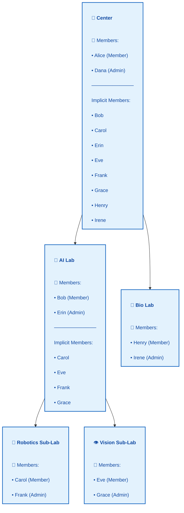
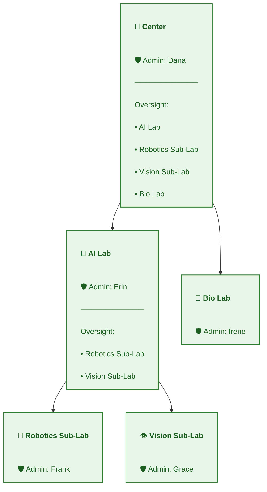
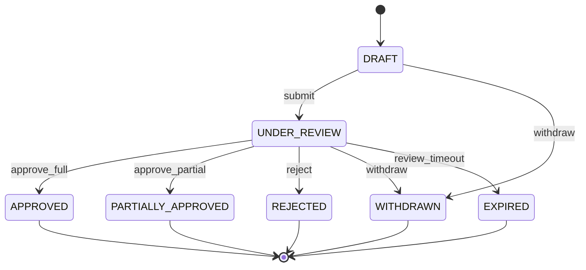
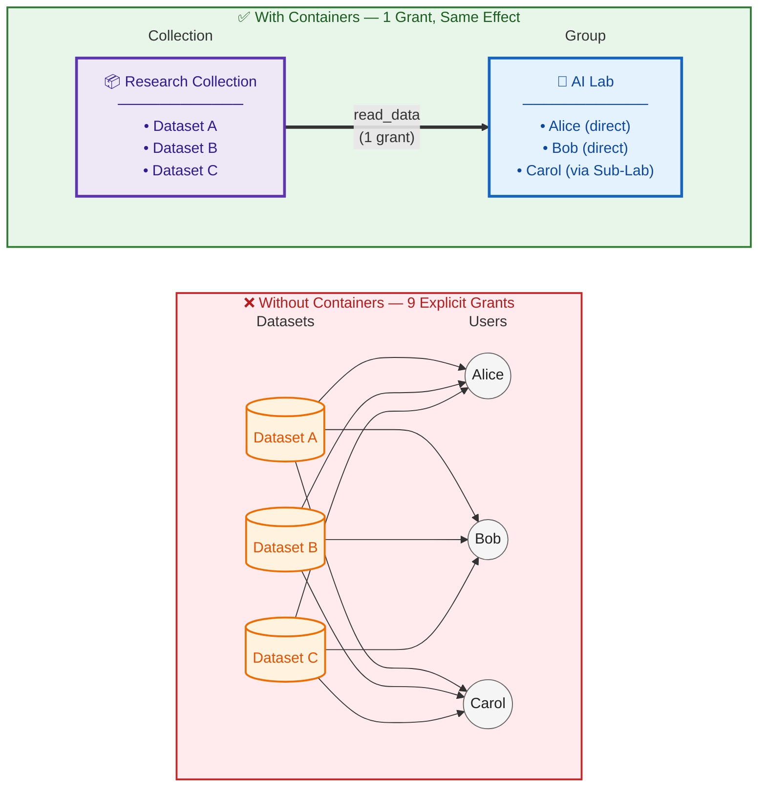
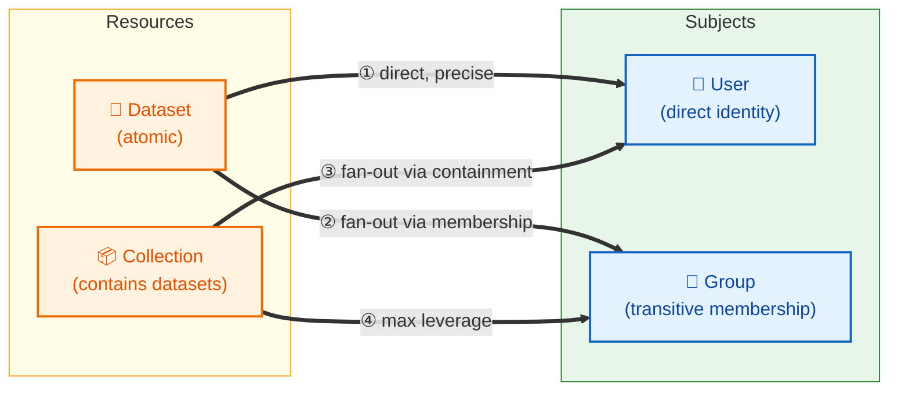
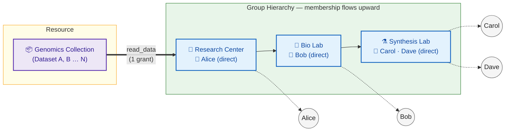

::: warning Design record — active
This is the design record for the groups, collections, and grants system. It describes the
target state. Much of it has shipped; the parts that have not are marked where they appear,
and [Code Map](./code-map.md) maps each concept to the code that
implements it. The reasoning behind the shape of the system, and the alternatives that were
rejected, are in [Decisions](./decisions.md).
:::

# Hierarchical Groups, Collections, and Data Access – Unified Design

## Purpose and Scope

This document defines a **foundational, future‑proof design** for hierarchical groups, dataset ownership, collections, and access control in a university or research‑group data management portal.

## Core Concepts

### Subjects

* **User** – authenticated human or service identity
* **Group** – container for users and administrative authority

Users may belong to multiple groups simultaneously.

---

### Resources

* **Dataset** – atomic unit of data access
* **Collection** – container for datasets, used for scalable access management

Datasets may belong to zero or more collections.

---

### Ownership vs Access

Ownership and access are **intentionally distinct**:

* **Ownership** defines *authority*
* **Access** defines *permission to act*

Every dataset and collection has exactly one **owning group**. `dataset.owner_group_id` is
`NOT NULL`, so a dataset outside the ownership model cannot exist. Datasets that predated the
constraint were moved into an archived `Unassigned Datasets` system group, whose contents are a list for
platform admins to work through rather than a fallback anything writes to.

@see [decision 2](./decisions.md#_2-every-dataset-has-an-owning-group)

---

### History Is Preserved, Not Deleted

Removing a member and removing a dataset from a collection both **close** the row rather than
deleting it. Each carries validity columns, and the current state is read through a view that
filters on them.

Deleting the row would make the audit record the only evidence that access ever existed, which
is the one thing a later migration cannot recover. "Who could see this last March?" has to be
answerable from the data, not inferred from an event log.

@see [decision 1](./decisions.md#_1-membership-and-collection-history-are-preserved)

## Hierarchical Groups

### Group Hierarchy

Groups may be nested arbitrarily:

* Center → Core
* Center → Lab → Sub‑Lab

Hierarchy semantics:

* Membership is **transitive upward**
* Administrative authority is **local only**
* Oversight visibility is **transitive downward**

* If G1 is a parent of G2, then:

  * All members of G2 are also members of G1
  * Admins of G1 have **oversight visibility** over G2 (read-only governance observability)
  * Admins of G1 do **NOT** have governance authority over G2

* If an access grant targets Group G, then: All users who are members of G or its descendant groups receive the grant.

#### Critical Distinction: Organizational Hierarchy vs Governance Authority

* Hierarchy determines membership propagation and oversight visibility
* Ownership determines governance control
* Governance authority never derives from hierarchy alone

This separation ensures that organizational restructuring (reparenting) does not accidentally shift data governance authority.

#### Membership Transitivity Example


#### Oversight Transitivity Example


---

### Closure Table

To support transitive queries efficiently, group ancestry is materialized using a **closure table**.

**GroupClosure**

* ancestorGroupId
* descendantGroupId
* depth

Invariant:

* Every group has a self‑row with depth = 0

Hierarchy writes are rare; authorization reads are constant‑time and indexed.

### Oversight Visibility

**Oversight** is a derived, read-only governance capability.

#### Definition

A user has `oversight_view` over Group G if:

* User is admin of any ancestor of G (via closure table)

#### What Oversight Allows (Read-Only)

* View group metadata
* View descendant groups
* View datasets owned by descendant groups
* View grants on those datasets
* View membership of descendant groups
* Run audit reports

#### What Oversight Does NOT Allow

* Grant access
* Revoke access
* Edit dataset metadata
* Transfer ownership
* Edit collection membership
* Modify group membership
* Change visibility presets

Oversight provides **read-only governance observability**, not delegated control.

#### Reparenting Safety

When a group is reparented:

* Old ancestor admins lose oversight visibility
* New ancestor admins gain oversight visibility
* **No governance authority changes**
* **No dataset grant authority changes**

This ensures organizational restructuring does not accidentally shift data control.

### Archiving Groups

#### Archiving Philosophy

Archiving is **not deletion**. It represents a governance boundary that is organizationally closed but structurally and historically persistent.

Deletion would:
* Break auditability
* Orphan datasets
* Invalidate historical grant provenance
* Destroy explainability of past decisions

Archiving corresponds to institutional reality:
* A lab shutting down
* A grant expiring
* A project being formally closed
* A core being reorganized

But closure does not mean erasure.

#### What Archiving Preserves

When a group is archived:

* **Ownership remains intact**
  * Datasets owned by the archived group remain owned by it
  * No implicit ownership transfer occurs
  * If ownership transfer is desired, it must be performed explicitly via the dual-consent model
  * This preserves the invariant: authority changes require explicit action

* **Grants remain valid**
  * Grants granted **to** the group (giving access to group members) remain active
  * Grants granted **by** the group (created under its governance authority) remain valid
  * Dataset consumption grants remain active unless separately revoked or expired
  * Archiving is structural; it does not retroactively mutate access

* **Membership remains frozen**
  * Existing membership is preserved
  * No new members may be added
  * No members may be removed
  * This prevents silent access mutations that would violate auditability
  * If institutional policy requires explicit membership revocation, that must be performed separately

* **Hierarchy relationships remain intact**
  * Parent-child relationships persist
  * Ancestor admins retain oversight visibility over archived group
  * Reparenting of archived groups is disallowed (see prohibitions below)

#### What Archiving Prohibits

When `group.is_archived = true`, the following actions are disallowed:

**Membership and Admin Mutations:**
* Add new members
* Remove members
* Add new admins
* Modify admin list

**Governance Authority:**
* Create new grants for resources owned by the group
* Revoke existing grants (except via platform admin for incident response)
* Transfer ownership of datasets from the group (except via platform admin override)
* Create new datasets owned by the group
* Edit group metadata (except for archival notes or administrative timestamps)

**Structural Mutations:**
* Reparent the group
* Modify parent-child relationships
* Dataset creation with an archived group as owner must be rejected. Reason: Archive signals governance boundary closure. Allowing new assets under it defeats the lifecycle signal.
* Create new collections owned by the group / delete existing collections owned by the group
* Modify collection membership (add/remove datasets from collections owned by the group)


#### Permitted Actions on Archived Groups

For clarity, these actions **are** allowed:
* View metadata
* View members
* Oversight visibility (ancestor admins over archived descendants)
* Evaluate existing grants
* Run audit reports and explain historical access decisions
* Platform admin incident response (all actions, with audit trail)

#### Reversibility: Unarchiving

Archiving is reversible via explicit unarchive action:

```
Allow group.unarchive IF:
  user is platform_admin

```

Unarchiving requires platform admin authority because:
* It reactivates governance authority
* It re-enables dataset creation and grant authority
* It is a high-impact structural change

Each unarchive event must emit an audit record with full provenance.


---

### System principals

#### Definition

Two built-in, non-editable principals name a whole audience without listing its members.

| Principal | Covers |
|---|---|
| `Public` | everyone, including people who are not signed in |
| `Authenticated Users` | everyone signed in to this platform |

`Public` is the wider of the two, so a signed-in user's subject set contains both. Both
share the same characteristics:

* Not real groups in the hierarchy.
* Cannot have members or admins.
* Cannot contain sub-groups.
* Exist solely as grant targets.

Every route requires authentication, so a grant to `Public` reaches the same people as one
to `Authenticated Users` today. The distinction is recorded because retrofitting a second
principal into every subject-set query later is the expensive move.
See [decision 3](./decisions.md#_3-a-public-principal-exists-and-everyone-is-renamed).

#### Purpose

Enables explicit representation of global access.

Example:

* Public dataset → Grant(read_data) to `Public`.
* Discoverable dataset → Grant(view_metadata) to `Authenticated Users`.

#### Why This Matters

This preserves a single source of truth:

Access exists only if a grant exists.

Even “public” access is now durable, auditable, and revocable.

---

## Collections

Collections are **first‑class authorization containers**, owned by exactly one group.

* Groups contain users
* Collections contain datasets

Collections exist to:

* Avoid dataset‑by‑dataset grants
* Enable coherent access review
* Support large‑scale governance


### Collection Membership Control

Collections **are** authorization containers.

Adding or removing a dataset from a collection is not a casual metadata edit—it is a **high‑impact authorization operation** that changes effective access for all subjects with grants to that collection.

Therefore:

* Adding a dataset to a collection requires the same authority as granting direct access to that dataset
* Only users with admin authority over the dataset's owning group may modify collection membership
* Collection edits emit audit events with full provenance (actor, authority, affected grants)
* Effective access changes are traceable to specific collection membership changes

Invariant:

* Collection membership mutations are subject to the same authorization and auditing standards as grant creation.
* No group may indirectly grant access to data it does not own.

This ensures that collections remain **explainable authorization primitives**, not implicit side channels.


```
ALLOW collection.addDataset IF:

U ∈ (collection.ownerGroup)
AND dataset.ownerGroup == collection.ownerGroup
```

```
ALLOW collection.removeDataset IF:

U ∈ (collection.ownerGroup)
AND dataset.ownerGroup == collection.ownerGroup
```


---

## Grants: The Core Authorization Primitive

### Grant Definition

A **Grant** is a durable, auditable fact that confers access.

**Grant**

* id
* subjectType (User | Group)
* subjectId
* resourceType (Dataset | Collection)
* resourceId
* accessType (read, compute, download, admin, etc.)
* grantedBy (actor identity)
* grantedViaGroup (authority)
* validFrom
* validUntil (nullable)
* status (active | revoked | expired)

Grants are **never deleted**.

---

### Why Grants Are Foundational

All non‑trivial use cases depend on grants:

* Revocation
* Expiration
* Access explanation
* Auditing
* Delegation
* Approval workflows

Implicit permissions are explicitly forbidden.

---

### Grants are atomic, and access types carry a partial order

Each grant is a single fact: one subject, one resource, one access type. A grant is audited,
explained, and revoked on its own.

Atomic storage does not mean the access types are unrelated. They carry a partial order, held
in `grant_access_type_implication` and closed over transitively once at startup. Holding a
wider type satisfies a check for a narrower one, so `DOWNLOAD` satisfies `LIST_FILES`, which
satisfies `VIEW_METADATA`. Giving somebody download access is therefore one grant, not three.

The order is a property of the access types, not of any grant. Two rows are still two facts,
each revocable alone; the evaluator widens the requirement rather than writing extra rows.

**File listing is the read plane.** There is no `DATASET:READ_DATA` access type, and the
`read_data` policy action checks `DATASET:LIST_FILES` on purpose.

@see [decision 7](./decisions.md#_7-access-types-imply-one-another)


### Critical Constraint: No Overlapping Grants

For the same
`(subject_type, subject_id, resource_type, resource_id, access_type_id)` tuple,
there must never exist two non-revoked grants whose validity intervals overlap.

Historical multiplicity is allowed, but Concurrent multiplicity: forbidden.

This invariant prevents:
- Conflicting grants (e.g., two active grants with different `grantedBy` or `grantedViaGroup`)
- Ambiguous access explanations (which grant is the source of access?)
- Multiple audit trails for the same effective permission
- Complex revocation semantics (revoking one grant should revoke the permission, not leave another active grant in place)

Having this invariant helps with:
- Deterministic explainability
- Simple revocation logic
- Idempotent grant issuance: applying the same preset twice creates nothing the second time
- Clean mental model: one grant = one access type held over one interval

The constraint is per access type, and the order runs across access types. A grant of
`DOWNLOAD` is one row and satisfies checks for `LIST_FILES` and `VIEW_METADATA` as well, so
one row is not one capability. It is one authorization fact, and the order says what that
fact reaches. Issuance reduces a request to the access types the order does not already
supply, so the two never disagree about how many rows an approval is worth.

### Critical Constraint: Grants Are Only For Consumption Actions

Grants represent **consumption rights**, not **governance authority**.

**Consumption Actions** (Grant-Based):

* `dataset.view_metadata`
* `dataset.view_sensitive_metadata`
* `dataset.read_data`
* `dataset.download`
* `dataset.compute`
* `collection.view_metadata`
* `collection.request_access`

These actions:

* Change who can use data
* Are revocable
* Are delegatable
* Are frequently modified
* Require explicit audit trails

**Governance Actions** (Structure-Based, NOT Grant-Based):

* `dataset.edit`
* `dataset.admin`
* `dataset.transfer_ownership`
* `dataset.grant_access`
* `dataset.revoke_access`
* `collection.edit`
* `collection.manage_membership`

These actions:

* Change who controls access
* Derive from ownership + group admin role
* Are enforced via ABAC rules
* Follow organizational hierarchy
* Require **no grant rows**

**Invariant**:

> Ownership defines *who may control access*.
>
> Grants define *who may consume data*.

This separation prevents:

* Circular administrative authority
* Cross-group governance complexity
* Blurred ownership boundaries
* Administrative authority existing outside organizational structure

**Why Keep Admin Actions Outside Grants**:

1. Governance topology must align with organizational structure
2. Administrative delegation would explode complexity
3. Ownership-based authority is deterministic and auditable
4. No risk of orphaned administrative grants after org changes

---

### Grant Presets

A grant names one subject, one resource, and one access type. That is precise and auditable,
and it asks a data steward to think in access types when they only want to make a dataset
downloadable by their lab. **Grant presets** are named bundles of access types that close
that gap.

A preset is a convenience and a provenance label. It is not an enforcement boundary, and it
does not change what authorization evaluates. The design record is
[Access presets](./access-presets.md).

#### What a preset expands to

A preset is expanded when a grant is issued, never when a request is submitted. Expansion
reduces the preset to the access types the order does not already supply, so a preset naming
`VIEW_METADATA`, `LIST_FILES`, and `DOWNLOAD` writes one grant of `DOWNLOAD`.

A wider access type only absorbs a narrower one when it lasts at least as long. Approving a
month of `DOWNLOAD` beside a year of `VIEW_METADATA` writes both rows, because dropping the
year would end metadata access eleven months early.

Each issued grant records the preset that supplied it, so the Access tab names
"Standard Research Use" rather than listing access types with no shape. An access type the
request named directly, or that two presets both supply, records no preset.

#### The seeded presets

Four presets ship with the platform, two scoped to collections and two to datasets. They are
platform configuration rather than lifecycle-managed entities: they carry no version, no
per-group variant, and no owner. `is_active` retires one without deleting it, because
historical requests reference it.

#### What presets do not do

* **They do not constrain revocation.** An admin revokes any grant, whatever issued it.
* **They do not gate authorization.** Evaluation reads grants and the access-type order, and
  never asks which preset a grant came from.
* **They do not stop an incoherent combination.** The order does that, and it does it for a
  hand-issued grant as well.

#### Subject selection is explicit

A preset names access types only. It never resolves a subject. Choosing who receives access —
a user, a group, or a system principal — is a separate, explicit step in every flow.

@see [Access type order plan](./access-type-order-plan.md) for how issuance reduces a preset,
and [decision 7](./decisions.md#_7-access-types-imply-one-another) for the order itself.


## Restrictions

Grants only ever add. Nothing in a purely additive model can say "no", so a governance
decision that has to stop access — a lab closing, a hold pending review — has nowhere to live.

A **restriction** is that missing half. It is a durable row, like a grant, and it composes with
grants by AND:

> allowed = no restriction blocks this action AND some grant permits it

The two halves never negotiate. A restriction cannot grant anything, and no grant can overcome
a restriction. This is deliberately not a negative grant: negative grants make effective access
depend on the order rules are evaluated in, and the reason somebody cannot reach a dataset
stops being answerable.

### What a restriction attaches to

A restriction attaches to exactly one of a group or a resource, and reaches:

* the group it names, and every descendant group
* every dataset and collection those groups govern
* or, when it names a resource directly, that resource alone

So archiving a lab freezes the lab, its sub-labs, and everything any of them owns, from one row.

### What it blocks

Each restriction type names the actions it blocks. Every registered policy action is classified
as mutating or reading, and the classification is asserted to be exhaustive by a test, so an
action added later cannot quietly fall outside every restriction type.

`ARCHIVED` is the only type that ships. It blocks every mutating action, and exempts only the
three `unarchive` actions — otherwise an archived group could never be reopened.

### Restrictions apply to platform admins

The platform-admin short-circuit runs **after** the restriction check. An archived group is
archived for a platform admin too. This is the point of a governance boundary: it is not a
permission level that seniority passes through.

### Archiving is expressed through it

`is_archived` remains as a denormalised column, because listings, filters, and badges read it
on every page and a join through the restriction view would be the wrong shape for that. The
restriction row is the authority; the column is a cache of it, and a test asserts the two agree
for every group and collection.

@see [decision 6](./decisions.md#_6-restrictions-compose-by-and-grants-stay-additive)

---

--- 

## Access Requests Workflow



---

## Authorization Model

### Foundational Invariants

#### Zero-Default Access for Non-Privileged Users

Access to any resource requires explicit authority:

**Access is granted IF AND ONLY IF** no restriction blocks the action, AND:

* User is platform admin, OR
* User is admin of the resource's owning group, OR
* User has oversight authority over the resource's owning group, OR
* User has an active grant for the requested access type, or for one that implies it

The two halves compose by AND. A restriction can only ever subtract, and grants only ever add.
See [Restrictions](#restrictions) below.

**Corollary: Resource existence is access-controlled.**

A user with no grants and no structural authority cannot:
* See a resource in listings
* Resolve a resource by ID or slug
* Know the resource exists

This must be enforced at the query layer—not as a UI concern.

#### Platform Admin Is One Check, In The Engine

A platform admin is allowed every action. The engine consults the role once, before any action
policy runs, and no policy names it. Repeating the term in every policy meant a route whose
author forgot it had a hole rather than a stricter rule.

The check runs after the restriction check, so a restriction still applies. An action nobody
qualifies for on their own is written `platformAdminOnly`, which says that plainly rather than
leaving an empty combinator behind.

@see [decision 11](./decisions.md#_11-platform-admin-is-one-check-in-the-engine)

#### Grant Transitivity Through Group Hierarchy

When a grant targets group G, it applies to:
* All direct members of G
* All members of descendant groups of G (transitively)

**This is not a special rule—it is a direct consequence of transitive membership.**

If members of G2 are transitively members of G1, then grants targeting G1 naturally include G2 members.

**Design principle:** Group topology defines access topology.

If access should not extend to descendant groups, grant to the specific leaf group rather than a parent. The closure table exists to support this—organizational structure determines access boundaries.

### Authorization Paths: Consumption vs Governance

The authorization model has two distinct evaluation paths:

#### A. Consumption Actions (Data Access)

Evaluation order:

1. Restrictions. A restriction blocking this action refuses it outright, whatever follows.
2. Platform admin. Allowed every action, checked once in the engine.
3. Explicit active grants to the dataset.
4. Explicit active grants to a collection containing the dataset.
5. Deny.

**Example**: `dataset.read_data`

Allowed if no restriction blocks it, and **any** of:

* Subject has an active `LIST_FILES` grant to the dataset, or a grant of a type that implies it
* Subject has such a grant to a collection containing the dataset
* Subject belongs (directly or transitively) to a group holding such a grant on either

**Membership of the owning group is not itself an allow condition.** Creating a dataset or a
collection writes a grant to the owning group in the same transaction, so members read through
a row that can be listed and revoked rather than through a rule that exists only in the source.
An ordinary member of the owning group is a grant holder, not a special case.

@see [decision 12](./decisions.md#_12-owning-group-members-get-a-seeded-grant-not-structural-read)

This rule is monotonic and explainable.

**Grant transitivity note:** When evaluating "subject belongs to a group that has a grant", this includes membership through descendant groups. A grant to "Chemistry Department" applies to members of "Synthesis Lab" if Synthesis Lab is a descendant.

#### B. Governance Actions (Administrative Control)

Evaluation logic (no grant lookup required):

```
allow dataset.admin if:
  user is admin of dataset.ownerGroupId OR
  user is platform admin
```

**Note**: Ancestor group admins do **not** have governance authority. They have oversight visibility only.

#### C. Governance Visibility (Oversight)

For read-only governance observability:

```
allow dataset.view_governance_metadata if:
  user is admin of dataset.ownerGroupId OR
  user has oversight_view over dataset.ownerGroupId OR
  user is platform admin
```

This is distinct from:

* `dataset.read_data` (data-plane, grant-based)
* `dataset.view_metadata` (consumption-level, grant-based)

This is a **governance-plane permission** (structure-based).

### Groups Visibility Model

Non-admin members of a group can view:

**Visible:**
* Group identity (name, slug, description)
* Archive status
* Creation timestamp
* User contribution policy
* List of all members (identities and roles)
* Membership timestamps
* Admin list (which members hold admin role)
* Parent group(s) in hierarchy
* Immediate child groups

**Not visible:**
* Membership provenance (who assigned each member)
* Datasets owned by group (requires consumption grant)
* Collections owned by group (requires consumption grant)
* Grants given to the group (admin-only governance detail)
* Grants on group's resources (admin-only governance detail)

**Uniformity principle:** Transitive members see the same group information as direct members. There is no tiered visibility based on membership path.

**Rationale:** Membership semantics are already transitive. Visibility should be consistent with that definition. If an admin wants to restrict information access, the correct tool is restructuring group topology, not creating visibility tiers within the membership model.

**Platform configuration option:** Member list visibility may be configurable per deployment:
* `MEMBERS` (default): All group members can see member list
* `ADMINS_ONLY`: Only admins can see member list
* `PUBLIC`: Member list is publicly visible

---




---

## The Expressive Power of Indirection

Without containers, every access grant must target a specific user and a specific dataset. For **M datasets** and **N users**, this requires up to **M × N explicit grants** — a combinatorial explosion that is operationally unmanageable and hard to audit.

The authorization model eliminates this explosion through **three compounding layers of indirection**.

---

### Layer 1: Containers on Both Sides

Grants connect a **resource** (Dataset or Collection) to a **subject** (User or Group). Each side may be atomic or a container:



| Path | Datasets covered | Users covered | Grants needed |
|---|---|---|---|
| ① Dataset → User | 1 | 1 | M × N |
| ② Dataset → Group | 1 | all members (transitively) | M |
| ③ Collection → User | all in collection | 1 | N |
| ④ Collection → Group | all in collection | all members (transitively) | **1** |

---

### Layer 2: Group Membership Transitivity

A grant to a parent group is automatically inherited by all descendant groups through the closure table. Adding a new member to any descendant group — or adding a new descendant group — requires **zero new grants**.

<!-- cspell:ignore BIOLAB SYNTHLAB -->



**One grant written. Four users covered across N datasets across 3 group levels.**

---

### What This Means in Practice

> Add a dataset to the collection → all grantees gain access automatically.
> Add a member to any descendant group → they inherit access automatically.
> Neither action requires a new grant row.

Every access path remains **monotonic** (no grant = no access), **explainable** (each path traces to a specific grant + membership chain), and **revocable** (remove the single grant to revoke all derived access simultaneously).

---

## Dataset Facts That Are Not Authorization Inputs

Three things are recorded about a dataset that no policy, filter, or grant check reads. Each is
listed here because the natural assumption is that it must feed the access decision, and in
each case that assumption is wrong by decision rather than by omission.

### Provenance does not constrain access

`dataset_hierarchy` records which dataset came from which. It drives the Sources and Derivatives
views and answers provenance questions. **It is not an authorization edge.**

A derived dataset's access is decided on the derivative alone. A derivative may be shared more
widely than the data it came from — an aggregate, a summary statistic, or a de-identified
product of restricted input is the ordinary output of this platform — and a source may be shared
more widely than anything derived from it. Neither constrains the other.

@see [decision 10](./decisions.md#_10-derived-and-source-dataset-access-are-independent)

### Consent codes are captured, not enforced

`dataset_use_condition` records the conditions donors consented to, as machine-readable codes
with the vocabulary they came from. Nothing checks them.

They are captured because the information decays. The conditions sit on a consent form near the
people who ran the study, and reconstructing them later means going through review paperwork
study by study. Capturing at ingest is a metadata field; reconstructing is a project.

@see [decision 9](./decisions.md#_9-consent-codes-are-captured-not-enforced)

### Attribution is separate from ownership

`dataset_funding` and `dataset_affiliation` record who to credit and who paid for the work.
`owner_group_id` means governance and nothing else, and must never be widened to carry credit as
well. Crediting a group says who did the work, not who may read it.

@see [decision 13](./decisions.md#_13-attribution-is-its-own-relationship)

---

## Explainability and Effective Access

Every authorization decision must be explainable as:

* The minimal set of grants and relationships that caused it

Examples:

* “Access via Collection X granted to Group Y”
* “Access via Lab Z membership (ancestor of owning group)”

Explainability is a **hard invariant**, not a UI feature.

---


## Lifecycle Management

### Groups

#### Creation

Groups are created with `status = active`.

#### Reparenting (Transactional Closure Update)

Reparenting updates the closure table and changes oversight visibility but does not modify governance authority.

#### Archival

For complete archival semantics, see **Section 6.4: Archiving Groups**.

Key points:
* Ownership remains intact
* Existing grants remain valid
* Membership is frozen
* No new governance authority may be exercised
* No new datasets may be created with the archived group as owner
* State is reversible via platform-admin unarchive

---

### Dataset Creation and Initial Ownership Assignment

Datasets are created via two pathways:

1. **System-created** (e.g., directory watchers): Deterministic rule assigns owning group based on source location/metadata
2. **User uploads**: Explicit ownership assignment at creation time

#### Ownership Assignment Rules

**Platform Admin:**
* Choose any group; no restrictions

**Group Admin:**
* Choose from administered groups only (local authority boundary)

**Normal User (as contributor):**
* Determined groups where user is member (transitive) AND `allowUserContributions = true`
* Single eligible group → auto-assign
* Multiple eligible groups → require explicit selection
* Zero eligible groups → reject

**Key Invariant:** Users may only choose groups where they are members. Uploading does not grant governance authority—the owning group's admins retain all control (grants, revocation, metadata, transfers).


### Ownership Transfer (Dual Consent)

Transferring dataset ownership from Group A to Group B requires:

1. User must be admin of **both** source group (A) and target group (B)
2. **OR** explicit consent from admins of both groups

Rationale:

* Ownership defines governance authority
* Source group loses control
* Target group gains control
* This is a high-impact governance operation
* Dual consent prevents unauthorized authority shifts

Single-admin shortcut:

* If user is admin of both groups, dual consent is implicit
* Authority chain is clear and auditable

Audit record includes:

* Actor identity
* Source group admin authority
* Target group admin authority
* Timestamp
* Provenance

### Other Lifecycle Operations

* Deprecation (admin of owning group)
* Controlled retirement (admin of owning group or platform admin)

Access changes propagate immediately.

---

## Auditing and Observability

Every material event emits an immutable audit record:

* grant.created
* grant.revoked
* grant.expired
* policy.decision

Audit records include:

* actor
* authority
* resource
* policy version
* timestamp

Auditing is coupled with database transactions to ensure consistency.

---


## Architectural Decisions

### Why ABAC

ABAC was chosen because:

* Group structures are dynamic and hierarchical.
* Access rules depend on relationships, not static roles.
* RBAC would cause role explosion (e.g., LabA‑Reader, CoreB‑Admin, etc.).

ABAC policies operate on attributes such as:

* `user.groupIds`
* `dataset.ownerGroupId`
* `group.adminIds`

### Why Closure Table

The naive adjacency‑list model (`group.parentId`) requires recursive queries for reads, which is unacceptable in a read‑heavy system.

The closure table:

* Stores all ancestor–descendant relationships explicitly.
* Enables constant‑time, indexed authorization checks.
* Makes transitive permissions trivial to evaluate.

Trade‑off accepted:

* Slower writes (group creation, reparenting).
* Faster, predictable reads (authorization checks).

This trade‑off matches the system's workload.

---


## Extensibility and Future Considerations

### Adding New Capabilities

Future features are added by:

* Introducing new attributes
* Adding new policies
* Defining new resource types
* Adding new consumption actions (always grant-based)

Examples supported without redesign:

* Time‑bound access
* Purpose‑based access
* External collaborators
* Training/DUA enforcement
* Dataset versioning


Training/DUA enforcement:
```
allow dataset.read_data if:
  [existing checks] AND
  (NOT dataset.requiresTraining OR user.trainingCompleted) AND
  (NOT dataset.requiresDUA OR user.duaSigned)
```

---

## Summary

This design establishes a **minimal but complete authorization core** built on four critical separations:

1. **Organizational Hierarchy vs Governance Authority**
   * Hierarchy determines membership and oversight visibility
   * Ownership (local to owning group) determines governance control

2. **Consumption vs Governance**
   * **Grants** define consumption rights (who can use data)
   * **Ownership + admin role** defines governance authority (who controls access)
   * Evaluated via separate authorization paths

3. **Oversight vs Authority**
   * Ancestor admins have **read-only oversight** visibility over descendants
   * Only owning group admins exercise **governance authority**

4. **Permission vs Prohibition**
   * **Grants** only ever add; **restrictions** only ever subtract
   * They compose by AND, and neither can overcome the other
   * A restriction applies to platform admins too, because a governance boundary is not a permission level

### Implementation Foundations

* Closure tables for efficient transitive authorization queries
* ABAC policies for dynamic, hierarchical rule evaluation
* A partial order over access types, so one grant covers what it implies
* Restrictions checked ahead of every policy, and a single platform-admin check in the engine
* Validity columns rather than deletion, so membership and collection history survives
* Immutable audit trails coupled to all material events
* Mandatory explainability for every authorization decision
