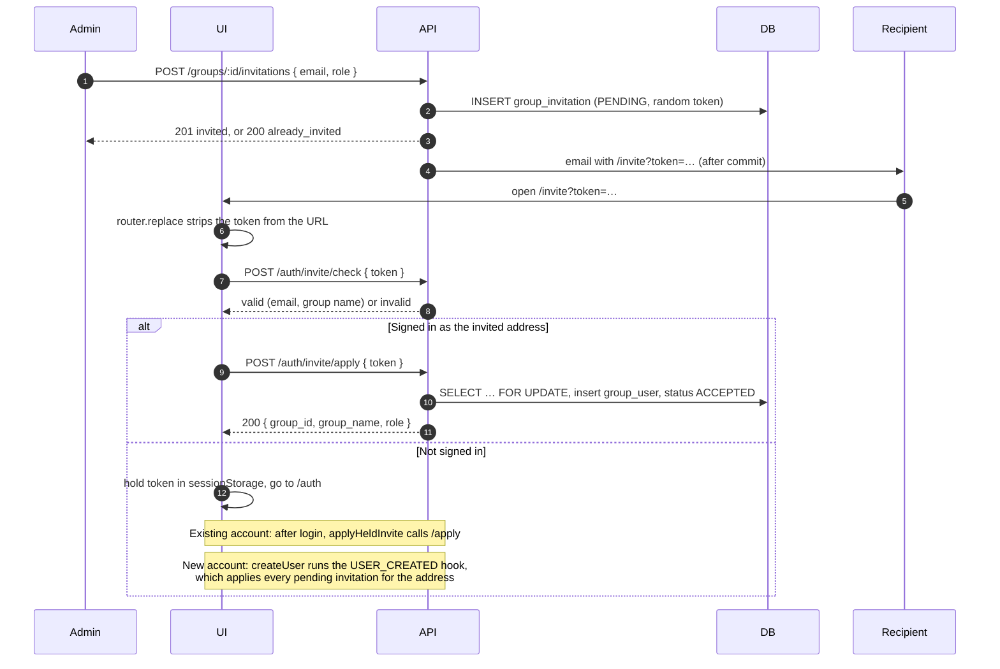

::: warning Design record — active
How a group admin brings in somebody who may not have an account yet, and why each step is
shaped the way it is. For where each piece lives, see [Code Map](./code-map.md).
:::

# Group Invitations

A group admin invites an email address. The recipient gets a link. Opening it puts them in
the group, whether or not they had an account.

**Collection access is not a separate invitation type.** An admin invites somebody to a group,
then gives the group access to the collection. Members inherit that access.

## The flow

## Why it is shaped this way

**The token is opaque, not a JWT.** It is 256 random bits in base64url. Both `/check` and
`/apply` must read the row anyway, to see status, expiry, and group state. A signature adds
nothing to that lookup. A JWT payload would also put the invited address in the URL, and so
in history, proxy logs, and referrers. The row is the authority, so an admin can cancel an
invitation at any time.

**`/check` answers only `valid` or `invalid`.** The caller is unauthenticated, and a token
leaks more easily than it looks. A reason such as "already accepted" would tell a token
holder that the recipient signed up. The service logs the specific reason at `info` instead.
The check never says whether the address has an account.

**The held token lives in `sessionStorage`.** Pinia state does not survive the OAuth redirect.
`localStorage` outlives the session and is visible to the next person on a shared machine.
`sessionStorage` survives a same-tab redirect and dies with the tab. The cost is that a link
opened in one browser and finished in another does not apply. Opening the link again once
signed in recovers it.

**The token is cleared only on a definitive outcome.** A 403, 404, or 409 means this link will
never work for this account, so `applyHeldInvite` clears it. A network error or 5xx keeps it,
so the person can retry within the tab. The `/invite` page keeps the token on a 403 too, so
the person can sign in as the right account.

**The status transition is the single-use guarantee.** `PENDING → ACCEPTED` under
`SELECT … FOR UPDATE` spends the token. The invitation row is the nonce, and no nonce table
exists.

**Invitations apply through a hook, not a wrapper.** Every new account must have its
address's pending invitations applied in the same transaction. A wrapper around `createUser`
would leave `createUser` callable, which is a wrong path guarded only by convention. So
`createUser` in `services/user.js` opens a transaction, creates the row, and runs
`hooks.run(hooks.USER_CREATED, { user, tx })`. It names nothing about invitations.
`services/invitations/hook.js` registers the handler through `services/hooks/subscribers.js`,
which `app.js` requires at startup. Signup, `POST /users`, and the auto-signup branch in
`services/auth.js` all get the behaviour without edits.

**Account creation and invitation application are one transaction.** If the account committed
and the invitations then failed, a retry would hit the email uniqueness check and the
invitations would never apply. A handler that throws therefore rolls the account back. A
handler nobody registered does nothing silently, so a test asserts that loading
`subscribers.js` registers it.

## Email normalization

Every stored or compared address goes through `normalizeEmail` in `api/src/utils/email.js`.

- It returns `null` for a non-address. `validator.normalizeEmail` alone mangles one
  (`'not-an-email'` becomes `'@not-an-email'`).
- It lowercases the address. For Gmail it also removes dots and plus-tags.
- It does not resolve institutional aliases or other providers' plus-tags.

The browser's `normalizeEmail` in `ui/src/services/email.js` only trims and lowercases.
`validator` is not in the UI bundle. The server's comparison is the one that decides.

## Stale invitations and failures

- **A runtime error** while applying invitations at signup rolls back the account too. The
  person retries from a clean state.
- **A group archived since the invitation** gets the invitation marked `CANCELLED` with
  `cancellation_reason: 'group_archived'`. At signup the other invitations still apply. At
  `/apply` the cancellation is written after the transaction, then the caller gets 409. A
  cancellation written inside the transaction would roll back with the throw.
- **A group deleted since** takes its invitations with it by cascade.
- **A caller already in the group** is not an error. The membership insert does nothing, the
  invitation still closes, and an existing role is never upgraded.
- **`/apply` checks the address before it reads the group**, so a forwarded link reveals
  nothing about its group.
- **Expiry is computed.** `expires_at` decides, and no `EXPIRED` status exists.

**Concurrent accepts.** Two tabs on one token serialize on `FOR UPDATE`. The losing tab gets
404 and says the link is spent, because "your other tab did this" and "somebody else spent
your link" look the same to the server.

**Email must stay immutable.** The `/apply` equality check assumes an account's address never
changes. Any future email-change feature must cancel the old address's `PENDING` invitations
in the same transaction.

## Authorization

`group.invite` and `group.view_invitations` both use `isGroupAdmin`. They are separate actions
because they fall on opposite sides of archiving. `invite` is `mutating`, so an archived group
takes no new invitations. `view_invitations` is `reading`, because an admin of a frozen group
still needs to see what is outstanding.

Creating an invitation never says whether the address has an account. Asking twice returns
`already_invited` and sends one email. The email goes out after the transaction commits and
cannot fail it. `sendInvite` takes no `userId`, because an invited address usually has no
account to hold an in-app notification. With `portal.base_url` unset, the message is refused
and the log names the setting.

## Mitigations

| Threat | Mitigation |
|---|---|
| Token forgery | 256-bit random token |
| Replay or double accept | `PENDING → ACCEPTED` under `SELECT … FOR UPDATE` |
| Wrong account uses the link | `/apply` compares normalized addresses on the server and answers 403. The UI never shows the invited address |
| Account enumeration | Create and `/check` answer the same whether or not the address has an account |
| Invite role escalation | `role` must be a `GROUP_MEMBER_ROLE`; only group admins may invite |
| Archived group | Create refuses with 409; `/check` answers `invalid`; `/apply` cancels and answers 409 |
| Cancelling another group's invitation | `cancelInvitation` matches on both `id` and `group_id` |
| Duplicate membership | `ON CONFLICT` against the `group_user_one_open_membership` partial unique index |
| Duplicate pending invitations | Partial unique index on `(group_id, invited_email) WHERE status = 'PENDING'` |
| HTML injection in the email | Handlebars auto-escapes the template |
| Token in browser history | `/invite` calls `router.replace` before any other request |
| Token in the referrer | `Referrer-Policy: no-referrer` on the `/invite` location in `nginx/conf/app.conf` |
| State oracle through `/check` | Only `valid` or `invalid`; the reason is logged |
| Inconsistent address forms | One `normalizeEmail` on every write and comparison |

## Out of scope

- **Resend.** Cancel and invite again.
- **Bulk or CSV invitations.** `createInvitation` composes; this is iteration.
- **Invitation-only signup.** Turning off the `signup` feature flag covers it.
- **Invitation audit events** beyond the `GROUP_MEMBER_ADDED` event an accept writes.
- **A cross-group invitation view** for platform admins.
- **Alias resolution** beyond what `validator.normalizeEmail` does for Gmail.

## Not built

**The signup mismatch dialog.** Somebody can finish OAuth as an address other than the invited
one. The signup page does not yet warn before the account is created. The server still refuses
at `/apply`, so nothing is unsafe. The work is tracked in
`.todo/issues/01-group-invitations.md` under T8.
