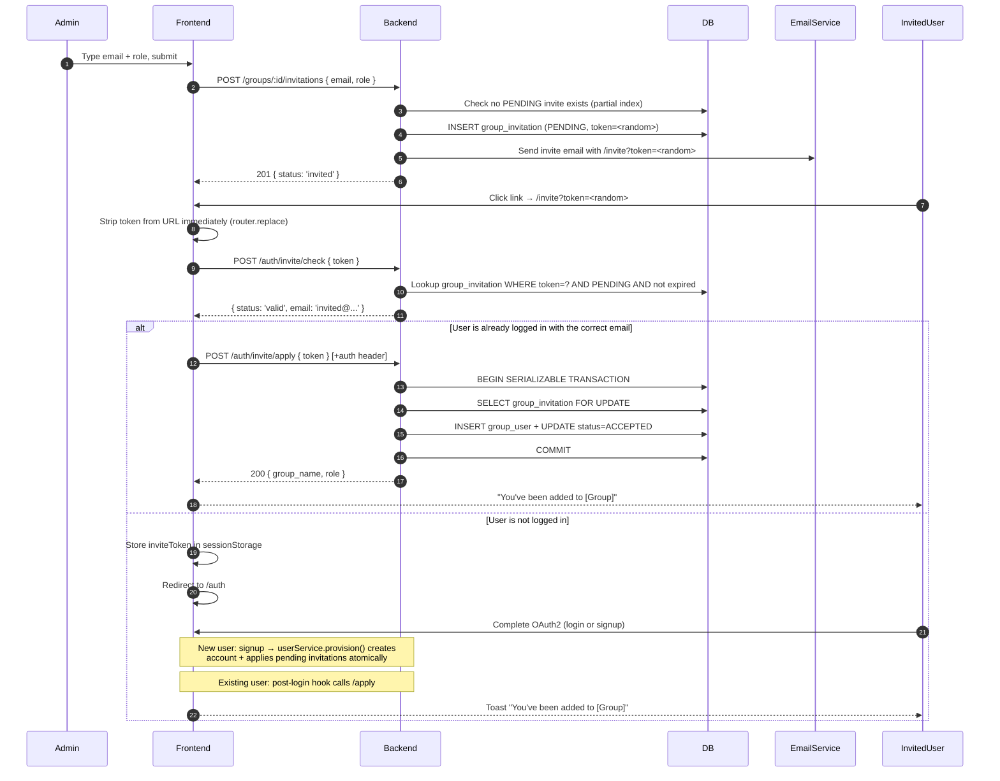

::: tip Built, with one part outstanding
The flow works end to end: a group admin invites an address, the recipient gets an email, and
the link puts them in the group whether or not they had an account. Schema, service, routes,
email, and UI all exist.

**Outstanding:** the signup-time mismatch dialog. The signup page does not yet warn, before it
submits, when the account someone signed in with differs from the address the invitation went
to. The server still refuses at `/apply` and the person is told, so nothing is unsafe — only
the earlier and friendlier warning is missing.

Three things below describe a shape the implementation deliberately does not have, and each
says so where it appears: `userService.provision()`, a standalone `api/src/services/email.js`,
and a single `invite` capability.
:::

# Group Invitations – Design Specification

## Overview

Group admins can invite users who do not yet have portal accounts to join a group. The system sends an email with a signed invite link. When the recipient clicks the link, one of two paths follows:

- **New user:** routed through the standard OAuth2 signup flow. After the account is created, all pending invitations for that email are applied automatically — the user lands in the portal already a group member.
- **Existing user:** prompted to authenticate (or already logged in). The group membership is applied immediately.

**Collection access is not a separate invitation type.** The correct composition is: invite a user to a group (this flow), then issue a collection grant to that group (existing grant flow). Users admitted through an invitation inherit collection access through group membership automatically.



---

## Design Decisions

### Why an opaque random token — not a custom JWT?

Earlier designs used a JWT for the invite URL, reasoning that it was consistent with the existing token infrastructure and that the embedded email payload would survive the OAuth2 redirect without a second sessionStorage key.

That reasoning does not hold under scrutiny:

**JWTs provide no enforcement benefit here.** Both `/check` and `/apply` must hit the DB regardless — to confirm `status = PENDING`, check `expires_at`, verify group state, and apply membership. The cryptographic signature adds a round-trip of verify-then-lookup on top of a lookup that was always required.

**Email in the URL is an unnecessary exposure.** A JWT encodes its payload in base64; anyone who intercepts or copies the invite URL can read the invited email address without authentication. While the email is delivered in the recipient's inbox in plaintext anyway, having it also in the URL means it appears in browser history, server access logs, intermediary proxy logs, and referrer headers if the stripping mitigation fails or is misconfigured. These are independent exposure surfaces beyond the email delivery channel.

**A `/check` endpoint that returns the email removes the only meaningful JWT advantage.** If `/check` returns `{ email }` on a valid token, the frontend already has the invited email from the server without needing to decode any token. The JWT's "email in the payload" benefit becomes redundant.

**The correct design:**
- Generate `crypto.randomBytes(32).toString('base64url')` — 256 bits of entropy, 43 URL-safe characters
- Store the token in `group_invitation.token` (unique, indexed)
- The URL is `/invite?token=<43-char-opaque>` — no embedded data, no decodable payload
- `/check` validates the token against the DB and returns `{ status: 'valid', email }` — the email travels through the server-validated response, not encoded in the URL itself
- `/apply` does the email equality check purely server-side — no client-side token decoding anywhere in the flow

---

### Why only the token is stored — not the email too?

After the OAuth2 redirect, only `invite_token` remains in sessionStorage. Getting the invited email for the signup mismatch check requires a `/check` call to the server.

The trade-off: one extra network round-trip on the signup page in exchange for:

- One less piece of mutable client state that can get out of sync
- No assumption that an email cached before OAuth is still the right email to compare against after OAuth
- A simpler auth store with a single invite key to manage and clear

The round-trip is cheap: `/check` is a fast indexed DB lookup that is already called on the `/invite` page. Calling it again on the signup page costs one request but gives a server-validated answer rather than trusting a value cached minutes earlier in sessionStorage.

---

### Why detect the OAuth email mismatch on the frontend before signup submits?

OAuth providers let users choose which account to authenticate with at the OAuth screen. If an invite is sent to `institutional@university.edu` and the user accidentally authenticates with `personal@gmail.com`, the backend would create an account under the personal email, `applyPendingInvitations` would find no matching invite, and the user would land in the portal without group membership and no explanation. The invite would stay `PENDING` indefinitely.

The backend cannot prevent this: it only sees the email the OAuth provider returned. The frontend is the right detection point — it has the invited email from sessionStorage and the OAuth-returned email from the pending auth state. Detecting the mismatch before the signup form submits means:

1. No account is created for the wrong email
2. The user gets an actionable explanation with a clear path to retry
3. The `inviteToken` is preserved in sessionStorage so the invite is honoured on the correct retry

This is not a security bypass. The backend independently enforces `normalizeEmail(row.invited_email) === normalizeEmail(req.user.email)` on every `/apply` call regardless. The frontend check prevents the UX failure of a committed account creation that silently orphans the invite.

---

### Why a lifecycle hook, and not a wrapper function?

The invariant is that every new account has its address's pending invitations applied, in the
same transaction. Any path that creates a user — signup, the admin endpoint, auto-signup,
import, recovery, merge — has to honour it, and an invariant that lives in documentation and
code-review attention is one that will eventually be forgotten.

A wrapper is the obvious fix and the weaker one. `userService.provision()` running `createUser`
and `applyPendingInvitations` together leaves `createUser` still callable, so it creates a
wrong path that has to be guarded by convention.

**The hook goes inside `createUser` instead.** It opens a transaction, creates the row, and
runs whatever handlers are registered for `USER_CREATED`, passing the row and the transaction
client. There is no wrong path, because there is no second entry point. `services/user.js`
names nothing about invitations: `services/hooks/` is a generic registry, and
`services/invitations/hook.js` registers itself through `services/hooks/subscribers.js`, which
`app.js` requires once at startup.

Two consequences. No call site was edited, and all of them gained the behaviour — including
the auto-signup branch in `services/auth.js`, which a wrapper would have left silently
skipping invitations. And a handler that throws propagates rather than being swallowed,
because handlers share the caller's transaction and a failure has to take the account down
with it.

The risk a hook introduces is silence: a handler nobody registered does nothing and says
nothing. Registration is therefore one file rather than scattered, and a test asserts that
loading it registers the handler.

---

### Why status transition for single-use — not a nonce?

The nonce table was purpose-built to make the signup JWT single-use. For invitations, the `group_invitation` row already carries a full lifecycle (`PENDING → ACCEPTED / CANCELLED`). The `PENDING → ACCEPTED` transition inside a serializable DB transaction gives the same single-use guarantee without adding a new table. **The invitation row is the nonce.**

---

### Why wrap signup in a single transaction?

User creation and invitation application must be atomic. A committed user with no group membership is a valid state — but if user creation commits and invitation application then fails, the invite is permanently orphaned: subsequent signup attempts fail at the email uniqueness check, so `applyPendingInvitations` can never be retried through the signup path.

A single `prisma.$transaction` makes both operations succeed or both roll back. The user always retries from a clean state. This transaction is now encapsulated inside `userService.provision()` — see above.

---

### Why does `/check` return only `valid` or `invalid` — without a reason?

An earlier design returned granular reasons (`expired`, `already_accepted`, `cancelled`). The rationale was UX: tell the recipient why their invite is no longer valid.

The problem is that `/check` is an unauthenticated endpoint. The only guard against information leakage is that the caller must hold a valid invite token. But invite tokens appear in email, URL history, proxy logs, and potentially browser history if the on-mount stripping fails late. The bar for "attacker holds a valid token" is lower than it looks.

Returning `reason: 'already_accepted'` to an unauthenticated caller with a copy of the invite URL reveals that the intended recipient has signed up — inferring account existence and activity without authentication.

**The fix:** return only `{ status: 'valid' | 'invalid' }` from `/check`. Log the specific reason server-side at `info` level for debugging. Show a generic "This invitation is no longer valid — contact your group admin" in the UI for all invalid cases. The UX loss is minor; the information oracle is closed.

---

### Why sessionStorage — not localStorage or memory?

| Storage | Verdict | Reason |
|---------|---------|--------|
| In-memory (Pinia state) | ✗ | Lost on full-page navigation — cannot survive the OAuth2 redirect |
| `localStorage` | ✗ | Persists indefinitely across browser sessions; a token left by one user is visible to another user opening a new tab on a shared machine |
| `sessionStorage` | ✓ | Survives the OAuth2 redirect (same-tab navigation), cleared on tab close, never shared across tabs or sessions |

`sessionStorage` is the smallest sufficient scope for a within-tab OAuth redirect.

**Known limitation — cross-browser / cross-device OAuth:** `sessionStorage` is scoped to the tab. If a user opens the invite link in Chrome but completes OAuth in Safari (common on iOS with password managers that redirect to a different browser), the `invite_token` is not present in the new context. The result: the user is logged in (or signed up) but is not added to the group. This is not a security failure — it is a usability gap. The mitigation is the invite link itself: clicking it a second time in the correct browser starts from `/check` (still `valid`, still `PENDING`) and routes through the normal flow. This limitation should be surfaced in support documentation.

---

### Why clear the invite token only on a definitive outcome — not always?

An earlier design called `clearInviteData()` unconditionally after the post-login `/apply` call — success or failure. If `/apply` fails for a transient reason (network error, 5xx), the token is gone and the user has no automatic retry path. The invite appears to have silently disappeared.

The correct policy:

| `/apply` outcome | Action |
|----------------|--------|
| `200` success | Clear token + email; show "You've been added to [group]" toast |
| `403` email mismatch | Clear token + email; show "Invitation was for a different address" |
| `404` invite not found | Clear token + email; show "This invitation is no longer valid" |
| `409` group archived | Clear token + email; show "The group has been archived" |
| `5xx` / network error | **Retain** token + email; show "Failed to join group — tap here to retry" with retry button |

Retaining the token on transient errors means the retry button calls `/apply` again in the same browser tab session. The token does not persist across tab closes — the retry window is intentionally bounded to the session.

---

### Extensibility pre-accommodations

Two anticipated extensions are pre-accommodated without speculative code:

- **Bulk invitations:** `invitationService.createInvitation()` is a pure, composable function — bulk support is just iteration with no architectural change.
- **Invitation-only signup mode:** Disable the `signup` feature flag. The `loginHandler`'s `NOT_A_USER` path short-circuits to a "you need an invitation" response. No new code needed.

---

## Email Normalization

**Rule:** `normalizeEmail` from `api/src/utils/email.js`, wrapping
[`validator`](https://github.com/validatorjs/validator.js).

`validator.normalizeEmail` is never called on its own. Given a string that is not an address it
returns a mangled string rather than failing — `'not-an-email'` comes back as `'@not-an-email'`
— which would then be stored and compared as though it were real. The wrapper checks validity
first and returns `null` for a non-address.

**The browser's version is deliberately weaker.** `ui/src/services/email.js` trims and
lowercases and nothing more; `validator` is an API dependency and is not in the UI bundle. The
difference shows in one place, and it is bounded: see [the signup mismatch
dialog](#signup--oauth-email-mismatch-detection).

This function is applied at every point where an email is stored or compared:
- Invite creation — before writing `invited_email` to the DB
- User creation — before writing `user.email` to the DB
- `/apply` — `normalizeEmail(row.invited_email) === normalizeEmail(req.user.email)`
- Frontend mismatch check — `normalizeEmail(auth.pendingUser.email) === normalizeEmail(inviteEmail)`

**What `validator.normalizeEmail` handles:**
- Lowercases the entire address
- For Gmail and Google Mail addresses: removes dots from the local part (`a.b@gmail.com` → `ab@gmail.com`), strips plus-tags (`user+tag@gmail.com` → `user@gmail.com`), and normalizes Google Mail aliases to `gmail.com`
- For all domains: lowercases the domain part

**What it does NOT handle:** institutional alias resolution (`jdoe@uni.edu` → `john.doe@uni.edu`) or provider-specific rules beyond Gmail. Non-Gmail plus-addressing (`user+tag@outlook.com`) is left as-is.

**Implication:** for Gmail users, dot-variants and plus-tags now match correctly — an admin can invite any Gmail variant and it will match the canonical address the OAuth provider returns. For other providers, an alias mismatch will not be automatically resolved. The user can always click the invite link a second time as an existing user to apply the invite via `/apply` directly.

**Frontend:** use the same `validator.normalizeEmail` via the browser-compatible build of `validator`. It is already a project dependency.

---

## Data Model

### `INVITATION_STATUS` enum

```prisma
enum INVITATION_STATUS {
  PENDING
  ACCEPTED
  CANCELLED
}
```

`EXPIRED` is not a status value. Expiry is a computed condition: `status = 'PENDING' AND expires_at < now()`. This keeps `expires_at` as the single source of truth — no cron job required, no consistency window between when a record logically expires and when a background job catches up.

### `group_invitation` table

```prisma
model group_invitation {
  id            String            @id @default(uuid())
  token         String            @unique @db.VarChar(43)  // 256-bit random base64url
  group_id      String
  invited_email String            @db.VarChar(254)         // stored normalized (trimmed, lowercase)
  role          GROUP_MEMBER_ROLE @default(MEMBER)
  invited_by    String            // user.subject_id of the inviting admin
  status        INVITATION_STATUS @default(PENDING)
  created_at    DateTime          @default(now()) @db.Timestamp(6)
  expires_at    DateTime          @db.Timestamp(6)
  accepted_at         DateTime?  @db.Timestamp(6)
  cancelled_at        DateTime?  @db.Timestamp(6)
  cancellation_reason String?    // e.g. 'group_archived', 'admin_cancelled'

  group   group @relation(fields: [group_id], references: [id], onDelete: Cascade)
  inviter user  @relation("invitations_sent", fields: [invited_by], references: [subject_id], onDelete: Restrict)

  @@index([group_id, status])
  @@index([invited_email, status])
}
```

The `token` field has a `@unique` index (Prisma-generated). No additional index is needed for `/check` and `/apply` lookups — `WHERE token = ?` resolves in O(1) via the unique index.

Add to the `user` model:
```prisma
invitations_sent group_invitation[] @relation("invitations_sent")
```

### Partial unique index

```sql
CREATE UNIQUE INDEX group_invitation_pending_unique
  ON group_invitation (group_id, invited_email)
  WHERE status = 'PENDING';
```

Enforces at most one active invite per `(group, email)` at the DB level, surviving race conditions at the application layer. Multiple `ACCEPTED` / `CANCELLED` rows for the same pair are permitted — they form the historical record.

### Invite token generation

```javascript
const { randomBytes } = require('node:crypto');

function generateInviteToken() {
  return randomBytes(32).toString('base64url'); // 43 chars, URL-safe, 256 bits of entropy
}
```

No signing key. No JWT library. Token validity is purely a DB lookup: if the row exists and is `PENDING` with `expires_at > now()`, the token is valid.

### Config additions

```json
// config/default.json
{
  "invitations": { "ttl_days": 7 },
  "portal": { "base_url": "" }
}
```

`portal.base_url` is where the `/invite` page lives, and there is no other setting in the API
that knows it. Empty by default like the other outward URLs, mapped to `PORTAL_BASE_URL` in
`custom-environment-variables.json`, and set to `https://localhost` in `localhost.json`.

**Unset, the message is refused rather than sent with a link that goes nowhere**, and the log
names the setting. A relative link in an email is inert and says nothing about why.

There is no `email.*` block. SMTP configuration already exists under `smtp`, read by
`api/src/notification/email/mailer.js`.

---

## API Reference

### Authorization

| Action | Policy action | Authorized roles |
|--------|---------------|-----------------|
| Create invitation | `group.invite` | Group admin, Platform admin |
| Cancel invitation | `group.invite` | Group admin, Platform admin |
| List invitations | `group.view_invitations` | Group admin, Platform admin |
| Check invite token | — | Public (unauthenticated) |
| Apply invite token | — | Authenticated user, email must match the invitation |

**Two policy actions rather than one, and not because different people hold them.** Both are
`isGroupAdmin`. They are separate because every action declares a restriction class, and these
fall on opposite sides.

`group.invite` is declared `mutating`, so an archived group takes no new invitations — the
same reasoning that makes `dataset.contribute` mutating. That does more than change a status code:
a blocked capability is absent from the capability map, so the UI never offers the button on an
archived group rather than offering it and failing.

`group.view_invitations` is declared `reading` and survives archiving. The admin explaining
why nobody can join is exactly the person who needs to see what is outstanding.

The test is not whether the two want the same rule today. It is whether an argument for
changing one is an argument for changing the other, and here it is not.

---

### `POST /groups/:id/invitations`

```json
// Request body
{ "email": "new-user@example.com", "role": "MEMBER" }
```

**Logic:**
1. Validate group exists and is not archived → `403` if archived
2. Normalize email: `normalizeEmail(body.email)`
3. Check if a user with this email is already a direct member → `400 Already a member`
4. Check for a `PENDING` invite for `(group_id, email)` → `200 { status: 'already_invited' }` (idempotent; no duplicate email sent)
5. Generate opaque token: `generateInviteToken()`
6. Create `group_invitation` row: `token`, `status: PENDING`, `expires_at = now + config.invitations.ttl_days`
7. Send invitation email (token in URL; see Email section)
8. Respond `201 { status: 'invited' }`

The endpoint intentionally does not reveal whether the invited email has an existing account — exposing this would allow group admins to enumerate portal users.

---

### `GET /groups/:id/invitations`

Returns invitations filtered by `status` query param (default: `PENDING`). Supports `limit` / `offset` pagination.

Response fields per row: `id`, `invited_email`, `role`, `status`, `created_at`, `expires_at`, `is_expired` (computed: `expires_at < now()`), `inviter.name`.

`is_expired` is computed by the API — the UI uses it to display an "Expired" badge. To query expired invitations, request `status=PENDING` and filter on `is_expired: true`.

---

### `DELETE /groups/:id/invitations/:inviteId`

Sets `status = CANCELLED`, `cancelled_at = now`. Only allowed if current status is `PENDING`.

The WHERE clause **must** include `group_id` to prevent an ID-based access issue — an admin of Group A must not be able to cancel Group B's invitations:

```javascript
await prisma.group_invitation.update({
  where: {
    id: inviteId,
    group_id: params.id, // ties inviteId to the authorized group
  },
  data: { status: 'CANCELLED', cancelled_at: new Date(), cancellation_reason: 'admin_cancelled' },
});
// Prisma throws RecordNotFound if the invitation doesn't belong to this group.
```

---

### `POST /auth/invite/check` — public

Validates the invite token without consuming it. The frontend calls this on mount of the `/invite` page to decide which path to show.

```json
// Request
{ "token": "<43-char-opaque-token>" }

// Valid response
{ "status": "valid", "email": "invited@example.com" }

// Invalid response
{ "status": "invalid" }
```

No `reason` field is returned to unauthenticated callers. The specific failure reason (`expired`, `already_accepted`, `cancelled`, `not_found`) is logged server-side at `info` level for diagnostics.

**Logic:**
1. Validate token is a non-empty string
2. Look up `group_invitation WHERE token = ? AND status = 'PENDING' AND expires_at > now()`
3. If not found: log reason, respond `{ status: 'invalid' }`
4. Do not check whether the email has an existing account (prevents account enumeration)
5. Respond `{ status: 'valid', email: row.invited_email }`

---

### `POST /auth/invite/apply` — authenticated

Applies the invitation to the authenticated user's account.

```json
// Request
{ "token": "<43-char-opaque-token>" }

// Success response
{ "group_name": "...", "role": "MEMBER" }
```

**Logic (inside a serializable transaction):**
1. Validate token is a non-empty string
2. `SELECT group_invitation WHERE token = ? AND status = 'PENDING' AND expires_at > now() FOR UPDATE`
3. If not found: respond `404`
4. Assert `normalizeEmail(row.invited_email) === normalizeEmail(req.user.email)` → `403 This invitation is for a different email address`
5. Check `group.is_archived` → if archived, return the condition rather than throwing
6. Insert into `group_user` with the invited `role`, `ON CONFLICT ... DO NOTHING`
7. Update `group_invitation` → `status = ACCEPTED`, `accepted_at = now()`
8. Respond `200 { group_id, group_name, role }`

Then, **outside the transaction**, an archived group is marked `CANCELLED` with
`reason: 'group_archived'` and the response is `409 The group has been archived since this
invitation was sent`.

**The cancellation cannot happen inside the transaction.** Writing `CANCELLED` and then
throwing rolls the write back with everything else, leaving the invitation `PENDING` forever
on a group nobody can join. This is not a hypothetical; it shipped that way and a test caught
it.

Step 4 is checked before the group is read, so somebody holding a forwarded link learns
nothing about the group it points at.

Step 6 is `ON CONFLICT` against `group_user_one_open_membership` rather than a read-then-write,
which also makes the already-a-member case idempotent: the insert does nothing, the invitation
still closes, and **an existing membership is never upgraded** — an invitation is not a way to
change somebody's role.

The `SELECT FOR UPDATE` in step 2 serializes concurrent requests on the same token — see
[Security Analysis](#security-analysis).

---

### User provisioning — the `USER_CREATED` hook

Every path that creates an account goes through `userService.createUser`, and that is where the
invariant lives. See [Why a lifecycle hook, and not a wrapper
function?](#why-a-lifecycle-hook-and-not-a-wrapper-function) for the reasoning.

```javascript
// services/user.js — the whole of what it knows
const user = await prisma.$transaction(async (tx) => {
  const created = await tx.user.create({ /* ... */ });
  await hooks.run(hooks.USER_CREATED, { user: created, tx });
  return created;
});
```

```javascript
// services/hooks/subscribers.js — required once by app.js, for its side effect
hooks.on(hooks.USER_CREATED, applyInvitationsForNewUser);
```

`services/user.js` names nothing about invitations, and would read the same if the feature were
deleted. `services/hooks/index.js` is a generic registry: handlers run in registration order,
and one that throws stops the rest and propagates.

**No call site was edited.** `routes/users.js`, `routes/auth/signup.js`, and the auto-signup
branch in `services/auth.js` all call `createUser` and all gained the behaviour. None of them
holds an open transaction, so `createUser` opening its own is safe and no `tx` parameter has to
be threaded through. A future import, recovery, or merge path gets it by construction.

The auto-signup branch is worth naming: it creates an account the first time somebody arrives
through the institution's identity provider, and under a wrapper it would have kept silently
skipping invitations.

#### Failure taxonomy inside `applyPendingInvitations`

**Category A — Runtime errors** (DB failure, deadlock, unexpected exception)

Propagate up and roll back both user creation and all invitation applications. The user sees a `500` and retries from scratch. Because no user row was committed, the next attempt is identical.

**Category B — Stale data errors** (caught per-invitation; do not abort the outer transaction)

| Condition | Handling |
|-----------|---------|
| Group archived after invite was created | Skip; mark `CANCELLED` with `reason: 'group_archived'`; continue with remaining invites |
| Group deleted after invite was created | `group_invitation` row CASCADE deleted — no row found, no-op |
| User somehow already a member (defensive) | Treat as idempotent success; mark `ACCEPTED` |
| Multiple invites, one is stale | Per-invite isolation — remaining invites still apply |

Signup succeeds regardless of Category B failures. The `cancellation_reason` field gives admins an audit trail for why an invite was not honoured.

---

## Frontend Flow

### `/invite` page

Route: `ui/src/pages/invite.vue` — `requiresAuth: false`. At `/invite`, not `/auth/invite`:
the path is baked into every link already sent.

```
/invite?token=<43-char-opaque-token>
```

**On mount:**

1. Extract `token` from `route.query.token`
2. **Immediately** call `router.replace({ query: {} })` to strip the token from the URL — before any sub-resource request fires. This removes the token from the browser's active history entry and prevents it appearing in referrer headers sent to third-party resources the page loads (analytics, CDN fonts, etc.).
3. Call `POST /auth/invite/check { token }`.

**If `/check` returns `invalid`:** Show "This invitation is no longer valid — please contact your group admin" with a link to `/auth`. No specific reason is shown to the user.

**If `/check` returns `valid`:**

| Logged-in state | Action |
|----------------|--------|
| Logged in; `normalizeEmail(auth.user.email) === normalizeEmail(check.email)` | Call `POST /auth/invite/apply { token }` → show "You've been added to [group]" → redirect to group page |
| Logged in; emails don't match | Show **"This invitation was sent to a different email address"** — do not reveal which email (the logged-in user is not the intended recipient) |
| Not logged in | Store `inviteToken` in sessionStorage; redirect to `/auth` |

When not logged in, the frontend always redirects to `/auth` — checking whether the user has an account would require account enumeration. The `loginHandler` handles both cases: existing users receive an auth JWT; new users receive a signup JWT and are routed to `/auth/signup`.

---

### Auth store additions

```javascript
// sessionStorage: survives same-tab OAuth2 redirects,
// cleared on tab close, never shared across tabs or sessions.
const inviteToken = ref(useSessionStorage("invite_token", ""));

function clearInviteData() {
  inviteToken.value = "";
}
```

---

### Post-login invite application

In `withHandledVerifyResponse`, after a successful `SUCCESS` login response, if `inviteToken.value` is set:

```javascript
try {
  const res = await applyInvite({ token: inviteToken.value });
  showToast(`You've been added to ${res.group_name}`);
  clearInviteData();
} catch (err) {
  if ([403, 404, 409].includes(err.response?.status)) {
    // Definitive rejection — token is no longer usable
    showToast(errorMessageFor(err.response.status), { type: 'error' });
    clearInviteData();
  } else {
    // Transient failure — retain token so the user can retry
    showToast('Failed to join group — tap here to retry', {
      type: 'warning',
      action: () => applyInviteAndClear(),
    });
    // inviteToken is NOT cleared
  }
}
```

Clearing on transient errors would silently orphan the invite from the user's perspective. Retaining the token bounds the retry window to the current tab session.

---

### Signup — OAuth email mismatch detection

::: warning Not built
This is the one part of the flow that does not exist. It needs a real OAuth round trip to
exercise, and the path it guards already ends correctly without it: `/apply` refuses the
mismatch server-side, the auth store clears the held token on 403, and the person is told the
invitation was sent to a different address. What is missing is only the earlier, friendlier
warning. The rest of this section describes the intended shape.
:::

This is also the only place where the browser's weaker `normalizeEmail` is visible. The
comparison happens before the person is authenticated, so no server-side answer exists at that
moment and the browser has to make it. Two addresses differing only by Gmail dots would see the
dialog when the server would have accepted them; the "continue without joining" path is the way
out, and the invitation stays `PENDING`.

After OAuth returns the pending user's email (`auth.pendingUser.email`), if `inviteToken` is set, the signup page detects a mismatch before form submission:

```javascript
const oauthEmail = normalizeEmail(auth.pendingUser?.email);
// Re-fetch from /check — one round-trip, but avoids a second sessionStorage key
// and gives a server-validated email rather than a value cached before OAuth.
const { email: rawInviteEmail } = await checkInvite({ token: auth.inviteToken });
const inviteEmail = normalizeEmail(rawInviteEmail);

if (inviteEmail && oauthEmail && oauthEmail !== inviteEmail) {
  showMismatchDialog = true;
}
```

**Mismatch dialog:**
> "The account you signed in with (`personal@gmail.com`) doesn't match the email this invitation was sent to (`institutional@university.edu`). To join the group automatically, go back and sign in with the correct account."

Two choices:

- **Go back and try again** — clears the pending OAuth state, redirects to `/auth` to reauthenticate. `inviteToken` is retained in sessionStorage so the invite is honoured on the correct retry.
- **Continue to portal without joining the group** — clears `inviteToken`, proceeds with account creation. The invitation stays `PENDING`; the group admin can see it is still outstanding in the invitations list.

If emails match, the form submits normally. `userService.provision()` applies the invite atomically as part of account creation.

---

## Email

### Template

**Subject:** `You've been invited to join [Group Name] on [App Name]`

**Body (plain text + HTML):**
```
[Inviter Name] has invited you to join "[Group Name]" as a [Member / Admin].

Click the link below to accept the invitation:

  Accept Invitation →  https://app.example.com/invite?token=<opaque-token>

This link expires in 7 days. If you did not expect this invitation, you can safely ignore this email.
```

All user-supplied values (group name, inviter name) must be HTML-escaped in the HTML version of the email body — a malicious group admin could otherwise inject HTML and mislead recipients about where the invite link points. Use a template engine that auto-escapes (e.g. Handlebars) or explicit `he.encode()` calls.

### Email service

**No new email service.** `api/src/notification/` already holds a pooled, rate-limited mailer,
three Bull priority queues, MJML and Handlebars templates, and a worker process. Adding an
invitation is the four steps that subsystem's own `INTEGRATION.md` describes: a constant in
`types.js`, a routing entry, a `send*` method, and a template.

- `TYPES.INVITE`, routed to `email:high`. An invitation is time-limited and the recipient is
  usually waiting: somebody told them to expect it before it was sent.
- `notify.sendInvite({ to, subject, groupName, inviterName, role, acceptUrl, expiresInDays })`.
- `templates/invite.mjml.hbs`. Handlebars auto-escapes, which is the HTML-injection mitigation
  above — no explicit encode call is needed, and a test asserts a group name containing markup
  comes out escaped.

**`sendInvite` takes no `userId`, and that is the point.** `_enqueue` writes an in-app
notification as a dual write whenever a `userId` comes with the call, and an invited address
usually has no account to read one.

`api/src/services/invitations/notify.js` builds the link and calls it. Sending happens after
the transaction commits and cannot fail it: the row is already there, an admin can see it
pending, and the link works whenever the message arrives. Asking twice sends one message,
because only a fresh invitation is announced.

### Config

```json
// config/default.json
{
  "invitations": {
    "ttl_days": 7
  },
  "email": {
    "enabled": false,
    "from": "noreply@bioloop.example.com",
    "smtp": {
      "host": "",
      "port": 587,
      "secure": false,
      "auth": { "user": "", "pass": "" }
    }
  }
}
```

```json
// config/custom-environment-variables.json
{
  "email": {
    "enabled": "EMAIL_ENABLED",
    "from": "EMAIL_FROM",
    "smtp": {
      "host": "EMAIL_SMTP_HOST",
      "port": "EMAIL_SMTP_PORT",
      "auth": { "user": "EMAIL_SMTP_USER", "pass": "EMAIL_SMTP_PASS" }
    }
  }
}
```

---

## Security Analysis

### Mitigations summary

| Threat | Mitigation |
|--------|-----------|
| **Token forgery** | 256-bit random token — computationally infeasible to guess; no signature required because the token is not self-contained |
| **Token replay / double-accept** | `PENDING → ACCEPTED` transition inside a serializable transaction with `SELECT FOR UPDATE`; second request finds token no longer `PENDING` |
| **Email mismatch / impersonation** | `/apply` asserts `normalizeEmail(row.invited_email) === normalizeEmail(req.user.email)` server-side. For new sign-up flows: frontend detects mismatch before form submission using server-provided `inviteEmail` from sessionStorage |
| **Account enumeration by group admin** | Invite creation always returns the same response regardless of whether the email has an existing account |
| **Expired invite** | `expires_at > NOW()` enforced in both `/check` and `/apply`; expiry is a computed condition — no cron or separate status value required |
| **Privilege escalation via invite role** | Role field validated server-side; only `MEMBER` or `ADMIN` accepted; only group/platform admins can create invitations |
| **Invite to archived group** | `POST /groups/:id/invitations` rejects at creation; `/apply` cancels with `reason: 'group_archived'` and returns `409` |
| **ID-based access issue on invitation cancel** | `DELETE` WHERE clause includes both `id` and `group_id` — Prisma throws `RecordNotFound` if the invite doesn't belong to the authorized group |
| **Duplicate memberships** | `group_user_one_open_membership`, a partial unique index on `(group_id, user_id) WHERE removed_at IS NULL` — DB constraint enforces at write layer. Not the primary key, which is a surrogate `id`, because membership is soft-deleted and a closed row must be able to sit beside an open one |
| **Duplicate PENDING invites** | Partial unique index on `(group_id, invited_email) WHERE status = 'PENDING'` — DB-enforced, race-safe |
| **Email header injection** | nodemailer's structured API — no raw header string interpolation |
| **HTML injection in email body** | All user-supplied values (group name, inviter name) HTML-escaped before template rendering |
| **Token in URL: browser history** | `/invite` page strips `?token=` immediately on mount via `router.replace({ query: {} })` before any sub-resource fires |
| **Token in URL: referrer leakage** | `Referrer-Policy: no-referrer` set at the nginx `/invite` location block |
| **Token state oracle via `/check`** | `/check` returns only `valid` / `invalid` — no reason field exposed to unauthenticated callers; reason logged server-side |
| **Email normalization inconsistency** | `normalizeEmail()` applied at every write and comparison point — one function, enforced by `userService.provision()` and invite service |

---

### Wrong user clicks the invite link

The invited email is stored in the DB row, not in the token. The server enforces the match; no trust is placed in client-side state.

| Scenario | What happens |
|----------|-------------|
| Not logged in, wrong person | They complete OAuth → logged in as themselves → `/apply` asserts email match → `403` |
| Already logged in as someone else | Frontend compares `auth.user.email` to `check.email` (case-insensitive) → shows "This invitation was sent to a different email address" — does not reveal which email — no `/apply` call made |
| Link intentionally forwarded to a colleague | Colleague authenticates as themselves via OAuth; `/apply` → `403` email mismatch |

The error message for a wrong logged-in user does not display the invited email. The opaque token reveals nothing decodable — there is no `jwtDecode` equivalent on the client side.

---

### Concurrent accepts

If the recipient opens the invite link in multiple tabs simultaneously:

1. All tabs call `POST /auth/invite/apply` with the same token
2. `SELECT FOR UPDATE` inside the serializable transaction serializes the requests
3. **First request:** finds `status = PENDING`, adds to `group_user`, transitions to `ACCEPTED`, commits
4. **Subsequent requests:** find the row is no longer `PENDING` → `404 This invitation is no longer valid`
5. One tab shows "You've been added to [group]"; the others say the link is spent

No duplicate `group_user` row is possible regardless: the insert is `ON CONFLICT` against
`group_user_one_open_membership`, the partial unique index on `(group_id, user_id) WHERE
removed_at IS NULL`.

A losing tab reports the link as spent rather than reporting success. The alternative — telling
every tab it worked — cannot distinguish "your other tab did this a moment ago" from "somebody
else spent your link", and the second is worth showing.

---

### Email mutability

The `/apply` email equality check holds only if user email addresses are immutable after account creation.

If email change is ever implemented:
- PENDING invitations for the old address become unable to be applied — correct, since the invite was issued to that identity
- Those invitations should be explicitly `CANCELLED` on email change to keep the admin list accurate and avoid orphaned `PENDING` records

**Note for the future:** any email-change feature must cancel PENDING group invitations for the old address as part of the change transaction.

---

## Out of Scope

| Feature | Rationale |
|---------|-----------|
| **Resend invitation** | Straightforward follow-up: cancel + re-create with the same email |
| **Bulk / CSV invitations** | `createInvitation` is composable; implementation is iteration with no architectural change |
| **Collection access via invitation** | Not a separate invitation type. Invite to a group (this flow), grant the group access to the collection (existing grant flow). Group members inherit collection access automatically. |
| **Invitation-only signup mode** | Disable `signup` feature flag; `loginHandler`'s `NOT_A_USER` path short-circuits — no code changes needed |
| **Invitation audit trail** | Extend `authorization_audit` with `INVITE_SENT`, `INVITE_ACCEPTED`, `INVITE_CANCELLED` event types |
| **Platform admin invitation dashboard** | Add `/admin/invitations` endpoint for a cross-group view |
| **Provider-specific email canonicalization** | Gmail dot-insensitivity and plus-address stripping handled by `validator.normalizeEmail`. Non-Gmail aliases and institutional alias resolution are out of scope — documented as a known mismatch edge case |

---

## What was built

Six phases, one commit each, `invitations-phase-1` through `-6`, on 2026-09-09.

### Backend

| Piece | Where |
|---|---|
| `INVITATION_STATUS` enum, `group_invitation` table, both indexes, `invitations_sent` relation | `prisma/migrations/20260912010000_group_invitations/` |
| `normalizeEmail`, refusing a non-address rather than mangling it | `api/src/utils/email.js` |
| `generateInviteToken`, `createInvitation`, `listInvitations`, `cancelInvitation`, `applyPendingInvitations`, `checkInvitationToken`, `acceptInvitationByToken` | `api/src/services/invitations/index.js` |
| The invitation email, best-effort and after commit | `api/src/services/invitations/notify.js` |
| `TYPES.INVITE`, `sendInvite`, `invite.mjml.hbs` | `api/src/notification/` |
| The generic `USER_CREATED` registry and its one subscriber | `api/src/services/hooks/`, `api/src/services/invitations/hook.js` |
| The transaction and one `hooks.run` call — the whole legacy edit | `api/src/services/user.js` |
| `POST`, `GET`, `DELETE /groups/:id/invitations` | `api/src/routes/groups.js` |
| `POST /auth/invite/check` and `/apply` | `api/src/routes/auth/invite.js` |
| `group.invite` and `group.view_invitations`, sorted into the restriction sets | `authorization/builtin/policies/group.js`, `authorization/builtin/restrictions.js` |
| `invitations.ttl_days`, `portal.base_url`, `PORTAL_BASE_URL` | `api/config/` |

No expiry cron. Expiry is `PENDING AND expires_at < now()`, computed at query time.

### Frontend

| Piece | Where |
|---|---|
| Trim-and-lowercase `normalizeEmail` | `ui/src/services/email.js` |
| The `/invite` page: strips the token on mount, then checks, redirects, or applies | `ui/src/pages/invite.vue` |
| `inviteToken` in sessionStorage, `clearInviteData`, and the post-login apply with selective clearing | `ui/src/stores/auth.js` |
| `createInvitation`, `listInvitations`, `cancelInvitation` | `ui/src/services/v2/groups.js` |
| `checkInvite`, `applyInvite` | `ui/src/services/auth.js` |
| The invite-by-email section | `ui/src/components/v2/groups/AddGroupMemberModal.vue` |
| The invitations table, with a status badge that reads `status` and `is_expired` together | `ui/src/components/v2/groups/GroupInvitationsTab.vue` |
| `Referrer-Policy: no-referrer` on the `/invite` location | `nginx/conf/app.conf` |

The invite-by-email section is always shown, not revealed when a user search comes back empty.
The search only finds people who have already signed in, so an empty result is the normal case
for a new colleague, and a section that appears and disappears reads as an error.

### Verified

Against the running system, with tokens read out of MailHog as a recipient would. The emailed
43-character token is byte-identical to the row. `/check` unauthenticated answers `valid` and
then `invalid` once spent. The wrong-account screen appears without naming the invited address.
`POST /users` put a brand-new account straight into the group as `ADMIN` through a call that
mentions no invitation. Withdraw empties the list and returns the tab badge to zero.

`Referrer-Policy` is the one thing not verified here: development serves the UI from Vite and
never reaches `nginx/conf/app.conf`. The page's own token-stripping is verified — the address
bar reads `https://localhost/invite` after every visit.

### Still open

- **The signup mismatch dialog.** See [Signup — OAuth email mismatch
  detection](#signup--oauth-email-mismatch-detection).
- **Support docs** for the sessionStorage limitation: an invitation held before signing in
  belongs to the tab it was opened in, so opening the link on a phone and finishing on a laptop
  loses it. The recovery is to open the link again once signed in, and nobody has written that
  down anywhere a user would find it.
