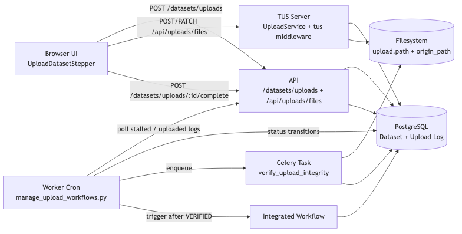
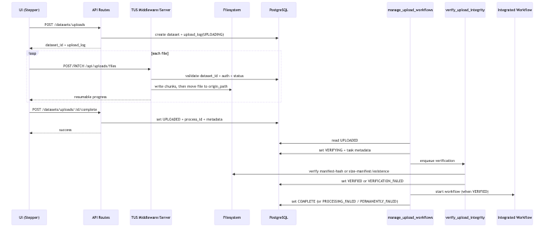
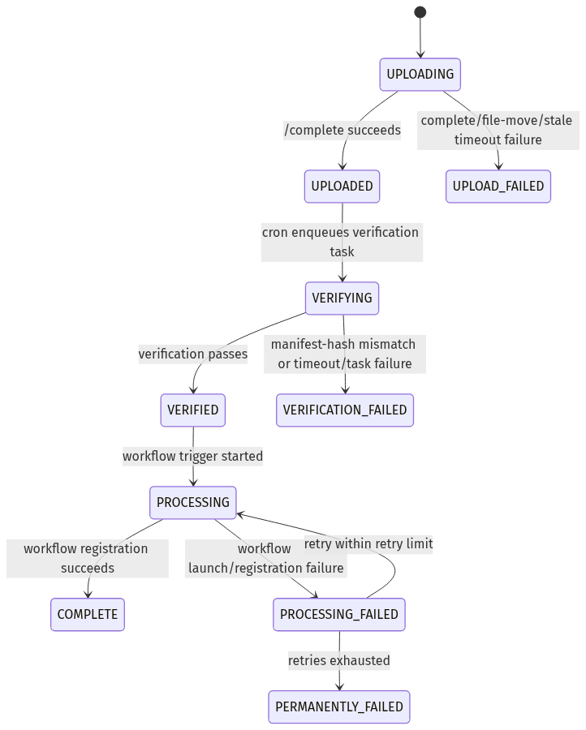
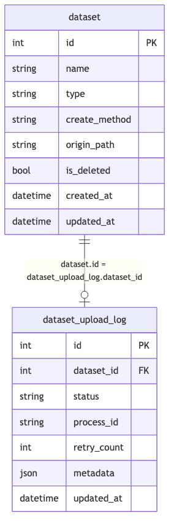
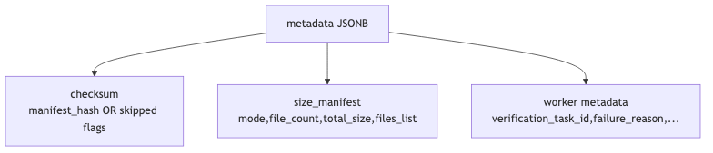
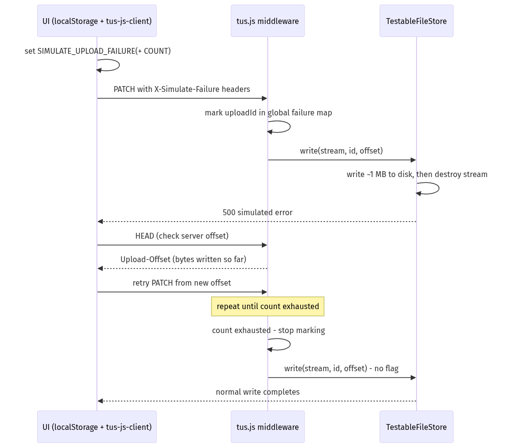

# Dataset Upload

## Overview

Uploads use TUS resumable transfer handled directly by the core API.

## Architecture

### Components

- **UI** (`UploadDatasetStepper`) orchestrates metadata collection and TUS transfer.
- **API** hosts TUS server and upload routes (`/datasets/uploads/*`).
- **Worker cron** (`manage_upload_workflows.py`) drives status transitions.
- **Celery task** (`verify_upload_integrity.py`) performs async verification.
- **PostgreSQL** stores upload logs and relational-associations related to a Dataset-upload.



### Objectives

- Support large-file and large-directory browser uploads without restarts.
- Preserve file integrity with optional end-to-end manifest-hash validation.
- Keep upload registration and post-upload processing idempotent.
- Make failure states explicit and recoverable.

## Request Flow

### 1) Register Upload Session

`POST /datasets/uploads`

- Creates dataset (`create_method = UPLOAD`).
- Creates `dataset_upload_log` with status `UPLOADING`.
- Persists deterministic `origin_path`.

### 2) Transfer File Bytes (TUS)

`POST/PATCH /api/uploads/files`

- TUS metadata includes `dataset_id`, `filename`, and directory metadata.
- In non-production test mode, failure simulation can be injected with:
  - `X-Simulate-Failure`
  - `X-Simulate-Failure-Count`
- `onUploadFinish` moves each file into final `origin_path` immediately.

### 3) Mark Upload Complete

`POST /datasets/uploads/:id/complete`

- Transitions upload log to `UPLOADED` in an idempotent manner.
- Records `process_id` and optional metadata (e.g. upload manifest-hash, size manifest).
- Rejects status regression if upload already advanced beyond upload stage.

### 4) Worker-Orchestrated Post-Upload Pipeline

`manage_upload_workflows.py` runs every minute:

- `UPLOADED` -> enqueue verification task and set `VERIFYING`.
- `VERIFYING` -> inspect Celery state; apply timeout/failure fallback logic.
- `VERIFIED` -> start integrated workflow and atomically persist `COMPLETE`.
- `PROCESSING_FAILED` -> retry integrated workflow up to retry limit.
- stale `UPLOADING` sessions -> `UPLOAD_FAILED`.





## Data Model

### `dataset`

- `create_method` moved here from `dataset_audit`.
- `origin_path` set at registration time.

### `dataset_upload_log`

- Direct FK to dataset (`dataset_id`).
- `status`, `process_id`, `retry_count`, `metadata`, `updated_at`.
- `metadata` JSONB is merged atomically in SQL to avoid concurrent key loss.





## Upload Statuses

Persisted statuses:

- `UPLOADING`
- `UPLOAD_FAILED`
- `UPLOADED`
- `VERIFYING`
- `VERIFIED`
- `PROCESSING`
- `PROCESSING_FAILED`
- `COMPLETE`
- `PERMANENTLY_FAILED`
- `VERIFICATION_FAILED`

UI-only transient statuses:

- `PROCESSING` (pre-upload registration/manifest-hash phase label)
- `COMPUTING_CHECKSUMS`
- `CHECKSUM_COMPUTATION_FAILED`

## Integrity Verification

### Checksum Path (Primary)

- UI computes BLAKE3 manifest-hash (feature-flag controlled).
- Worker recomputes the manifest-hash from `origin_path`.
- Mismatch yields `VERIFICATION_FAILED`.

### Size-Manifest Fallback

- When manifest-hash computation fails or is disabled, the UI sends a `size_manifest`
  containing per-file paths and byte sizes in the `/complete` payload.
- Worker validates every expected path exists and its byte-size matches.
- Catches missing files, extra files, truncated files, and path mismatches.

### File-Existence Fallback (Compatibility)

- If neither manifest-hash metadata nor size manifest is available, worker confirms files
  exist at `origin_path`.

## Failure Simulation (TUS Resume Testing)

Failure simulation is a **test-only** mechanism to force a mid-upload error and
validate resumable behavior. It is composed of three cooperating layers:
the client (UI), the API middleware, and the file-store.

### How it works

#### 1. Client (localStorage flags)

The UI reads two `localStorage` keys before each upload and forwards them as
HTTP headers on every TUS request:

```
SIMULATE_UPLOAD_FAILURE      ->  X-Simulate-Failure
SIMULATE_UPLOAD_FAILURE_COUNT ->  X-Simulate-Failure-Count
```

Headers are set once when the `tus.Upload(...)` instance is created, so
changing localStorage mid-upload has no effect on the current upload session.

#### 2. API middleware (`api/src/middleware/tus.js`)

`handleFailureSimulation(req, uploadId)` runs on every TUS request. It is a
complete no-op when `NODE_ENV === 'production'`, so the simulation surface
cannot be activated on live infrastructure.

For non-production environments, the middleware:

- Only counts **PATCH** requests that carry a positive `Content-Length` (actual
  data uploads; HEAD, OPTIONS, and POST creation requests are ignored).
- Maintains two per-upload-ID maps in `global`:
  - `global.tusFailureSimulation` — one-shot flag consumed by `TestableFileStore`
  - `global.tusFailureSimulationCount` — cumulative failure counter
- Increments the counter and sets the flag on each qualifying PATCH until the
  count reaches `X-Simulate-Failure-Count` (default `1`).
- Once the quota is exhausted, the flag is not set and the upload proceeds
  normally.

#### 3. File-store (`api/src/services/upload/TestableFileStore.js`)

`TestableFileStore` extends the TUS `FileStore`. Its `write(stream, id, offset)`
checks the global flag; when set:

1. Creates a write-stream to the upload file at the given `offset` (using
   `flags: 'r+'` on retries so partial data written by earlier attempts is
   preserved).
2. Pipes the incoming stream through a `Transform` that counts bytes. After
   ~1 MB (`FAILURE_THRESHOLD_BYTES`) it passes the final chunk downstream with
   `callback(null, chunk)` and then calls `setImmediate(() => destroy(err))`
   so the data reaches disk before the stream is torn down.
3. The resulting 500-class error propagates to the TUS client, which performs
   a HEAD to learn the server's `Upload-Offset` and retries from there.

The flag is cleared after each check, so a single write attempt can only
trigger one simulated failure.

#### 4. TUS client retry behavior

`tus-js-client` is configured with Fibonacci-progression retry delays
(~16 minutes cumulative):

```
[0, 1000, 2000, 3000, 5000, 8000, 13000, 21000, 34000, 55000, 89000,
 144000, 233000, 377000]
```

There is **no hard wall-clock timeout** — the client will retry through the
entire delay schedule. `onError` fires only after the final delay has elapsed
without a successful reconnect.



### How to recreate failures manually

In browser devtools console **before clicking Upload**:

```js
localStorage.setItem('SIMULATE_UPLOAD_FAILURE', 'mid-upload');
localStorage.setItem('SIMULATE_UPLOAD_FAILURE_COUNT', '2'); // fail first 2 PATCH attempts
```

Then perform a normal upload. With a failure count within the 14-retry budget,
the upload will resume from the partial offset and complete successfully.

To observe the resume in the Network tab, look for:

- Multiple PATCH requests to `/api/uploads/files/<id>` — early ones return 500
- Interleaved HEAD requests returning increasing `Upload-Offset` values
- A final successful PATCH

### How to stop recreating failures

```js
localStorage.removeItem('SIMULATE_UPLOAD_FAILURE');
localStorage.removeItem('SIMULATE_UPLOAD_FAILURE_COUNT');
```

Flags only take effect on **new** `tus.Upload(...)` instances. Clearing them
before starting the next upload is sufficient.

### Important caveats

- **Production safety:** `handleFailureSimulation` returns immediately when
  `NODE_ENV === 'production'`. No amount of header or localStorage manipulation
  can trigger simulation in production.
- **Only data PATCHes are counted.** The middleware ignores HEAD, OPTIONS, POST,
  and any PATCH with `Content-Length: 0`.
- **Per-upload-ID isolation.** Failure tracking is keyed by TUS upload ID. Two
  concurrent uploads with simulation enabled maintain independent counters.
- **Flag is consumed once per write.** `_shouldSimulateFailure()` deletes the
  flag after reading it, so each `write()` call gets at most one simulated
  failure.
- **Count defaults to 1** when `X-Simulate-Failure-Count` is omitted.
- **Partial data persists on disk.** Each simulated failure writes ~1 MB before
  destroying the stream. On the next retry, `Upload-Offset` will reflect that
  partial write, and the write-stream opens at the correct offset with
  `flags: 'r+'`.
- **No client timeout.** The client will exhaust all 14 retries (~16 minutes total)
  before calling `onError`. To simulate a true timeout failure, set
  `SIMULATE_UPLOAD_FAILURE_COUNT` to a value exceeding 14.
- **Retry button creates a new upload.** If the client does exhaust retries,
  the UI shows a failure state. Clicking "Retry" creates a **new** TUS upload
  with a new upload ID, so failure counters reset. Clear localStorage flags
  before retrying unless you want the new upload to fail as well.
- **Manifest-hash is cached.** If BLAKE3 manifest-hash computation ran before the first
  attempt, the cached result is reused on retry — it is not recomputed.
- **Minimum file size for meaningful testing:** Files under ~1 MB may complete
  within the first write chunk, before the 1 MB failure threshold is reached,
  making the simulation ineffective. Use files of 5 MB or larger.

## Failure Handling

- Upload completion failure writes `UPLOAD_FAILED`.
- Terminal failures (`UPLOAD_FAILED`, `VERIFICATION_FAILED`, `PERMANENTLY_FAILED`)
  tombstone the dataset (`name -> name--id`, `is_deleted = true`) to free name.
- Verification timeout protection marks stuck `VERIFYING` sessions failed.
- `VERIFIED -> COMPLETE` flow is guarded against duplicate workflow starts.

---

### Deployment Notes

#### 1. Update properties

- Some properties are now outdated and may need to be removed in your `.env` files (if these outdated properties currently exist in your Bioloop instance):

```
# 📄 ui/.env

# Remove this property:
VITE_UPLOAD_API_BASE_PATH=https://...

# ---

# 📄 api/.env

# Remove these properties:
OAUTH_UPLOAD_CLIENT_ID=xxx
OAUTH_UPLOAD_CLIENT_SECRET=xxx
UPLOAD_DIR=/x/y/z

# ---

# 📄 secure_download/.env

# Remove this property
# ℹ️ This will need to be done on the host where secure_downloaded is hosted
UPLOAD_PATH_DATA_PRODUCTS=/a/b/c

```

- The following properties will need to be added:
```
# 📄 workers/workers/config/production.py
# ℹ️ This update will need to be performed on the host where the workers run.
# ℹ️ `/home/bioloop/landing/uploads` (and its subdirectories) in this example is where uploaded content will be written to on disk.
    ...,
    'paths': {
        'RAW_DATA': {
            'upload': '/home/bioloop/landing/uploads/raw_data',
        },
        'DATA_PRODUCT': {
            'upload': '/home/bioloop/landing/uploads/data_products',
        },
    },
    ...
```


#### 2. Volume Mounts
Uploads are written to the host through a volume-mount. This volume will have to be declared within the `api` service of the docker-compose YML file:
```
# 📄 docker-compose-prod.yml (or appropriate docker-compose file)
  api:
    volumes:
      - /home/bioloop/landing/uploads:/opt/sca/data/uploads
```

#### 3. Database Migration

Do a Prisma migration, which will create the necessary database-schema changes.
```
npx prisma migrate deploy
```
💡 **Note:** Restart of the API/application will be needed after Prisma migration.


#### 4. Install worker dependencies
```
cd workers
# bioloop/workers
poetry install --no-root
```

#### 5. Create directories needed for Uploads by workers
- Run `workers/workers/scripts/setup_dirs.py`.
- Running the script with the `--create` flag will create any directories that do not exist.
- The 2 property-additions made to `production.py` in Step 1 will need to be done before this step. 

```
# bioloop/workers
poetry shell
python -um workers.scripts.setup_dirs --create
```

#### 6. Start workers
```
# bioloop/workers
poetry shell (if shell not already activated)
pm2 start ecosystem.config.js
```

#### 7. Nginx configuration changes

Add a `/api/uploads/` sub-block to the API's Nginx configuration (main `/api/` block), which will apply customizations needed to make uploads of large files work.

Example:
```
location /api/ {
    proxy_pass http://172.19.0.2:3030/;
    proxy_http_version 1.1;
    proxy_cache_bypass $http_upgrade;
    proxy_redirect      http://api/ https://$host/api/ ;

    location /api/uploads/ {
        proxy_pass http://172.19.0.2:3030/uploads/;
        proxy_request_buffering off;
        client_body_timeout 300;
        proxy_read_timeout 300;
    }
}
```

💡 **Tip:** Adjust IPv4 address as per your environment. See the `api` service in the docker-compose file corresponding to your environment, for the IPv4 address used by the `api` service.

ℹ️ Why these are needed:
- `proxy_read_timeout 300` — This is the timeout for reading a response from the API after nginx has already forwarded the request. The default 60s would only be a problem if the API took > 60s to process a chunk and send back a response. For a 50MB chunk write to disk, that's very unlikely to hit 60s, so this also doesn't change much for uploads.
- `proxy_request_buffering off` - this controls whether nginx buffers the incoming request body before forwarding it to the API. With buffering on (the default), nginx holds the full chunk in memory/disk before the API sees any of it. With it off, nginx streams the bytes directly to the API as they arrive. For upload endpoints specifically, disabling this is the right call.
- `client_body_timeout 300` — this is the timeout for reading the request body from the client. The default is 60 seconds. For a slow connection uploading a 50MB chunk at ~1MB/s, that would take 50 seconds — borderline. A 300 second timeout here is the safer choice.

💡 **Note:** Restart Nginx after making these changes.

---

### Post-Deploy Smoke Test

1. Log in to the UI and initiate a small test upload.
2. Confirm the upload log row appears:
   ```sql
   SELECT id, dataset_id, status, process_id, retry_count, metadata
   FROM dataset_upload_log ORDER BY id DESC LIMIT 5;
   ```
3. Status should transition:
   `UPLOADING -> UPLOADED -> VERIFYING -> VERIFIED -> COMPLETE`
4. Confirm the file lands at `origin_path`.
5. Confirm the integrated workflow starts (check `/workflows` in the UI).

## Testing

- E2E UI coverage: route + stepper flow, file and directory uploads,
  simulated mid-upload failure with resume, zero-byte file in directory upload.
- Worker coverage: manifest-hash success/mismatch, size-manifest fallback,
  fallback existence verification, `manage_upload_workflows` edge cases.
