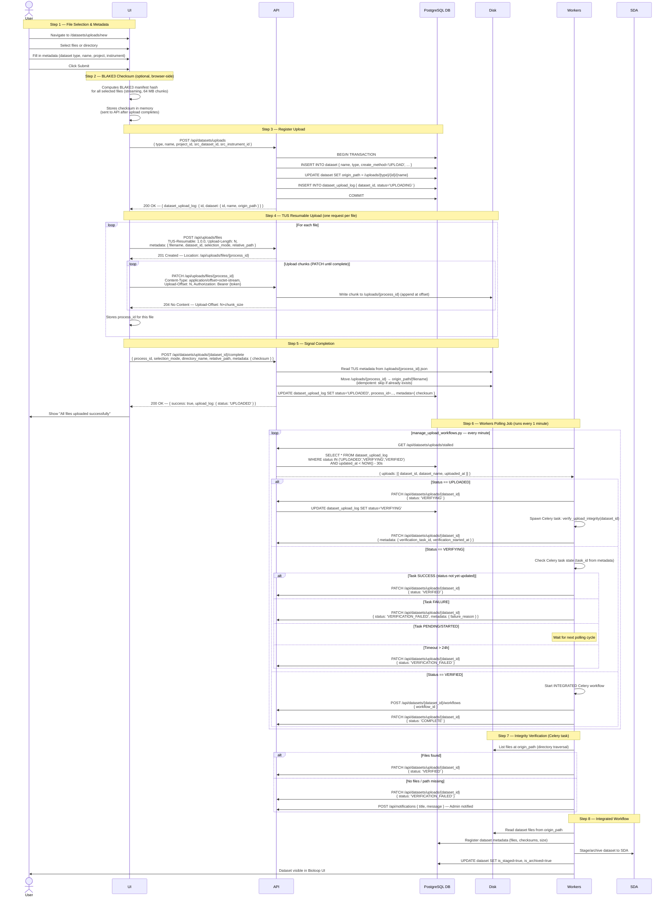

# Dataset Upload

## 1. Introduction

Bioloop allows uploading datasets through the browser using a resumable upload architecture based on the [TUS protocol](https://tus.io/). The system ensures strict access control, data integrity via BLAKE3 checksums, and reliable processing through an asynchronous worker pipeline.

## 2. Requirements and Limitations

- Authorized users should be able to upload datasets directly from their web browsers. The uploaded datasets should be protected from unauthorized users.
- Network timeouts, data corruption, and other problems that arise from uploading large datasets must be avoided. To achieve this, the upload architecture uses the TUS resumable upload protocol (supports files up to 100 GB per file).
  - TUS tracks byte offsets, so interrupted uploads can resume from where they left off without re-uploading already-transferred data.
- End-to-end data integrity is verified using BLAKE3 cryptographic checksums computed in the browser and re-verified server-side.

## 3. Architecture Overview

The upload system is composed of five layers that work together:

| Component | Role |
|-----------|------|
| **UI** | Multi-step form: file selection, metadata entry, BLAKE3 checksum computation, TUS upload, completion signaling |
| **API** | Node.js/Express server that hosts the TUS endpoint, registers datasets, moves files to final destination, and exposes polling endpoints for workers |
| **PostgreSQL DB** | Stores dataset metadata and upload lifecycle state (`dataset`, `dataset_upload_log`) |
| **Workers** | Python/Celery polling job that detects completed uploads, runs integrity verification, and triggers the integrated workflow |
| **Disk** | Shared filesystem: TUS writes files to a temp directory; API moves them to the dataset's `origin_path`; workers and the integrated workflow read from `origin_path` |
| **SDA** | Scientific Data Archive — final destination for processed datasets, reached via the integrated workflow |

## 4. Data Flow Sequence

The diagram below shows the complete data flow for a successful upload, from the moment a user selects files through to dataset archival in the SDA.



## 5. Upload Status Lifecycle

The `dataset_upload_log.status` field tracks each upload through its lifecycle:

| Status | Persisted | Set By | Description |
|--------|-----------|--------|-------------|
| `UPLOADING` | ✅ | API (`POST /datasets/uploads`) | Upload registered; TUS transfers in progress |
| `UPLOAD_FAILED` | ✅ | UI / API | TUS transfer failed after all retries exhausted |
| `UPLOADED` | ✅ | API (`POST /datasets/uploads/:id/complete`) | All files moved to `origin_path`; ready for verification |
| `VERIFYING` | ✅ | Workers (`manage_upload_workflows.py`) | Celery verification task spawned |
| `VERIFIED` | ✅ | Workers (Celery task) | BLAKE3 / file-existence check passed |
| `VERIFICATION_FAILED` | ✅ | Workers | Verification failed; admin notified |
| `PROCESSING` | ✅ | Workers (retry path) | Integrated workflow triggered (retry case) |
| `PROCESSING_FAILED` | ✅ | Workers | Integrated workflow failed |
| `COMPLETE` | ✅ | Workers (`manage_upload_workflows.py`) | Integrated workflow triggered successfully |
| `PERMANENTLY_FAILED` | ✅ | Workers | Max retries (`MAX_RETRY_COUNT=3`) exceeded |

> **UI-only statuses** (not persisted): `COMPUTING_CHECKSUMS`, `CHECKSUM_COMPUTATION_FAILED`, `UNINITIATED`.

```
UPLOADING
    │
    ├──(TUS failure)──► UPLOAD_FAILED
    │
    └──(POST /complete)──► UPLOADED
                               │
                         (Workers poll)
                               │
                           VERIFYING
                               │
                  ┌────────────┴────────────┐
           (pass) │                         │ (fail)
              VERIFIED             VERIFICATION_FAILED
                  │
           (Workers poll)
                  │
              COMPLETE ──(workflow fails)──► PROCESSING_FAILED
                                                    │
                                              (retry ≤ 3x)
                                                    │
                                            PERMANENTLY_FAILED
```

## 6. Directory Structure

Files move through two locations on disk:

### TUS Temporary Directory (`config.upload.path`)

TUS writes each uploaded file as a flat binary blob and a sidecar metadata file:

```
/uploads/
  {process_id}           ← uploaded file bytes (appended by TUS PATCH requests)
  {process_id}.json      ← TUS metadata (filename, filetype, dataset_id, selection_mode)
```

### Dataset Origin Path (final destination)

After `POST /datasets/uploads/:id/complete`, the API moves files to:

```
/uploads/{dataset_type}/{dataset_id}/{dataset_name}/
  file.raw               ← single-file upload
  my_dir/                ← directory upload (relative paths preserved)
    subdir/
      file.raw
```

This path is stored in `dataset.origin_path` and is the root from which the integrated workflow reads files for processing and SDA archival.

## 7. Data Integrity

BLAKE3 checksum verification is performed in two stages:

1. **Browser (pre-upload)** — `checksum.js` computes a BLAKE3 manifest hash for all selected files using streaming 64 MB chunks. The manifest format is:
   ```
   blake3-manifest-v1
   path/to/file.raw\t<size_bytes>\t<blake3_hex>
   ...
   ```
   The manifest itself is then hashed to produce a single `manifest_hash`. This is sent to the API in the `/complete` request and stored in `dataset_upload_log.metadata.checksum`.

2. **Worker (post-upload)** — `verify_upload_integrity.py` currently performs file-existence verification (confirms files exist at `origin_path`). Full BLAKE3 re-hashing against the stored manifest hash is available via `_compute_manifest_hash()` and can be enabled for deployments requiring cryptographic end-to-end verification.

## 8. Access Control

All upload-related API endpoints (`/api/datasets/uploads/*` and `/api/uploads/files/*`) require a valid JWT Bearer token issued by the Bioloop authentication service. The TUS middleware (`tus.js`) calls `authenticate()` before forwarding any request to the TUS server. Role-based access control (`accessControl('datasets')`) is enforced on all REST upload endpoints.

## 9. Retry and Failure Handling

The polling job `manage_upload_workflows.py` (runs every 1 minute via PM2 cron) handles all failure recovery:

| Failure Scenario | Recovery |
|------------------|----------|
| Verification task ID missing but `VERIFYING` < 5 min | Wait for next cycle |
| Verification task ID missing but `VERIFYING` > 5 min | Respawn verification task |
| Verification hung > 24 hours | Mark `VERIFICATION_FAILED`, notify admin |
| Celery task `FAILURE` | Mark `VERIFICATION_FAILED`, notify admin |
| Integrated workflow fails | Increment `retry_count`; retry up to `MAX_RETRY_COUNT=3` |
| Retries exhausted | Mark `PERMANENTLY_FAILED`, send admin notification |
