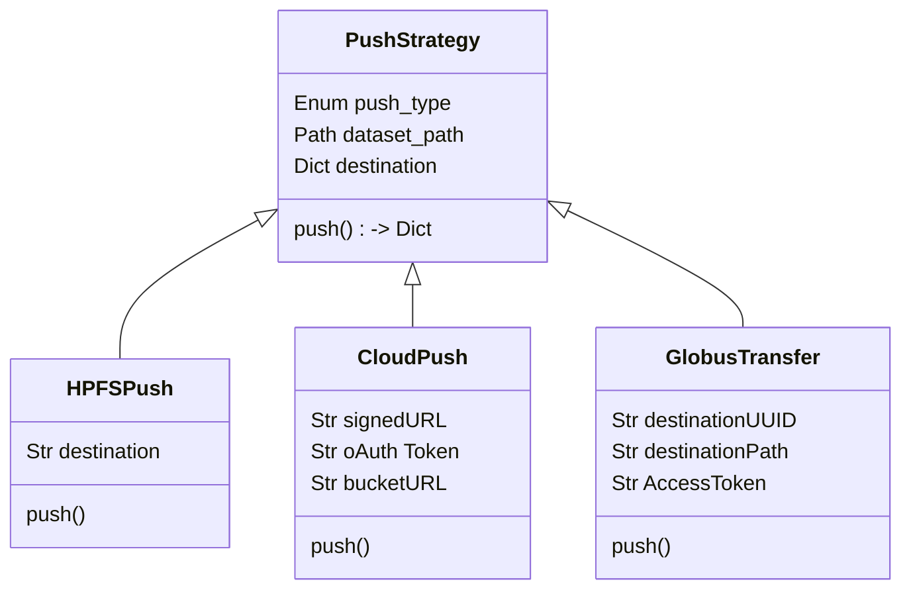

# Push Data Delivery System

## **Overview**

This document defines the design and implementation plan for extending the research data management platform to support **push-based data delivery**. This includes delivery to:

* HPFS directories owned by other users
* User-provided cloud storage buckets (AWS, GCP, Azure)
* Globus endpoints

The goal is to integrate these push modes seamlessly into the existing Celery-based workflow architecture while maintaining idempotency, auditability, and minimal surface area for operational risk.

### Assumptions

* Staging is already resilient, idempotent, and tracked.
* Push is best modeled as another task in the existing workflow engine.
* Users define destination (HPFS or cloud) at request time.
* Cloud destinations are user-defined, not pre-registered; this means per-push credential provisioning is necessary.
* Idempotency, retry logic, auditability, and transformation support are already in place via your workflow + metadata architecture.

### Problems to Solve

1. Credential Management for Cloud Pushes.
2. Clean interface for operators to define bulk pushes.
3. Safe/robust copy to another user’s HPFS directory.
4. Push job should compose seamlessly with existing workflows.
5. Future extensions (notifications, audit trails, push-to-multiple-targets) should not require major rewrites.


## **Architecture Summary**

### Workflow Steps
The push task is integrated into the existing workflow engine, which consists of several stages:
1. **Stage**: The dataset is downloaded from tape archive and extracted to a local directory.
2. **Validate**: The dataset is validated for integrity and completeness.
3. **Filter**: The dataset is filtered based on user-defined criteria (e.g., glob based inclusion & exclusion filters, file_type, size).
4. **Transform**: The dataset is transformed as needed (e.g., renaming, compressing).
5. **Push**: The dataset is pushed to the specified destination (HPFS, cloud, or Globus). Save the job results in the database and clean up the copied files.


### Push Task
The push task is implemented as a strategy pattern, allowing for different push implementations based on the destination type. The base class `PushStrategy` defines the interface for all push strategies, while concrete implementations (`HPFSPush`, `CloudPush`, `GlobusTransfer`) handle the specifics of each push type.



Push is implemented as a final step in an existing asynchronous workflow. Push logic is abstracted per target type, using strategy pattern to dispatch push handlers.


## **Push Targets**

### **HPFS Push**

* Destination: Path on HPFS owned by another user.
* ACLs must allow write for the application user.
* Operation: Use `rsync` or atomic `cp` to destination.
* Metadata: Record in audit trail.
* Idempotency: Check if push already occurred using flag file.

### **Cloud Push**

* Supported providers: AWS S3, GCS, Azure Blob.
* Credential Modes:

  * Preferred: **Pre-signed PUT URL** (one-time upload, simplest).
  * Optional: OAuth2 / service account delegation for advanced users.
* Tooling:

  * Primary: `rclone` (resumable, cross-provider, stable).
* Metadata: Store destination bucket URI and upload confirmation.
* Idempotency: Use object existence check or tag.

### **Globus Transfer**

* Supported: Transfers to **user-specified Globus endpoints**.
* Required Inputs:

  * Destination Endpoint UUID
  * Path within endpoint
  * User’s access token or delegated transfer token (Globus Auth)
* Tooling:

  * Globus SDK (`globus_sdk`) for initiating and monitoring transfers.
* Operation:

  * App must be registered as a Globus app (client ID, secret)
  * Users grant access using Globus Auth flow
  * Use `TransferData` objects to submit a transfer
* Idempotency:

  * Maintain task\_id of Globus submission
  * Use sync-level `checksum` for endpoint detection of file duplication
* Fault Tolerance:

  * Submit transfer and periodically check status
  * Support retry on failure


## **Task Interface & Flow**

```python
# Abstract push task signature
push_dataset(
    dataset_id: UUID,
    push_type: Enum['hpfs', 'cloud', 'globus'],
    destination: Dict[str, Any],
    user_id: str,
)
```

Each handler implements a `push()` method:

```python
class PushStrategy:
    def push(self, dataset_path: Path, destination: Dict[str, Any]) -> PushResult
```


## **Metadata Schema**

Extend the existing metadata model:

```prisma
model push_job {
  id               String   @id @default(uuid()) @db.Uuid
  dataset_id       Int      @db.Uuid
  push_type        PushType
  destination      Json
  creator_id       Int?
  created_at       DateTime @default(now()) 

  dataset          Dataset  @relation(fields: [datasetId], references: [id])
  creator          User?    @relation(fields: [creator_id], references: [id])
}

model push_workflow {
  push_job_id   String   @db.Uuid
  workflow_id   String   @db.Uuid
}

enum PushType {
  hpfs
  cloud
  globus
}
```

Globus-specific fields (stored in destination\_json):

```json
{
  "endpoint_id": "uuid",
  "remote_path": "/user/foo/",
  "globus_task_id": "uuid",
  "token_expiry": "2025-07-01T00:00:00Z"
}
```


## **Security and Credential Handling**

* **Cloud:** Signed URL preferred; OAuth2 session ephemeral.
* **Globus:** Store refresh token temporarily; access token scoped to transfer only.
* **Encryption:** No custom at-rest requirements. All transit via HTTPS/Globus.
* **Token Expiry:** All access tokens must be short-lived (hours max), ideally tied to job lifecycle.


## **Error Handling & Retriability**

* All push steps use built-in Celery retry logic.
* On failure: mark task as failed and log reason.
* Operator or user can manually retry via CLI/UI.

## **Dataset Filtering**
Dataset filtering allows users to specify which files or directories within a dataset should be included in the push operation. This can be done using a filter step in the workflow before the push step. The filter step can include any necessary filtering criteria such as file types, sizes, or specific directories to include or exclude.

## **Dataset transformations**
Dataset could be transformed, e.g. renaming, compressing, etc. before the push step. This can be done using a transformation step in the workflow before the push step. The transformation step can be defined in the workflow and can include any necessary transformations such as renaming, compressing, or converting the dataset to a different format.

## **Web UI Integration**
* For each dataset, provide a "Push" button in the UI.
* Allow users to select push type (HPFS, Cloud, Globus).
* Provide input fields for destination details (e.g., path, bucket name).
* Show progress and status of push operation.
* Display push history and logs for each dataset.
* Allow users to view and manage their push jobs.
* Provide a way to cancel or retry failed push jobs.
* Provide a way to view the metadata associated with each push job.


## **Future Extensions**

| Feature                        | Priority  | Notes                                     |
| ------------------------------ | --------- | ----------------------------------------- |
| Notification hooks             | Med       | Slack/email notifications post-push       |


## **User Stories (Researcher)**

### Request Data Push to HPFS

> As a user, I want to request a dataset to be pushed to a specific path on the University’s HPFS system that I have access to, so I can access the data without downloading it manually.

### Request Data Push to My Cloud Storage

> As a user, I want to specify my own cloud storage bucket and have the dataset pushed there directly, so I can access it in my existing cloud workflows.

### Request Data Push to My Globus Endpoint

> As a user, I want to request a dataset be transferred to my Globus endpoint, so I can receive data securely and efficiently in my institutional environment.

### View Status of My Push Requests

> As a user, I want to see the status (queued, in progress, completed, failed) of all my push requests so I can monitor and debug delivery issues.

### Provide One-Time Credentials for Push

> As a user, I want to securely provide temporary credentials or pre-signed URLs, so the platform can push the dataset to my cloud or Globus endpoint without storing my credentials permanently.


### Define Dataset Filtering Rules

> As a user, I want to specify which files or directories within a dataset should be included or excluded from the push operation, so that I only receive the relevant parts of the dataset and reduce unnecessary data transfer.

### Preview or Validate Filtering Rules

> As a user, I want to preview or validate the result of my dataset filtering rules before push is executed, so that I can ensure the filters are correct and avoid errors or incomplete data.

### Apply Transformations Before Push

> As a user, I want to apply transformations to the dataset (such as renaming, compressing, or format conversion) before the dataset is pushed to the destination, so that it is delivered in a usable or optimized format for my downstream workflows.

### Reuse or Save Filtering/Transformation Configurations

> As a user, I want to reuse or save filtering and transformation configurations for future datasets or push jobs, so that I don’t have to redefine complex operations repeatedly.


## **User Stories (Admin / Operator)**

### Bulk Push for Multiple Users

> As an admin, I want to perform a bulk push operation for multiple users and datasets in a single batch, so I can fulfill scheduled or large-scale deliveries efficiently.

### Retry Failed Pushes

> As an admin, I want to identify failed push jobs and manually retry them after fixing issues, so that temporary problems don’t block delivery.

### Audit Delivery Actions

> As an admin, I want to see a full audit trail of who requested what to be delivered, where, and when, so that I can satisfy compliance requirements.

### Monitor System Health

> As an admin, I want to track metrics and logs around data delivery tasks (volume, errors, duration), so I can detect bottlenecks or failures proactively.

### Enforce Mandatory Filtering or Transformation Policies

> As an admin, I want to enforce specific filtering or transformation policies (e.g., exclude raw files, enforce anonymization) before pushing datasets, so that institutional compliance and security standards are met.

### Audit Filtering and Transformation Actions

> As an admin, I want to see an audit trail of all filters and transformations applied to each dataset before delivery, so I can track changes and ensure correctness.


## **System Requirements (Functional)** 

### Dataset Staging

* System shall support automatic staging of datasets from tape archive to scratch before any push operation.
* System shall verify dataset integrity and apply access filters (`dataset_permissions`) before push.

### Push Operation

* System shall support push to:

  * Another HPFS directory (given write permissions)
  * A user-provided cloud storage bucket (via signed URL or OAuth)
  * A user-defined Globus endpoint
* System shall allow users to submit one-time credentials (e.g., signed URL, OAuth token, Globus access token) for each push request.
* Push operations shall be executed as the final step in a Celery workflow chain.

### Cloud Integration

* System shall support AWS S3, Google Cloud Storage, and Azure Blob Storage via `rclone` or equivalent.
* System shall support resumable uploads where the underlying tool allows it.
* System shall cleanly fail and retry push operations up to N times before marking them as failed.

### Globus Integration

* System shall allow users to initiate Globus Auth flow and authorize the platform to transfer data on their behalf.
* System shall use the `globus_sdk` to submit transfers, check status, and log results.

### Audit & Metadata

* System shall log every push job (dataset, destination, trigger user, status, timestamps).
* System shall support idempotency — no duplicated push for the same dataset-target tuple.

### Admin Features

* System shall allow bulk push initiation (via CLI or API) for multiple datasets and users.
* System shall expose metrics and logs for delivery tasks (duration, throughput, errors).
* System shall allow operators to manually retry failed pushes.

### Dataset Filtering

* System shall support file and directory-level filtering within datasets, defined as part of the workflow before the push step.
* Filters shall support inclusion/exclusion patterns based on:

  * Path expressions (e.g. glob patterns)
  * File extensions or MIME types
  * Size thresholds
  * Regex-based rules
* System shall provide a dry-run or preview option to validate filter logic prior to actual execution.
* Filtering metadata (rules, outcome) shall be recorded and linked to the push job for auditability.

### Dataset Transformations

* System shall support configurable transformations such as:

  * Renaming files or directories
  * Compressing files or directories (e.g. tar.gz, zip)
  * Format conversion (e.g. CSV to Parquet)
* Transformation logic shall be defined declaratively in the workflow step and applied before the push task.
* Transformations must be side-effect free on the canonical source data and applied only to the staged (scratch) copy.
* Transformation metadata (rules, outcome) shall be logged and linked to the dataset and push job.

## Non-Functional Requirements

### Security

* All external credentials shall be stored temporarily, encrypted at rest, and removed after use.
* All data transfers shall occur over HTTPS, Globus, or similarly secure channels.

### Scalability

* The system shall support concurrent staging and push workflows for up to 100 datasets simultaneously.

### Reliability

* The system shall ensure all push tasks are atomic and consistent (no partial pushes or orphaned records).
* The system shall maintain audit logs for at least 1 year.
