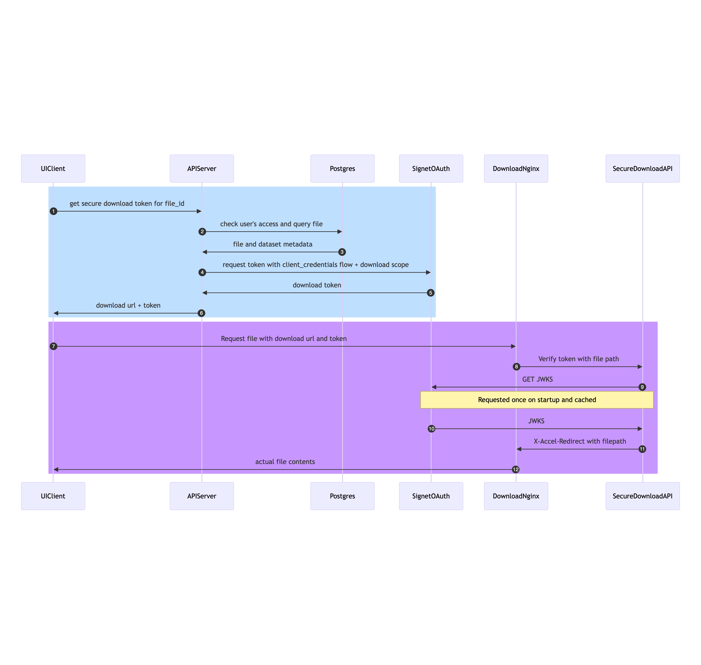

# Secure Download Documentation
## Table of Contents

  - Introduction
  - Requirements
  - Staging the Dataset
  - Access Control
  - Architecture Overview
  - Downloading a Dataset File

## 1. Introduction

This document provides an overview of the Secure Download functionality, detailing the requirements and architecture of the system. The primary goal is to allow authorized users to download dataset files both directly from the browser and from Slate Scratch while ensuring strict access control to prevent unauthorized access.

## 2. Requirements and Limitations

Users with access to the dataset should be able to download dataset files directly from their web browsers. The file download link should be accessible only to users with the necessary permissions. 

Dataset files must be staged before attempting to download.

The staged files should be protected from unauthorizzed users who have access to slate scratch from navigating and/or downloading dataset files.

### 2.1 Limitations

The UI and API are running on a node where the Slate Scratch path is not mounted, preventing direct file access. An Nginx server is hosted on the colo node, which has access to the staged files. However, configuring Nginx as a simple file server would allow anyone to access any files. However, the download file server cannot determine users'access because the access control data, specifying which users have access to which datasets and files, is maintained by the API in a PostgreSQL database.


## 3. Staging the Dataset

The Staging Dataset functionality allows users to request the download of individual dataset files (or the entire dataset, as a bundled file) through the UI or API. Staging a dataset involves the transfer of the corresponding archived bundle from the SDA (Source Data Archive) to a temporary location known as the Slate Scratch path. This intermediate step ensures efficient and secure access to the dataset while preventing unauthorized access through path enumeration.

Staging Process:

- **User Request**: Users initiate a dataset file/bundle download request through either the user interface (UI) or the application programming interface (API).

- **Rhythm Workflow**: The request triggers a rhythm workflow "Stage" on the colo node where the celery tasks are registered. "stage_dataset", "validate_dataset", "setup_dataset_download" are the celery tasks involved in this workflow. 

- **Path Randomization**: During dataset staging, the path of the staged dataset files/bundle are obfuscated through the means of two random universally unique identifiers (UUIDs) called `stage_alias` and `bundle_alias`. This UUIDs are generated to limit access to datasets through path enumeration.
  - The `stage_dataset` celery task downloads the dataset bundle from SDA, and extracts the dataset files and the bundle to their corresponding randomized paths.
    - The dataset's staging path follows the pattern: `<stage_directory>/<dataset_stage_alias>/<dataset_name>`.
    - The bundle's staging path follows the pattern: `<bundle_stage_directory>/<dataset_bundle_name>`.

Example:
```
/stage_directory/6a5b1734-98e8-4e47-ae5f-1a9e5d8d9f7c/dataset_name
/bundle_stage_directory/bundle_name
```

- **Symlink Creation**: Two symlinks are created to facilitate downloads. 
  - `<download_path>/<dataset_stage_alias>`. This points to `<stage_directory>/<dataset_stage_alias>/<dataset_name>`. This will be path given to the users who want to download the dataset files from the Slate Scratch directly.
  - `<download_path>/<dataset_bundle_alias>`. This points to `<bundle_stage_directory>/<dataset_bundle_alias>/<dataset_name>`. This will be path given to the users who want to download the dataset as a bundle from the Slate Scratch directly.

The file download nginx server is configured to serve files from the `<download_path>` directory.


To enhance security, the access control list (ACL) of the `<stage_directory>/<dataset_stage_alias>` directory is carefully configured. It is limited to granting only the "execute" permission bit (--x) for the "others" group. This permission setup ensures that users with access to the Slate Scratch path cannot browse or navigate through all datasets present in the directory. Instead, only users who possess the complete path `<stage_directory>/<dataset_stage_alias>/<dataset_name>` are allowed to read the contents of the staged dataset.

#### UUID Generation

The UUIDs used in the staging/bundle paths are generated deterministically. They are a function of the dataset type, dataset (or bundle) name, and a salt string. This deterministic approach ensures consistency and allows authorized users to access the staged dataset/bundle when needed, while making it computationally infeasible for users to guess the path of other datasets.

By implementing these measures, the Staging Dataset functionality maintains data security and privacy, preventing unauthorized access and ensuring the integrity of the staged datasets.

## 4. Access Control

Access control is managed through the project membership and user roles by the API. Users of "operator" and "admin" roles can access any dataset and its files. Users with "user" can only access the datasets that are associated with projects the user is a member of. This role-based access control ensures that sensitive dataset information is only accessible to those who have been explicitly granted access rights.

To further enhance security and prevent unauthorized access to dataset files, a secure ephemeral resource bound URL is constructed. This URL contains critical components to ensure its validity and security:
Components of the Secure URL:
- **File Path**: The URL contains the file path relative to the download directory of the dataset file that needs to be downloaded.
- **JWT (JSON Web Token)**: A very short-lived JWT is included as part of the URL. The JWT payload includes the file path as one of its components.

URL Validation:

For the URL to be considered valid, the following conditions must be met:
- JWT Validity: The JWT included in the URL must be valid, meaning it must have a valid signature and must not be expired.
- Path Match: The file path inside the JWT payload should match the file path specified in the path section of the URL.

By enforcing these conditions, the system ensures that even if an unauthorized user somehow obtains a link to a dataset file sometime later, they cannot access it. It also makes sure that a token cannot be used to download other files even if it is unexpired and has a valid signature.

## 5. Architecture Overview

To meet the requirements outlined above, a distributed architecture is employed.

- UI Client: Users logs into the bioloop application through their web browsers and navigate to the file browser view to initiate file downloads.
- API: This node serves the user interface and API endpoints with user and dataset metadata stored in a PostgreSQL database but does not have direct access to the dataset files.
- Workers / Colo Node: Staging of dataset files occurs on this node via a Celery task. The node also hosts an Nginx server with access to the staged files.
- Signet: An OAuth server supporting client credential flow with download file scope to create secure tokens.
- File Download Server (Nginx): A file server on the colo adjacent to data which recieves requests from users to download large dataset files.
- Secure Download API: A lightweight app with one endpoint that validates the incoming requests to the file download server

### 6. Downloading a Dataset File



To download a dataset file:

- Step 1. An authorized user logs in through the UI and requests to download a dataset file.
- Steps 2,3. The API checks if the user has access to the requested file by querying the database and constructs the download file path.
- Step 4,5. Requests the Signet oauth server for a download token with the file path
- Step 6. Responds to UI with the download file url and download token.
- Step 7. UI Client constructs a URL by including the download token as a query parameter and requests the file download server.
- Step 8. File server forwards the request to SecureDownloadAPI for validation.
- Step 9.10. SecureDownloadAPI fetches the public JWT verfication keys from the Signet Oauth server in the form of JWKS and perform URL validation as described in section 4. 
- Step 11. If it is valid, it responds to file server (Nginx) with a special header x-accel-redirect with a value of the path of the requested file.
- Step 12. Nginx performs internal redirect and sends the requested file to the UIclient with headers invoking a browser file download.
