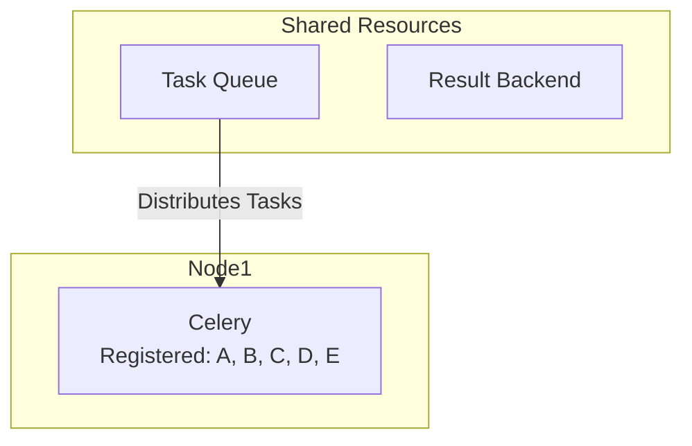
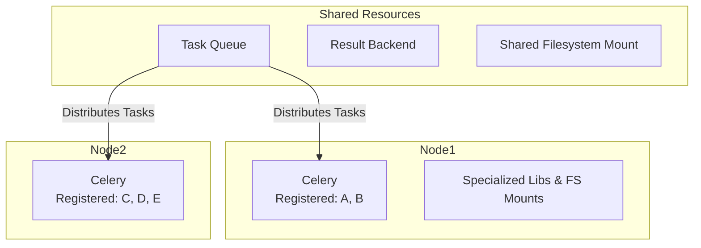
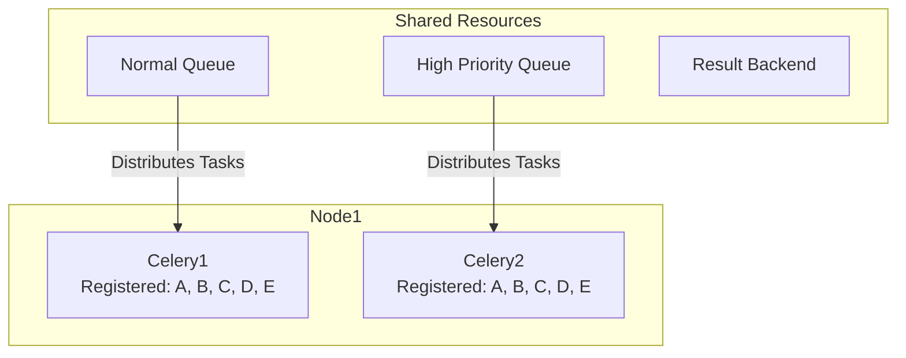
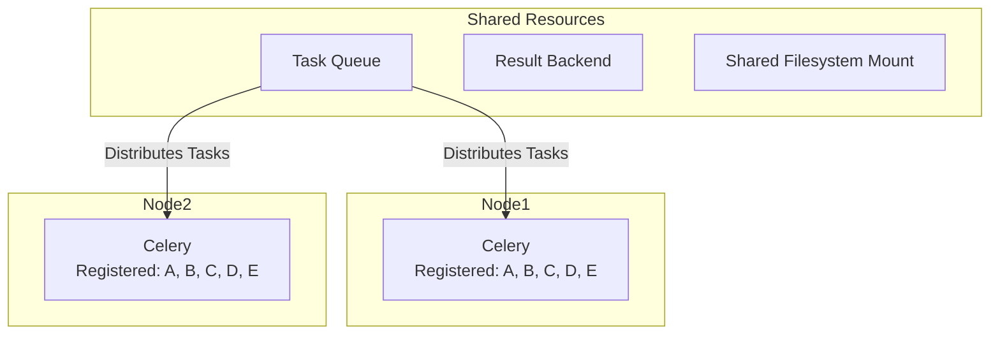
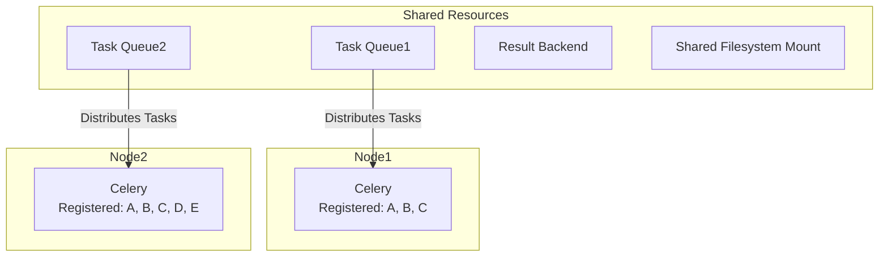

# Workers Topography

A Distributed and scalable worker system is essential for handling large-scale data processing tasks, as the number of tasks and their complexity can vary significantly. This document outlines a few examples of how to set up a distributed worker system using Celery to address different use cases.

## Basic Worker Setup
In this example, we will set up a basic worker system with a single worker node. This is suitable for small-scale applications or development environments.

In this setup:
- **Task Queue**: A message broker (e.g., RabbitMQ or Redis) that holds tasks until they are processed.
- **Worker Node**: A single Celery instance that may run multiple workers that processes tasks from the queue.

## Specialized Workers
Certain tasks may require access to specialized libraries or filesystem mounts that are only available on specific nodes. In this example, Node 1 is equipped with a specialized library or filesystem mount not present on Node 2, while both nodes share a common filesystem for reading and writing files.

- **Node 1** is configured to execute Task A and Task B, leveraging its unique resources.
- **Node 2** is configured to execute Task C, Task D, and Task E.

When a workflow consisting of sequential tasks (A → B → C → D → E) is submitted, Celery ensures that:
- Tasks A and B are executed on Node 1.
- Tasks C, D, and E are executed on Node 2.

This setup allows for efficient task distribution based on resource requirements, while maintaining shared access to files across all nodes.

**Workflow A -> B -> C -> D -> E**

| Task   | Assigned Node |
|--------|--------------|
| Task A | Node 1       |
| Task B | Node 1       |
| Task C | Node 2       |
| Task D | Node 2       |
| Task E | Node 2       |

## Priority based Workers

To prevent a single Celery instance from becoming overloaded and delaying task processing, you can run multiple Celery applications on the same node, each dedicated to specific task types or priorities. This approach is especially useful when certain tasks are long-running and could block others in a shared queue, even with multiple workers.

A common scenario is separating normal tasks from high-priority or admin-submitted tasks. By assigning these to different queues and Celery instances, you ensure that critical tasks are processed promptly without being delayed by regular workload.

**Workflow A -> B -> C -> D -> E**
| Task                       | Assigned |
|-----------------------------------|---------------|
| Task A ( High Priority Queue )     | Celery 2        |
| Task B ( High Priority Queue )     | Celery 2        |
| Task C ( High Priority Queue )     | Celery 2        |
| Task D ( High Priority Queue )     | Celery 2        |
| Task E ( High Priority Queue )     | Celery 2        |

## Load Balancing
In a distributed worker system, load balancing is crucial to ensure that tasks are evenly distributed across available worker nodes. This prevents any single node from becoming a bottleneck and allows for efficient resource utilization.
In this example, we have two worker nodes (Node 1 and Node 2) that share a common task queue. The load balancer distributes tasks to the nodes based on their current workload, ensuring that both nodes are utilized effectively.

Celery on Node 1 and Node 2 can claim tasks from the shared queue based on their availability and workload. Tasks in a workflow can now be executed in any available node, allowing for better resource utilization and faster task completion.

**Workflow A -> B -> C -> D -> E**

| Task   | Assigned Node |
|--------|--------------|
| Task A | Node 1       |
| Task B | Node 2       |
| Task C | Node 1       |
| Task D | Node 1       |
| Task E | Node 2       |

## Another Example

In this example, we have two worker nodes (Node 1 and Node 2) that share two task queues (Queue 1 and Queue 2). Each node is capable of processing tasks from both queues, but they may have different registered tasks. This setup allows for flexibility in task distribution and resource utilization.

**Workflow A -> B -> C -> D -> E**
| Task                       | Assigned |
|-----------------------------------|---------------|
| Task A ( Queue 1 )     | Node 1        |
| Task B ( Queue 1 )     | Node 1        |
| Task C ( Queue 1 )     | Node 1        |
| Task D ( Queue 2 )     | Node 2        |
| Task E ( Queue 2 )     | Node 2        |

**Workflow A -> B -> C -> D -> E**
| Task                       | Assigned |
|-----------------------------------|---------------|
| Task A ( Queue 2 )     | Node 2        |
| Task B ( Queue 2 )     | Node 2        |
| Task C ( Queue 2 )     | Node 2        |
| Task D ( Queue 2 )     | Node 2        |
| Task E ( Queue 2 )     | Node 2        |

