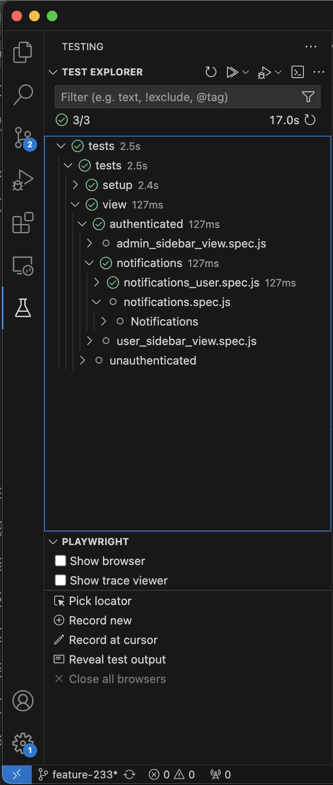

## Testing Library

Tests are written using Playwright.

---

## Coverage

- Some tests assert authenticated state, while others assert unauthenticated state of the app.
- Tests are end-to-end, in the sense that they do not require mocked network requests, and instead make calls to an actual backend API. These tests span across 3 components of the app:
  - UI
  - API
  - Database

---

## Config
Playwright config is in `tests/playwright.config.js`.

---

## Authentication bypass

Tests bypass login authentication by using a mock CAS ticket in the CI environment.

The ability to run tests while logged in as different roles is achieved by using Playwright projects (https://playwright.dev/docs/test-projects).

### Setup Projects

'Setup' projects are used to login as a specific role before a test runs.

There are currently three login-setup projects, and can be used to login as a user, an admin or an operator:
- `user_login.setup.js`
- `operator_login.setup.js`
- `admin_login.setup.js`
  

The login-setup projects redirect the test to `/auth/iucas` with a mocked ticket that is included as a query parameter. The mocked ticket is the same as the desired role.

```
// admin_login.setup.js

await page.goto(`${config.baseURL}/auth/iucas?ticket=admin`);
```

The CAS-ticket-verification API receives this mocked ticket, and upon determining the user to be used for the test based on the role contained in this ticket, returns a token which gets persisted to the browser's `localStorage` via the application code.

At this point, the test user has successfully logged in, which can be verified so:
```
// admin_login.setup.js

...
await expect(page.getByTestId('header-username')).toContainText('adminUser');
```

The final step of the login-setup projects is persisting the session information that was written to the test browser's `localStorage` to a local file (via Playwright's `storageState` API) so that it can be reused across tests:

```
// admin_login.setup.js

...
await context.storageState({ path: '/path/to/session_storage_file.json' });
```
The files that the `localStorage` information is written to should not be tracked in version control, to avoid publishing secrets.


### Running tests in logged-in/logged-out states

A project can be made dependent on a login-setup project to ensure that the tests in that project begin in a logged-in state. A dependent project that uses the same `storageState` as its dependency login-setup project will be executed while logged-in as the user that the login-setup project logged in as.

Projects that are not dependent on a login-setup project will be executed in an unauthenticated state.

### Examples

The following example shows a login-setup project that logs in as an admin:
```
// admin_login.setup.js

import { expect, test as setup } from '@playwright/test';

const config = require('config');

setup('login', async ({ context, page }) => {
  await page.goto(`${config.baseURL}/auth/iucas?ticket=admin`);

  await expect(page.getByTestId('header-username')).toContainText('e2eAdmin');

  await context.storageState({ path: '/path/to/admin_storage_state.json' });
});

```

If some tests need to be executed in a logged-in state:
- Create a project in `playwright.config.js` which contains the tests that need to be executed while logged-in as a specific role.
- Choose the appropriate login setup project based on the role that your tests need to login as.
- Add the login setup project as a dependency of the project that contains your tests. Ensure that the dependent project uses the same `storageState` that your login-setup project is writing the session information to.

The following example will run the `admin_login` project first, which will login as an admin. The tests in the `admin_views` will then be kicked off while logged-in as this admin user.

```
// playwright.config.js
    ...
    projects: [
      {
        name: 'admin_login',
        testMatch: path.join(__dirname, '/tests/setup/admin_login.setup.js'),
      },
      {
        name: 'admin_views',
        use: { ...devices['Desktop Chrome'], storageState: '/path/to/admin_storage_state.json' },
        dependencies: ['admin_login'],
        testMatch: '/view/authenticated/admin_*_view.spec.js',
      },
    ]
    ...
```

### Isolation
Each setup project and its dependent projects are run in an isolated browser context, so tests that require logging in as different roles can be executed in parallel.

### Using server-side state in test

If a test needs to get/set the server-side state before or after it runs, it can be accomplished by making calls to the API layer.

For making requests to Bioloop's authenticated API routes, the request will need a JWT token embedded in the `Authorization` header. This token can be read from `localStorage` inside a running test.

- Playwright offers an `APIRequestContext` API which can be used to make REST calls.
  - There are wrappers for standard REST API methods within `tests/api/index.js`, which use Playwright's `APIRequestContext` to make API calls. Using these wrappers instead of using `APIRequestContext` directly can make your test code less verbose.
  - You can also wrap these REST-method wrappers further into entity-specific-REST-API invocations.
- Third-party open-source REST-API libraries like Axios can also be used to make REST calls, if desired.

The below example illustrates how to make a REST API call from within a test, using Playwright's `APIRequestContext` API. It is recommended to use the REST-API wrappers from `tests/api/index.js` instead of using `APIRequestContext` directly.

```
test('test that needs to get server-side state', async ({ page }) => {
  ...
  // It's necessary to visit a route in the app first before accessing `localStorage`
  await page.goto('/');
  // retrieve token from local storage
  const token = await page.evaluate(() => localStorage.getItem('token'));
  
  // use retrieved token to make API calls
  const { request } = page;
  const response = await request.get(`${config.apiBasePath}/datasets`, {
    headers: {
      Authorization: `Bearer ${token}`,
    },
  });
  const retrievedDatasets = await response.json();
  ...
})
```


---
## Running tests locally

The following instructions are meant for running tests on a local host machine, and do not conform to any particular CI/CD workflow at this point.

### Set CI properties
1. Set in api/.env:
```
NODE_ENV=ci

E2E_USER=e2eUser
E2E_OPERATOR=e2eOperator
E2E_ADMIN=e2eAdmin
```
2. Set in tests/.env
```
E2E_USER=e2eUser
E2E_OPERATOR=e2eOperator
E2E_ADMIN=e2eAdmin
```

### Run tests via Docker Compose
The test suite can be run via Docker Compose, using `./docker-compose-e2e.yml`.

- `./docker-compose-e2e.yml` builds an image from `./tests/Dockerfile`, which is used to start the `e2e` container.
- The `e2e` container has a `depends_on` condition which ensures that the test suite isn't kicked off until the `api` container's health check returns `200 OK`.

```
# in bioloop root dir
docker-compose -f "docker-compose-e2e.yml" build
docker-compose -f "docker-compose-e2e.yml" up -d
```

### Viewing artifacts
- The `e2e` container mounts its `/opt/sca/app` directory to the host machine's `./tests` directory, to enable accessing test artifacts from the host machine.  
- Artifacts are generated in the following locations:
  - `./tests/playwright-report`
    - contains an HTML report of passed/failed tests
  - `./tests/test-results`

### Notes
- Playwright version in `./tests/Dockerfile` needs to be the same as that in `./tests/package.json`
  - If these versions don't match, the Playwright running in Docker won't be able to detect the test suite.
- Running the app in CI mode (i.e. when the API's env is set to `ci`) breaks the redirect that occurs after a successful IU Login, since the ticket included in the redirect is ignored in CI mode.
   - To bypass this, visit `/auth/iucas?role=[testRole]` where `testRole` can be one of `admin`, `operator` or `user`. This will log you in as a test user.

---

## Using VS Code's Playwright Plugin

Playwright offers a plugin for VS Code, which allows us to:
- Run tests within VS Code
- Generate tests via actions taken in the browser

### Install Playwright plugin
- Install the Playwright plugin for VS Code (https://marketplace.visualstudio.com/items?itemName=ms-playwright.playwright)
- Ensure that the tests that you need to run within VS Code are defined in `playwright.config.js`.

Tests should now show up in VS Code's Playwright plugin, as pictured below.
  - If tests are not showing up, click refresh



### Run tests

- Once your tests show up within VS Code's Playwright plugin, you should see a 'Play' button next to each `test` block, clicking which will first run any dependencies (like the ones used to login) and then the actual test.
  - You can decide whether to run these tests in headed or headless mode via the `Show browser` checkbox.

### Record tests

The Playwright plugin offers the ability to generate test scripts via actions performed in the browser, thus circumventing the need to write tests manually.


The plugin offers two ways to record a test:
- `Record New`
  - Allows you to record a test with no pre-defined steps
- `Record at cursor`
  - Allows you to record a test which may have pre-defined steps. This option:
    - first runs any dependency projects that you may have defined on your actual tests (for situations like logging-in prior to the test)
    - then runs your actual test

  
To record a test via the `Record at cursor` feature:
- Create your test file (`myTest.spec.js`), and add it to `playwright.config.js`.
  - Define any dependency projects for your test, if needed
- If needed, establish a base state in your test before you start recording.
  - This could include navigating to a particular URL, setting database state, etc.
- Hit the 'Play' button that's next to the `test` block to launch the test.
  - Check the `Show browser` checkbox to ensure that tests run in a headed browser
- Once Playwright is finished running the code in `myTest.spec.js`, the browser will stay open.
- Now, go back to VS Code, and click `Record at cursor`.
- Go back to the browser where your test is running.
- You can now make Playwright generate the rest of the test via the actions that you take in the browser.
  - Playwright will generate locators for each DOM element you that interact with, which can later be improved manually if needed.
  - Assertions can be made on the value, the text and the visibility of DOM elements.

---

For details on using the Playwright plugin in VS Code, refer to https://playwright.dev/docs/getting-started-vscode.