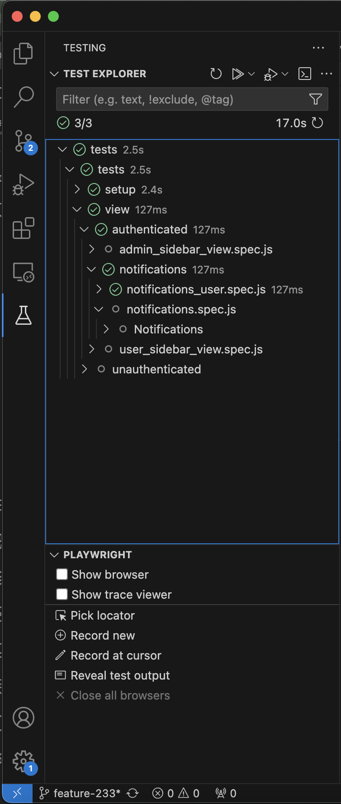

## Running tests locally

The following instructions are meant for running tests on a local host machine, and do not conform to any particular CI/CD workflow at this point.

### Run all end-to-end tests

From the project root, run:

```bash
npm run test:e2e
```

This command starts the app in CI mode, prepares the test data, runs the
complete configured Playwright suite, and restores any local services that
were running beforehand. Do not set `NODE_ENV=ci` in `api/.env`; Docker
Compose selects the correct mode for both E2E and normal local development.

### Run all dataset upload tests

From the project root, run:

```bash
npm run test:e2e -- --project=upload --project=upload_role_visibility --project=upload--project_association--user_role--association
```

To run one upload spec, provide its path and Playwright project:

```bash
npm run test:e2e -- src/tests/view/authenticated/upload/file_selection_step.spec.js --project=upload
```

### Viewing artifacts
- The `e2e` container mounts its `/opt/sca/app` directory to the host machine's `./tests` directory, to enable accessing test artifacts from the host machine.
- Artifacts are generated in the following locations:
    - `./tests/playwright-report`
        - contains an HTML report of passed/failed tests
    - `./tests/test-results`

### Notes
- Playwright version in `./tests/Dockerfile` needs to be the same as that in `./tests/package.json`
    - If these versions don't match, the Playwright running in Docker won't be able to detect the test suite.
- Running the app in CI mode (i.e. when the API's env is set to `ci`) breaks the redirect that occurs after a successful IU Login, since the ticket included in the redirect is ignored in CI mode.
    - To bypass this, visit `/auth/iucas?role=[testRole]` where `testRole` can be one of `admin`, `operator` or `user`. This will log you in as a test user.

---

## Using VS Code's Playwright Plugin

Playwright offers a plugin for VS Code, which allows us to:
- Run tests within VS Code
- Generate tests via actions taken in the browser

For details on using the Playwright plugin in VS Code, refer to https://playwright.dev/docs/getting-started-vscode.

### Install Playwright plugin
- Install the Playwright plugin for VS Code (https://marketplace.visualstudio.com/items?itemName=ms-playwright.playwright)
- Ensure that the tests that you need to run within VS Code are defined in `playwright.config.js`.

Tests should now show up in VS Code's Playwright plugin, as pictured below.
- If tests are not showing up, click refresh



### Run tests

- Once your tests show up within VS Code's Playwright plugin, you should see a 'Play' button next to each `test` block, clicking which will first run any dependencies (like the ones used to login) and then the actual test.
    - You can decide whether to run these tests in headed or headless mode via the `Show browser` checkbox.
