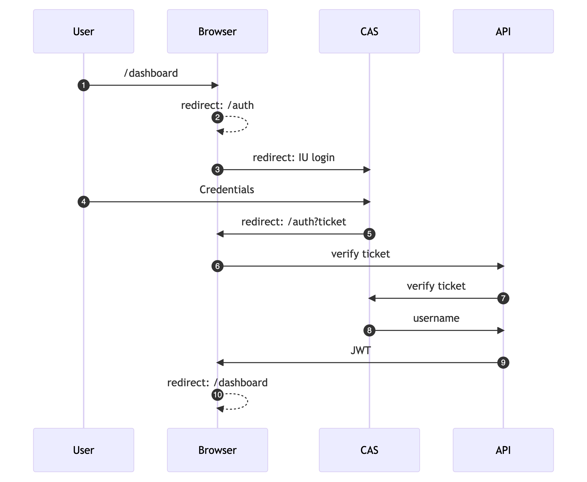
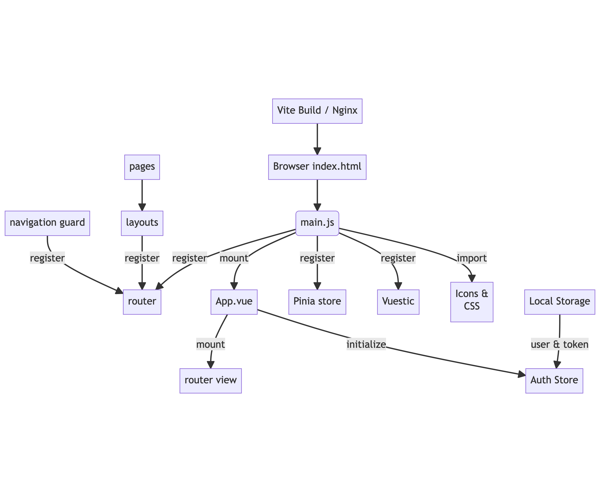
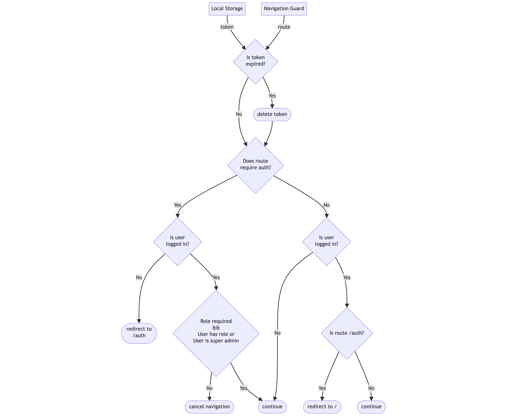
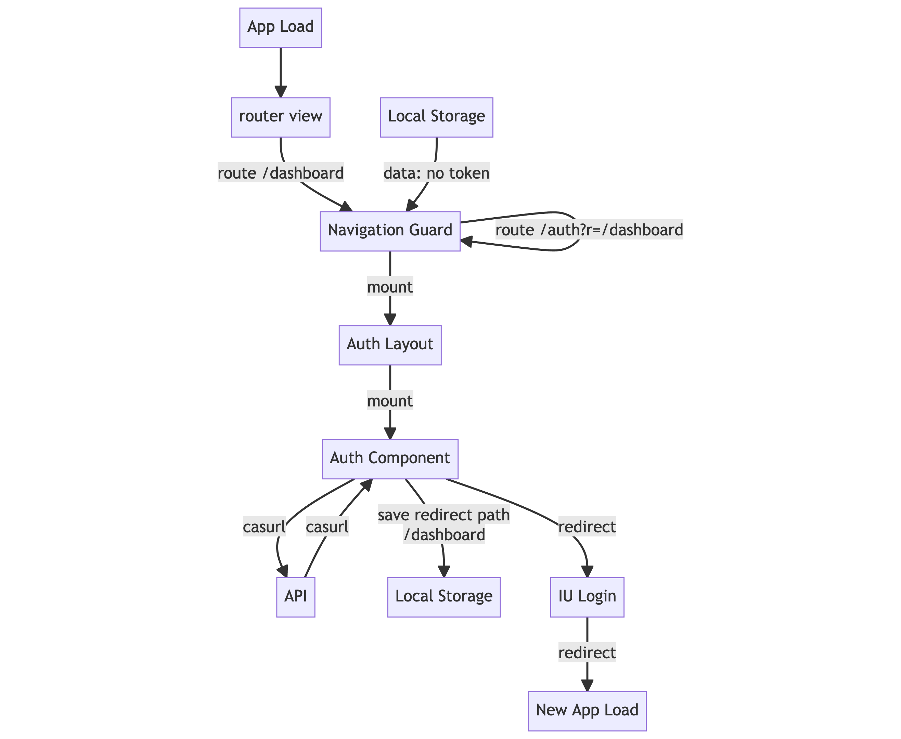
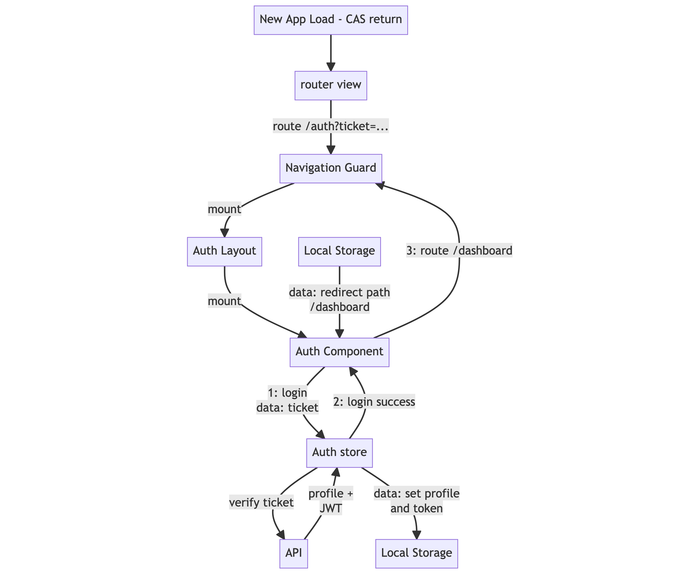
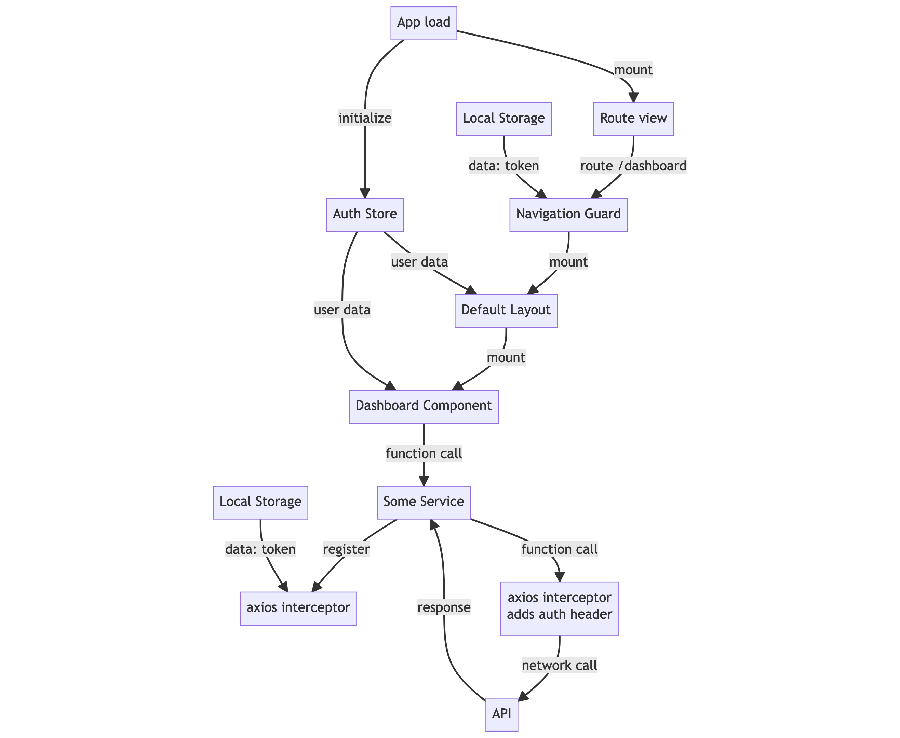

## Overview of Auth Flow

## Vue App Code Execution Order

## Route Navigation Guard Logic

## Login Code flow - Before IU Login

## Login Code flow - After IU Login

## Code flow for a Revisiting (logged in) User

## Code flow for token refresh

