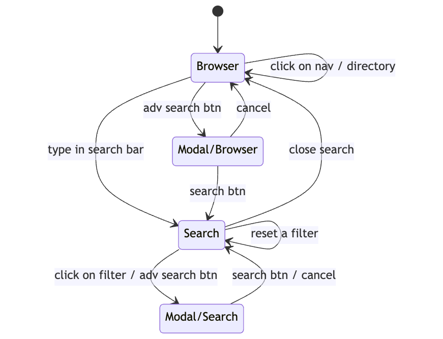

### State

```js
{
  datasetId: String,
  showDownload: Boolean,
  pwd: String,
  isInSearchMode: Boolean,
  filters: {
      name: String,
      location: String,
      filetype: String,
      extension: String,
      minSize: Number,
      maxSize: Number,
    },
  filterStatus: { //computed
      name: Boolean,
      location: Boolean,
      filetype: Boolean,
      extension: Boolean,
      minSize: Boolean,
      maxSize: Boolean,
  },
  fileList: Array,
  searchResults: Array,
  files: Array // computed
}
```


Defaults:
```js
{
  pwd: '',
  isInSearchMode: false,
  filters: {
      name: "",
      location: "/",
      filetype: "any",
      extension: "",
      minSize: null,
      maxSize: Infinity,
    },
  filterStatus: {
      name: false,
      location: false,
      filetype: false,
      extension: false,
      minSize: false,
      maxSize: false,
  }
}
```

### Events
- Browser view
  - click on directory row
  - click on file row
  - click on file navigation breadcrumb
  - type in seach bar
  - click on advanced search button
- Modal
  - change in forms
  - click on cancel button
  - click on reset button
  - click on search button
- Search view
  - click on filter
  - click on filter close
  - click on close search
  - click on location column
  - click on file row
  - click on directory row
- UnMounted

### Updates
- change in pwd
  - set isInSearchMode to False
  - reset filters to default values and set status as disabled
- type in search bar
  - set isInSearchMode to True
  - set status as enabled

### Effects
- change in pwd -> get files and directories at this path
- click on search btn -> search for files using enabled filter values
- type in search bar -> search for files using enabled filter values
- click on file row -> download file

### View
Components
- FileBrowser.vue: Main
- FileBrowserNav.vue: Navigational Breadcrumbs
- FileBrowserSearchBar.vue : search bar
- FileBrowserSearchFilters.vue: Enabled filters as chips with ability to reset each filter + close search button
- FileBrowserSearchModal.vue: Advanced Search Modal
- FileBrowserShortPath.vue: Location column in search view table
- FileSizeSelect.vue: file size in numbers + units
- FileTable.vue: data table to show file list as well as search results
- FileTypeIcon.vue: extension specific icon for files

- stores/fileBrowser.js - pinia store



<style>
  .center {
    display: block;
    margin-left: auto;
    margin-right: auto;
  }
</style>